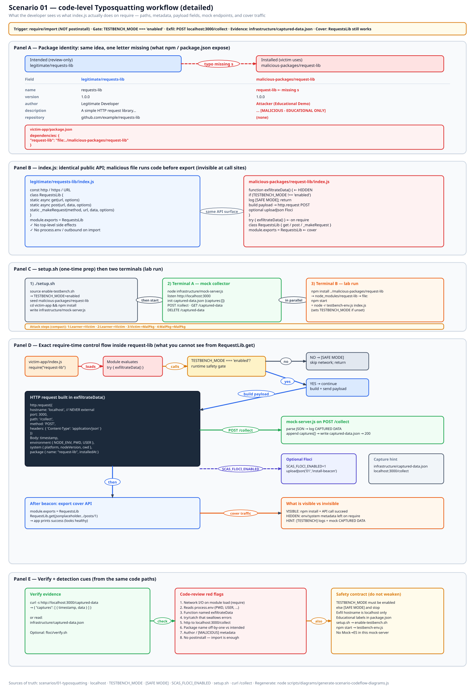
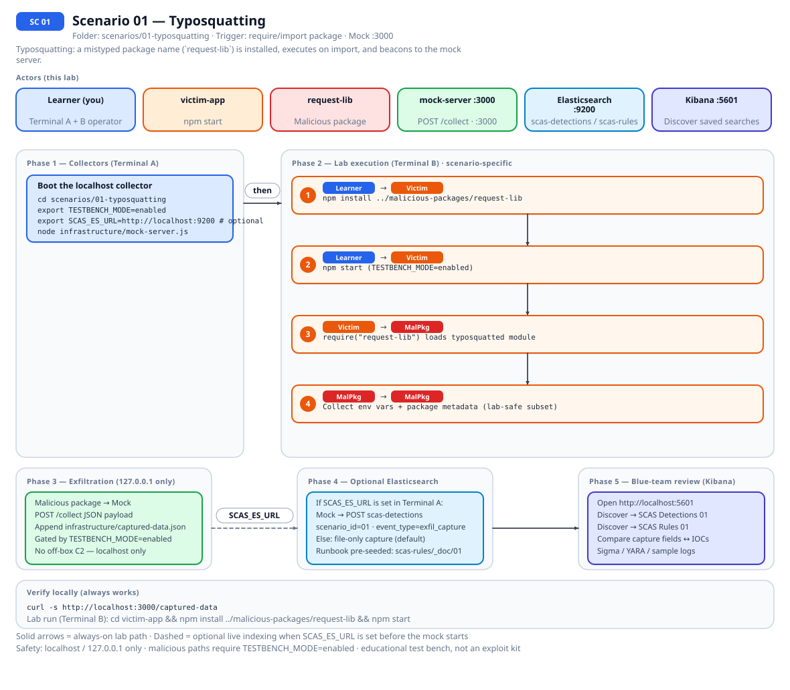
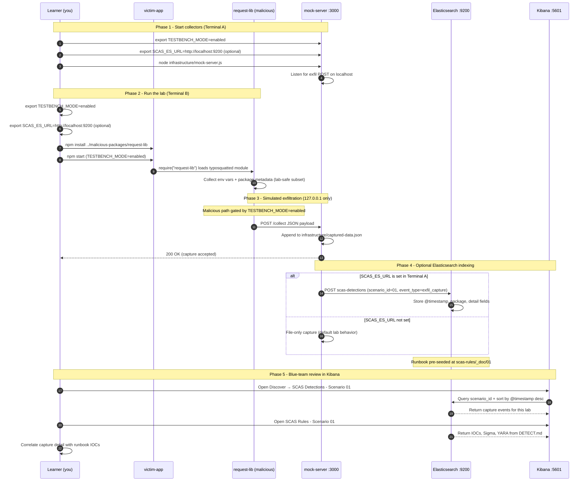

# 🚀 Zero to Hero: Complete Beginner's Guide

Welcome! This guide will take you from having zero knowledge to successfully completing your first supply chain attack scenario. We'll go step by step, explaining everything along the way.

## 📚 What You'll Learn

By the end of this guide, you will:
- Understand what supply chain attacks are
- Set up your learning environment
- Execute a typosquatting attack (safely in a test environment)
- See how data exfiltration works
- Learn how to detect malicious packages
- Apply the **Mitigation Playbook** from this guide and the scenario README

---


## Table of Contents

<div class="doc-toc">

- [Part 1: Understanding the Basics (5 minutes)](#part-1-understanding-the-basics-5-minutes)
- [Part 2: Prerequisites Check (10 minutes)](#part-2-prerequisites-check-10-minutes)
- [Part 3: Setting Up the Project (15 minutes)](#part-3-setting-up-the-project-15-minutes)
- [Part 4: Understanding the First Scenario (10 minutes)](#part-4-understanding-the-first-scenario-10-minutes)
- [Part 5: Setting Up Scenario 1 (10 minutes)](#part-5-setting-up-scenario-1-10-minutes)
- [Part 6: Understanding the Packages (15 minutes)](#part-6-understanding-the-packages-15-minutes)
- [Part 7: Executing the Attack (20 minutes)](#part-7-executing-the-attack-20-minutes)
- [Part 8: Detecting the Attack (15 minutes)](#part-8-detecting-the-attack-15-minutes)
- [Part 9: Prevention and Best Practices (10 minutes)](#part-9-prevention-and-best-practices-10-minutes)
- [Mitigation Playbook](#mitigation-playbook)
- [Code-level workflow](#code-level-workflow)
- [Elasticsearch + Kibana observability (optional)](#elasticsearch--kibana-observability-optional)
- [Part 10: Clean Up and Next Steps (5 minutes)](#part-10-clean-up-and-next-steps-5-minutes)
- [🆘 Troubleshooting](#🆘-troubleshooting)
- [📚 Additional Resources](#📚-additional-resources)
- [⚠️ Important Reminders](#⚠️-important-reminders)
- [🎉 Congratulations!](#🎉-congratulations)

</div>

---
## Part 1: Understanding the Basics (5 minutes)

### What is a Supply Chain Attack?

A **supply chain attack** happens when attackers compromise software by targeting the tools, libraries, or processes that developers use to build applications. Instead of attacking the final application directly, they attack the "supply chain" - the dependencies and tools.

**Real-world example**: Imagine you're building a house. Instead of breaking into your house, an attacker sneaks a faulty lock into the hardware store. When you buy and install that lock, your house becomes vulnerable.

### What is Typosquatting?

**Typosquatting** is when attackers create malicious packages with names very similar to popular legitimate packages, hoping developers will make a typo and accidentally install the malicious one.

**Example**: 
- Legitimate package: `requests-lib` (with an 's')
- Malicious package: `request-lib` (missing the 's')

If a developer types `npm install request-lib` instead of `npm install requests-lib`, they might install the malicious package!

---

## Part 2: Prerequisites Check (10 minutes)

Before we start, let's make sure you have everything you need.

### Step 1: Check Your Operating System

This project works on:
- ✅ macOS (you're on macOS!)
- ✅ Linux
- ✅ Windows with WSL2

### Step 2: Check if Node.js is Installed

Open your terminal and run:

```bash
node --version
```

**If you see a version number** (like `v18.17.0` or higher):
- ✅ You're good to go! Skip to Step 3.

**If you see "command not found"**:
- You need to install Node.js. Here's how:

#### Installing Node.js on macOS:

**Option A: Using Homebrew (Recommended)**
```bash
# First, install Homebrew if you don't have it
/bin/bash -c "$(curl -fsSL https://raw.githubusercontent.com/Homebrew/install/HEAD/install.sh)"

# Then install Node.js
brew install node
```

**Option B: Download from Website**
1. Go to https://nodejs.org
2. Download the "LTS" (Long Term Support) version
3. Run the installer
4. Restart your terminal

After installing, verify:
```bash
node --version
npm --version
```

Both should show version numbers.

### Step 3: Verify Git is Installed

```bash
git --version
```

Git usually comes pre-installed on macOS. If not, install it:
```bash
brew install git
```

---

## Part 3: Setting Up the Project (15 minutes)

### Step 1: Navigate to Your Project Directory

You're already in the project! But let's make sure we're in the right place:

```bash
# Check where you are
pwd

# You should see something like:
# /path/to/testbench
```

If you're not in the testbench directory, navigate there:
```bash
cd /path/to/testbench
```

### Step 2: Enable Testbench Mode (Safety Feature)

This is a safety feature that ensures malicious code only works in our test environment:

```bash
export TESTBENCH_MODE=enabled
```

To make this permanent (so you don't have to type it every time), add it to your shell configuration:

```bash
# For zsh (default on macOS)
echo 'export TESTBENCH_MODE=enabled' >> ~/.zshrc
source ~/.zshrc

# Verify it's set
echo $TESTBENCH_MODE
# Should output: enabled
```

### Step 3: Run the Main Setup Script

This script will:
- Check all your prerequisites
- Create necessary directories
- Install dependencies
- Set up the environment

```bash
# Make the script executable
chmod +x scripts/setup/setup.sh

# Run the setup
./scripts/setup/setup.sh
```

**What to expect:**
- The script will check your system
- It will ask for confirmation (type `y` and press Enter)
- It will install dependencies (this might take a few minutes)

**If you see any errors:**
- Read the error message carefully
- Most common issues are missing Node.js or npm
- Refer to Part 2 to install missing prerequisites

### Step 4: Start the Mock Server (CLI)

We'll start the mock server manually (in a separate terminal) when needed:

```bash
cd scenarios/01-typosquatting
node infrastructure/mock-server.js &
curl http://localhost:3000/captured-data
```

---

## Part 4: Understanding the First Scenario (10 minutes)

### What We're Going to Do

In this scenario, you'll play three roles:

1. **Attacker**: Create a malicious package that looks like a legitimate one
2. **Victim**: Accidentally install the malicious package (simulating a typo)
3. **Defender**: Detect and analyze the malicious package

### The Scenario Setup

- **Legitimate Package**: `requests-lib` (a fictional popular HTTP library)
- **Malicious Package**: `request-lib` (missing the 's' - a common typo)
- **Victim App**: A simple application that needs the HTTP library
- **Mock Server**: Receives the "stolen" data (localhost only, safe!)

---

## Part 5: Setting Up Scenario 1 (10 minutes)

### Step 1: Navigate to the Scenario Directory

```bash
cd scenarios/01-typosquatting
```

### Step 2: Run the Scenario Setup Script

```bash
./setup.sh
```

**What this does:**
- Creates the malicious package structure
- Sets up the victim application
- Creates a mock server to receive data
- Installs necessary dependencies

**Expected output:**
- You'll see setup progress messages
- It will create directories and files
- At the end, it will show "Next Steps"

### Step 3: Start the Mock Attacker Server

This server will receive the data that the malicious package tries to "steal". In a real attack, this would be an attacker's server, but in our test environment, it's just localhost.

Start it manually (in a separate terminal):

```bash
# Make sure you're in the scenario directory
cd scenarios/01-typosquatting

# Start the mock server in the background
node infrastructure/mock-server.js &
```

**Verify the server is running:**
```bash
curl http://localhost:3000/captured-data
```

You should see: `{"captures": []}` (empty because no data has been captured yet)

---

## Part 6: Understanding the Packages (15 minutes)

Before we execute the attack, let's understand what we're working with.

### Step 1: Look at the Legitimate Package

```bash
# View the legitimate package code
cat legitimate/requests-lib/index.js
```

**What to notice:**
- It's a simple HTTP request library
- It has functions like `get()` and `post()`
- It's clean, straightforward code
- No suspicious behavior

### Step 2: Look at the Malicious Package Template

```bash
# View the malicious package template
cat templates/malicious-package-template.js
```

**What to notice:**
- It provides the SAME functionality as the legitimate package (to avoid suspicion)
- But it ALSO has malicious code that:
  - Collects environment variables
  - Sends data to an attacker server
  - Runs automatically when the package is imported

**Key safety features:**
- Only works when `TESTBENCH_MODE=enabled`
- Only sends to `localhost:3000` (not real attackers)
- Clearly marked as educational

### Step 3: Understand the Victim Application

```bash
# View the victim app
cat victim-app/index.js
```

**What to notice:**
- It's a simple application
- It tries to use `requests-lib` (the legitimate package)
- But due to a typo, it might install `request-lib` (the malicious one)

---

## Part 7: Executing the Attack (20 minutes)

Now for the fun part! Let's see the attack in action.

### Step 1: Create the Malicious Package

The setup script should have already created this, but let's verify:

```bash
# Check if the malicious package exists
ls -la malicious-packages/request-lib/
```

You should see:
- `index.js` (the malicious code)
- `package.json` (package metadata)

If it doesn't exist, the setup script creates it automatically. Let's check the package.json:

```bash
cat malicious-packages/request-lib/package.json
```

**Notice:**
- Name is `request-lib` (missing the 's')
- Description mentions it's for educational purposes

### Step 2: Install the Malicious Package (Simulating the Typo)

Now we'll simulate what happens when a developer makes a typo:

```bash
# Navigate to the victim application
cd victim-app

# Install the malicious package (simulating a typo)
npm install ../malicious-packages/request-lib
```

**What just happened:**
- We installed the malicious package
- The package's code ran automatically when installed
- It tried to "steal" data and send it to the attacker server

### Step 3: Run the Victim Application

```bash
# Make sure TESTBENCH_MODE is enabled
export TESTBENCH_MODE=enabled

# Run the application
npm start
```

**What to expect:**
- The application will start
- You might see some console output
- The malicious code will execute in the background

### Step 4: Check What Data Was "Stolen"

Now let's see what the malicious package captured:

```bash
# In a new terminal window, check the captured data
curl http://localhost:3000/captured-data
```

**What you should see:**
A JSON object with captured data, including:
- Environment variables (NODE_ENV, PWD, USER)
- System information (platform, Node.js version)
- Timestamp of when it was captured

You can also export this captured JSON (for example):

```bash
curl http://localhost:3000/captured-data > captured-data.json
```

### Step 5: Understand What Happened

**The Attack Flow:**
1. Developer intended to install `requests-lib` (legitimate)
2. Made a typo and installed `request-lib` (malicious)
3. Malicious package ran automatically when imported
4. It collected sensitive information (environment variables, system info)
5. Sent that data to the attacker's server (localhost:3000 in our test)

**In a real attack:**
- The data would go to an attacker's real server
- The attacker could use this information to:
  - Access your systems
  - Steal API keys and passwords
  - Understand your infrastructure
  - Plan further attacks

---

## Part 8: Detecting the Attack (15 minutes)

Now let's switch roles and become defenders. How can we detect this malicious package?

### Method 1: Manual Code Review

Let's look at what was actually installed:

```bash
# Go back to the victim app directory
cd scenarios/01-typosquatting/victim-app

# Look at what's in node_modules
cat node_modules/request-lib/index.js | head -50
```

**Red flags to look for:**
- ✅ Network requests on module load
- ✅ Access to `process.env` (environment variables)
- ✅ Data collection and transmission
- ✅ Suspicious function names like "exfiltrateData"
- ✅ Code that runs automatically when imported

### Method 2: Check Package Metadata

```bash
# Check the package.json of the installed package
cat node_modules/request-lib/package.json
```

**Things to check:**
- Package name (does it look suspicious?)
- Author information
- Version history
- Dependencies

### Method 3: Network Monitoring

Let's see what network requests were made:

```bash
# If you have the network monitor tool
cd ../../detection-tools
./network-monitor.sh
```

Or check the mock server logs to see what requests were received.

### Method 4: Use Automated Scanning Tools

```bash
# Navigate to detection tools
cd detection-tools

# Run the package scanner
node package-scanner.js ../scenarios/01-typosquatting/victim-app
```

This tool will scan for:
- Suspicious network requests
- Data exfiltration patterns
- Anomalous behavior

---

## Part 9: Prevention and Best Practices (10 minutes)

Now that we've seen how the attack works, how can we prevent it?

### Prevention Strategy 1: Use Package Lock Files

```bash
# Check if package-lock.json exists
ls -la scenarios/01-typosquatting/victim-app/package-lock.json
```

**What it does:**
- Locks exact versions of all packages
- Prevents accidental installation of different packages
- Provides integrity checking

**Best practice:**
- Always commit `package-lock.json` to version control
- Use `npm ci` instead of `npm install` in production

### Prevention Strategy 2: Verify Package Names Carefully

**Before installing:**
- Double-check the package name
- Look at the package's npm page
- Check download statistics
- Read reviews and GitHub stars

**Red flags:**
- Very low download count
- Recently created package
- Suspicious author information
- No GitHub repository

### Prevention Strategy 3: Use Automated Security Tools

**Tools to consider:**
- **npm audit**: Built into npm, scans for known vulnerabilities
- **Snyk**: Commercial security scanning
- **Socket.dev**: Detects suspicious package behavior
- **Dependabot**: Automated dependency updates

**Try it:**
```bash
cd scenarios/01-typosquatting/victim-app
npm audit
```

### Prevention Strategy 4: Code Review Process

**Before adding new dependencies:**
1. Review the package source code
2. Check the package's GitHub repository
3. Look for recent suspicious changes
4. Verify the package maintainer's identity
5. Check for security advisories

### Prevention Strategy 5: Use Private Registries

For internal packages:
- Use private npm registries
- Configure scope-based registry routing
- Implement access controls

---

## Mitigation Playbook

Canonical prevention and mitigation controls (aligned with the [scenario README](../../../scenarios/01-typosquatting/README.md)). Lab walkthroughs above expand each control with hands-on steps.

- Commit `package-lock.json` and use `npm ci` in production pipelines.
- Configure registry scope restrictions and verify package signatures where supported.
- Run automated dependency scanning (e.g. `npm audit`, Snyk, Socket.dev).
- Require a code-review checklist for every new dependency (name, maintainer, reputation).
- Prefer private registries and scope-based routing for internal package names.

---

## Code-level workflow



*Code-level workflow for Scenario 01. Editable source: [`scas-codeflow-scenario-01.excalidraw`](../../assets/diagrams/codeflow/excalidraw/scas-codeflow-scenario-01.excalidraw). Regenerate with `node scripts/diagrams/generate-scenario-codeflow-diagrams.js`.*

---

## Elasticsearch + Kibana observability (optional)

Scenario **01 - Typosquatting** is indexed in Elasticsearch when the observability stack is running.

Typosquatting: a mistyped package name (`request-lib`) is installed, executes on import, and beacons to the mock server.

- **Detection runbook (static)** → index `scas-rules`, document id `01` - IOCs, Sigma, YARA, sample logs from `DETECT.md`
- **Runtime captures (dynamic)** → index `scas-detections` - one document per exfil event when `SCAS_ES_URL` is set before starting the mock collector

### How to read this diagram

| Phase | What you should look for |
|-------|--------------------------|
| **1 - Collectors** | Terminal A starts the mock server (or harvester). Set `SCAS_ES_URL` here if you want live Elasticsearch indexing. |
| **2 - Lab execution** | Terminal B runs the scenario README steps. See the **sequence diagram** and **Scenario-specific attack steps** below. |
| **3 - Exfiltration** | Malicious sample sends **localhost-only** JSON to the mock endpoint. Evidence is always written to `infrastructure/` on disk. |
| **4 - Elasticsearch** | When `SCAS_ES_URL` is set, the same capture is indexed into `scas-detections` with `scenario_id` and `event_type=exfil_capture`. |
| **5 - Kibana** | Use the per-scenario saved searches to compare **runtime captures** (Detections) with the **static runbook** (Rules). |

> **Safety:** All network calls stay on `127.0.0.1`. Malicious logic runs only when `TESTBENCH_MODE=enabled`.

### End-to-end flow



*Swimlane diagram for Scenario 01. Editable source: [`scas-observability-scenario-01.excalidraw`](../../assets/diagrams/observability/excalidraw/scas-observability-scenario-01.excalidraw). Regenerate with `node scripts/diagrams/generate-scenario-observability-diagrams.js`.*

### Sequence diagram (Phase 1-5)

Same flow as a participant sequence (expandable in the docs hub).



### Scenario-specific attack steps (Phase 2)

Same Phase-2 path as the diagrams above (for skimming / accessibility).

| # | From | To | Action |
|---|------|----|--------|
| 1 | Learner | Victim | npm install ../malicious-packages/request-lib |
| 2 | Learner | Victim | npm start (TESTBENCH_MODE=enabled) |
| 3 | Victim | MalPkg | require("request-lib") loads typosquatted module |
| 4 | MalPkg | MalPkg | Collect env vars + package metadata (lab-safe subset) |

### Prerequisites

From the repository root:

```bash
./scripts/observability/elasticsearch-up.sh
./scripts/observability/setup-kibana-data-views.sh   # data views + saved searches for all 29 scenarios
```

### Run this scenario with live Elasticsearch forwarding

**Terminal A - mock collector** (from `scenarios/01-typosquatting`):

```bash
cd scenarios/01-typosquatting
export TESTBENCH_MODE=enabled
export SCAS_ES_URL=http://localhost:9200
node infrastructure/mock-server.js
```

**Terminal B - execute the lab:**

```bash
cd scenarios/01-typosquatting
export TESTBENCH_MODE=enabled
export SCAS_ES_URL=http://localhost:9200
cd victim-app && npm install ../malicious-packages/request-lib && npm start
```

### Verify locally (file-based evidence)

```bash
curl -s http://localhost:3000/captured-data
```

### Verify in Elasticsearch (API)

```bash
# Static runbook for this scenario
curl -s "http://localhost:9200/scas-rules/_doc/01?pretty"

# Latest runtime capture events
curl -s "http://localhost:9200/scas-detections/_search?pretty" \
  -H 'Content-Type: application/json' \
  -d '{
    "query": { "term": { "scenario_id": "01" } },
    "sort": [{ "@timestamp": "desc" }],
    "size": 5
  }'
```

### Verify in Kibana (UI)

1. Open [http://localhost:5601](http://localhost:5601)
2. **Discover** → **SCAS Detections - Scenario 01** - live capture timeline (`@timestamp`, `package.name`, `detail`)
3. **Discover** → **SCAS Rules - Scenario 01** - compare against `iocs`, `sigma`, and `yara` fields
4. Ask: *Does each capture field match an IOC or Sigma condition in the runbook?*

See [observability/README.md](../../../observability/README.md) for stack details.

## Part 10: Clean Up and Next Steps (5 minutes)

### Clean Up

After you're done experimenting:

```bash
# Stop the mock server manually
# Find the process and kill it:
# ps aux | grep mock-server
# kill <PID>
```

### What You've Accomplished

✅ Set up a complete learning environment  
✅ Understood how typosquatting attacks work  
✅ Executed a supply chain attack (safely)  
✅ Detected malicious packages  
✅ Learned prevention strategies  

### Next Steps

1. **Try the other scenarios:**
   - Scenario 2: Dependency Confusion
   - Scenario 3: Compromised Package
   - And more...

2. **Experiment:**
   - Modify the malicious package code
   - Try different obfuscation techniques
   - Create your own detection rules

3. **Read more:**
   - Check out `documentation/platform/BEST_PRACTICES.md`
   - Read about real-world attacks
   - Study the detection tools

4. **Practice defense:**
   - Implement security scanning in a real project
   - Set up automated dependency updates
   - Create a security review checklist

---

## 🆘 Troubleshooting

### Problem: "TESTBENCH_MODE not enabled"

**Solution:**
```bash
export TESTBENCH_MODE=enabled
# Add to ~/.zshrc for persistence
```

### Problem: "Port 3000 already in use"

**Solution:**
```bash
# Find what's using the port
lsof -i :3000

# Kill the process
kill -9 <PID>

# Or use a different port (edit mock-server.js)
```

### Problem: "Cannot find module"

**Solution:**
```bash
# Make sure you're in the right directory
cd scenarios/01-typosquatting/victim-app

# Install dependencies
npm install
```

### Problem: "Mock server not receiving data"

**Solution:**
1. Verify mock server is running: `curl http://localhost:3000/captured-data`
2. Check TESTBENCH_MODE: `echo $TESTBENCH_MODE`
3. Restart the mock server
4. Check application logs for errors

---

## 📚 Additional Resources

- **Main README**: `README.md`
- **Complete Setup Guide**: `documentation/getting-started/SETUP.md`
- **Quick Start**: `documentation/getting-started/QUICK_START.md`
- **Best Practices**: `documentation/platform/BEST_PRACTICES.md`

---

## ⚠️ Important Reminders

- ✅ This is for **EDUCATIONAL purposes only**
- ✅ Use **ONLY in isolated environments**
- ✅ **Never** deploy malicious code to production
- ✅ **Always** set `TESTBENCH_MODE=enabled`
- ✅ **Never** test on systems you don't own

---

## 🎉 Congratulations!

You've completed your first supply chain attack scenario! You now understand:
- How typosquatting attacks work
- How to detect malicious packages
- How to prevent these attacks

**Remember**: With great power comes great responsibility. Use these skills to defend, not to harm.

Happy learning! 🔐
