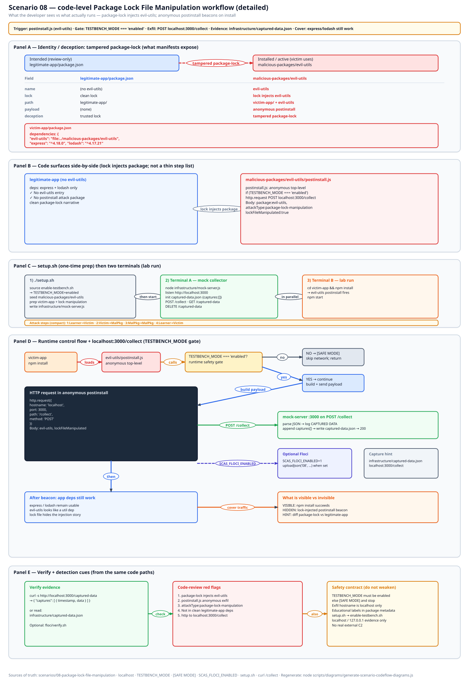
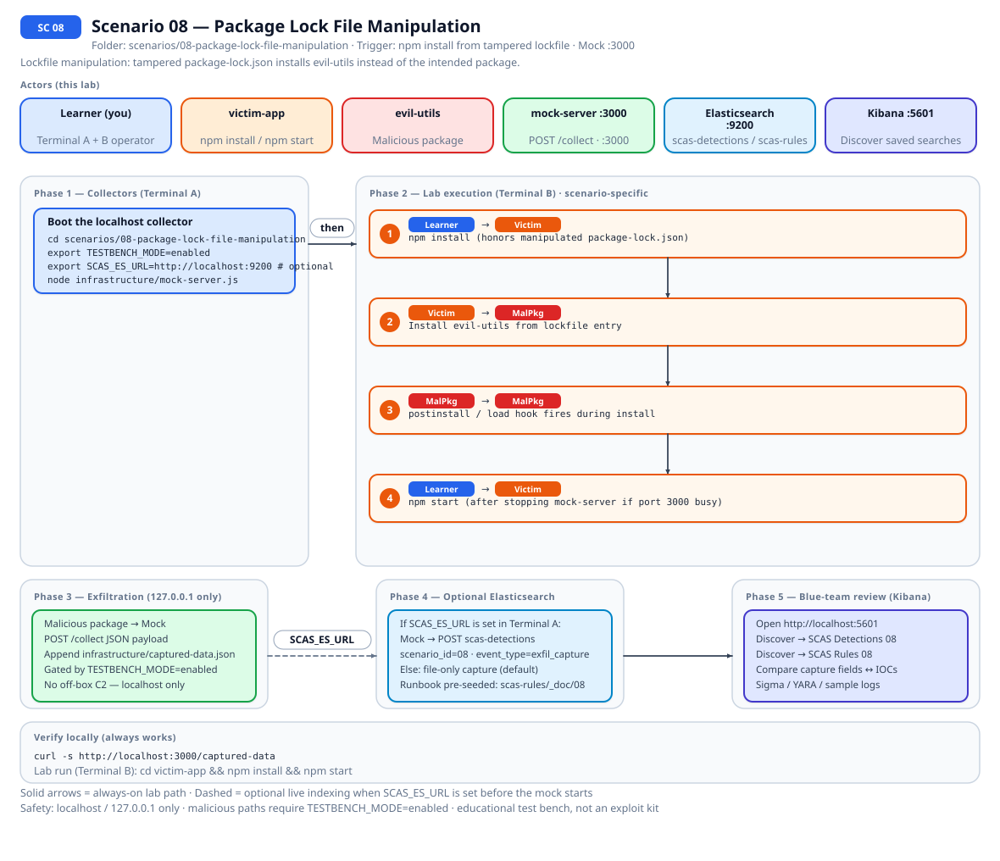
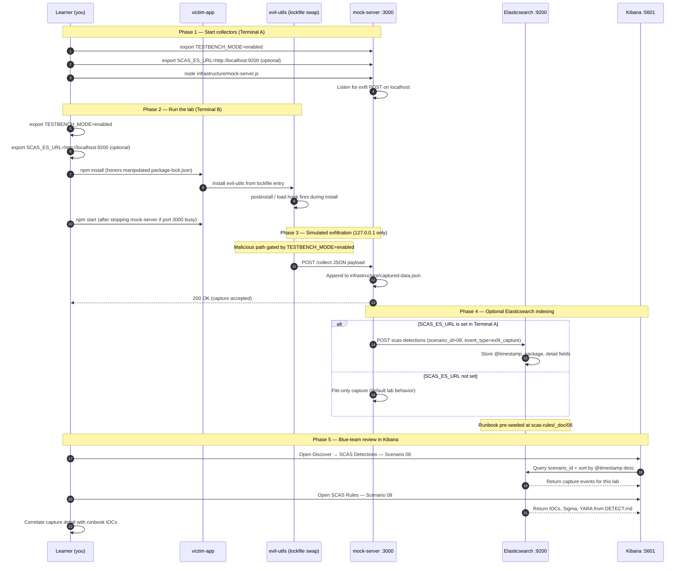

# 🚀 Zero to Hero: Scenario 8 - Package Lock File Manipulation

Welcome! This guide will take you from zero knowledge to successfully completing the Package Lock File Manipulation attack scenario. We'll go step by step, explaining everything along the way.

## 📚 What You'll Learn

By the end of this guide, you will:
- Understand what package lock files are and why they're important
- Learn how lock file manipulation attacks work
- Execute a lock file manipulation simulation (safely)
- Conduct lock file validation and forensic investigation
- Perform detection and incident response
- Implement defense strategies for CI/CD security

- Apply the **Mitigation Playbook** from this guide and the scenario README
---

## Table of Contents

<div class="doc-toc">

- [Part 1: Understanding Package Lock Files (15 minutes)](#part-1-understanding-package-lock-files-15-minutes)
- [Part 2: Understanding Lock File Manipulation (15 minutes)](#part-2-understanding-lock-file-manipulation-15-minutes)
- [Part 3: Prerequisites Check (5 minutes)](#part-3-prerequisites-check-5-minutes)
- [Part 4: Setting Up Scenario 8 (15 minutes)](#part-4-setting-up-scenario-8-15-minutes)
- [Part 5: Understanding the Attack Structure (20 minutes)](#part-5-understanding-the-attack-structure-20-minutes)
- [Part 6: The Attack - Lock File Manipulation (30 minutes)](#part-6-the-attack---lock-file-manipulation-30-minutes)
- [Part 7: Detection Methods (40 minutes)](#part-7-detection-methods-40-minutes)
- [Part 8: Forensic Investigation (30 minutes)](#part-8-forensic-investigation-30-minutes)
- [Part 9: Incident Response (30 minutes)](#part-9-incident-response-30-minutes)
- [Part 10: Defense Strategies (20 minutes)](#part-10-defense-strategies-20-minutes)
- [Mitigation Playbook](#mitigation-playbook)
- [Elasticsearch + Kibana observability (optional)](#elasticsearch--kibana-observability-optional)
- [Part 11: Key Takeaways (10 minutes)](#part-11-key-takeaways-10-minutes)
- [🎓 Congratulations!](#🎓-congratulations)
- [📚 Additional Resources](#📚-additional-resources)

</div>

---
## Part 1: Understanding Package Lock Files (15 minutes)

### What is a Package Lock File?

A **package lock file** (`package-lock.json` for npm, `yarn.lock` for yarn, `pnpm-lock.yaml` for pnpm) is a file that locks the exact versions of all dependencies, including transitive dependencies.

**Purpose**:
- Ensures reproducible installs
- Locks exact versions of all packages
- Includes transitive dependencies
- Used by `npm ci` for clean installs

### Why Lock Files Exist

**Without lock file**:
```bash
npm install express  # Might install express@4.18.1 or 4.18.2 (whatever is latest)
```

**With lock file**:
```bash
npm ci  # Installs EXACT versions from package-lock.json
```

**Example package-lock.json**:
```json
{
  "name": "my-app",
  "lockfileVersion": 2,
  "dependencies": {
    "express": {
      "version": "4.18.1",
      "resolved": "https://registry.npmjs.org/express/-/express-4.18.1.tgz",
      "integrity": "sha512-..."
    }
  }
}
```

### How npm Uses Lock Files

1. **npm install**: Uses lock file if present, updates it if dependencies change
2. **npm ci**: Uses lock file EXCLUSIVELY, ignores package.json dependencies
3. **Lock file priority**: Lock file takes precedence over package.json

**Critical Point**: `npm ci` trusts the lock file completely!

### Why Lock Files Are Trusted

- **Reproducibility**: Ensures everyone gets same versions
- **CI/CD**: Build systems use lock files for consistency
- **Security**: Locks known-good versions
- **Speed**: Faster installs (no resolution needed)

---

## Part 2: Understanding Lock File Manipulation (15 minutes)

### What is Lock File Manipulation?

**Lock File Manipulation** occurs when an attacker modifies `package-lock.json` (or pairs it with a sneaky manifest change) to steer installs toward malicious artifacts. On **npm 7+**, the lockfile root is reconciled with `package.json`, so “lock-only” injections without a matching dependency line are usually dropped on `npm install`. This lab uses an explicit **`file:`** `evil-utils` entry in `package.json` so installs are reproducible while you still practice **lock review**, integrity checks, and unexpected local-package detection.

### Attack Scenario

1. **Attacker manipulates package-lock.json**: Adds malicious package entry
2. **Commits to repository**: Lock file changes are committed
3. **Developer pulls changes**: Gets manipulated lock file
4. **Runs npm install/ci**: Installs malicious package from lock file
5. **Malicious code executes**: Postinstall script runs automatically

### Why This Attack Works

1. **Trust**: Package managers trust lock files completely
2. **Easy to miss**: `file:` and tarball specifiers are easy to skim past in both `package.json` and the lockfile
3. **CI/CD Vulnerability**: `npm ci` uses lock file exclusively
4. **Persistent**: Changes persist through git commits
5. **Review Bypass**: Security reviews focus on package.json, not lock files

### Real-World Attack Vectors

1. **Compromised Git Repository**: Attacker commits manipulated lock file
2. **Malicious Pull Request**: PR includes lock file with malicious packages
3. **CI/CD Compromise**: Attacker modifies lock file in build artifacts
4. **Developer Machine Compromise**: Attacker modifies local lock file

---

## Part 3: Prerequisites Check (5 minutes)

Before we start, make sure you've completed:

- ✅ Scenario 1 (Typosquatting) - Understanding basic attacks
- ✅ Scenario 2 (Dependency Confusion) - Understanding package resolution
- ✅ Scenario 3 (Compromised Package) - Understanding package compromise
- ✅ Node.js 16+ and npm installed
- ✅ TESTBENCH_MODE enabled

Verify your setup:

```bash
node --version
npm --version
echo $TESTBENCH_MODE  # Should output: enabled
```

---

## Part 4: Setting Up Scenario 8 (15 minutes)

### Step 1: Navigate to Scenario Directory

```bash
cd scenarios/08-package-lock-file-manipulation
```

### Step 2: Run the Setup Script

```bash
export TESTBENCH_MODE=enabled
./setup.sh
```

**What this does:**
- Creates directory structure
- Sets up legitimate app (clean baseline)
- Sets up victim app (`evil-utils` file: dependency + lockfile)
- Sets up compromised app (pre-manipulated state)
- Creates malicious package (evil-utils)
- Sets up detection tools
- Sets up mock attacker server

**Expected output:**
- Setup progress messages
- Directories and files created
- Three app states created
- "Next Steps" displayed

### Step 3: Understand the Three App States

**1. legitimate-app/**: Clean baseline
- Clean package.json and package-lock.json
- No malicious packages
- Reference for comparison

**2. victim-app/**: Active compromise
- `package.json` includes `evil-utils` as `file:../malicious-packages/evil-utils`
- Lockfile records the link and install scripts
- After `./setup.sh`, dependencies are installed

**3. compromised-app/**: Same dependency model for demos
- Same `evil-utils` `file:` line; run `npm install` when you want a fresh `node_modules` for teaching

---

## Part 5: Understanding the Attack Structure (20 minutes)

### Step 1: Examine the Legitimate App

```bash
cd legitimate-app
cat package.json
```

**What you'll see:**
```json
{
  "name": "legitimate-app",
  "dependencies": {
    "express": "^4.18.0",
    "lodash": "^4.17.21"
  }
}
```

```bash
cat package-lock.json | head -50
```

**What you'll see:**
- Clean lock file
- Only express and lodash
- No malicious packages

### Step 2: Examine the Victim App

```bash
cd ../victim-app
cat package.json
```

**Notice**: `victim-app/package.json` lists **`evil-utils`** as a **`file:`** dependency (legitimate-app does not). That is the signal to investigate.

```bash
cat package-lock.json | grep -A 10 "evil-utils"
```

**What you'll see:** entries under the root `packages` tree linking `node_modules/evil-utils` to `../malicious-packages/evil-utils`.

**Key Point**: Compare **legitimate-app** vs **victim-app** `package.json` and lockfile together—unexpected `file:` deps and lock drift are the lesson.

### Step 3: Compare the Files

```bash
# Compare package.json files (victim includes evil-utils file:)
diff legitimate-app/package.json victim-app/package.json

# Compare package-lock.json files (victim/evil-utils linkage)
diff legitimate-app/package-lock.json victim-app/package-lock.json | head -50
```

**Findings:**
- package.json: ❌ Different (victim-app declares `evil-utils`)
- package-lock.json: ❌ Different (victim-app resolves and records `evil-utils`)

---

## Part 6: The Attack - Lock File Manipulation (30 minutes)

### Step 1: Understand How the Manipulation Works

The attacker (or insider) has:
1. Added a **`file:`** dependency on `evil-utils` in `package.json`
2. Committed the updated lockfile that materializes that link
3. Relied on reviewers skimming past `file:` lines or huge lock diffs

**In real attack:**
- Attacker commits manifest + lock changes
- Lockfile-only tweaks still happen in weaker pipelines, but npm 7+ usually requires a matching manifest line for the root dependency
- CI/CD runs `npm ci` / `npm install` and postinstall hooks may run

### Step 2: Start the Mock Attacker Server

```bash
cd infrastructure
node mock-server.js &
```

**Verify it's running:**
```bash
curl http://localhost:3000/captured-data
# Should return: {"captures":[]}
```

### Step 3: Examine the Malicious Package

```bash
cd ../malicious-packages/evil-utils
cat package.json
```

**What you'll see:**
```json
{
  "name": "evil-utils",
  "scripts": {
    "postinstall": "node postinstall.js"
  }
}
```

**Key Feature**: Has a postinstall script!

```bash
cat postinstall.js | head -30
```

**What it does:**
- Executes automatically when installed
- Collects system information
- Reads sensitive files
- Exfiltrates data to attacker server

### Step 4: Simulate the Attack

```bash
cd ../../victim-app

# Clean install (simulates CI/CD environment)
rm -rf node_modules

# Install from manipulated lock file
npm install
# OR use npm ci (which ONLY uses lock file)
# npm ci
```

**What happens:**
1. npm reads `package.json` and `package-lock.json`
2. Links `evil-utils` from the declared `file:` path
3. Runs `evil-utils` **postinstall** when `TESTBENCH_MODE=enabled`
4. Data is collected and exfiltrated to the mock server
5. Check the mock server console for captured data!

### Step 5: Observe the Attack

```bash
# Check the mock server output
# You should see:
# 🎯 CAPTURED DATA FROM LOCK FILE MANIPULATION
# Package: evil-utils@1.0.0
# Lock File Manipulated: true
# ... system information ...
```

```bash
# Or check via API
curl http://localhost:3000/captured-data | jq
```

**What was exfiltrated:**
- System information (hostname, username, platform)
- Environment variables
- Contents of sensitive files (.npmrc, .env)
- Lock file contents (confirms manipulation)

### Step 6: Verify the Package is Installed

```bash
# Check installed packages
npm list --depth=0

# You should see evil-utils@1.0.0 linked from file:
```

```bash
# Confirm the manifest declares the local package
cat package.json | grep evil-utils
```

**Key Point**: The **`file:`** line in `package.json` is what npm 7+ needs to keep the root lock entry stable; the lockfile still deserves diff review.

### Step 7: Run the Victim Application

```bash
export TESTBENCH_MODE=enabled
npm start
```

**Notice**: The application runs normally! You might not notice anything wrong.

**Key Point**: The attack executed during `npm install`, not during application runtime.

---

## Part 7: Detection Methods (40 minutes)

### Detection Method 1: Lock File Validation

```bash
cd detection-tools
node lock-file-validator.js ../victim-app
```

**What this does:**
- Compares `package.json` with the lockfile root (including lockfile v3 `packages[""]`)
- Flags suspicious package names and **`file:`** specifiers
- Notes **postinstall** on **file:** dependencies

**Expected Output:** warnings for `evil-utils` as a `file:` dependency and for postinstall on that local package (exact wording may vary by npm lock shape).

### Detection Method 2: Manual Comparison

```bash
cd ../victim-app

# Compare package.json with package-lock.json
node -e "
const pkg = require('./package.json');
const lock = require('./package-lock.json');
const pkgDeps = Object.keys({...pkg.dependencies, ...pkg.devDependencies});
const lockDeps = Object.keys(lock.dependencies || {});
const unexpected = lockDeps.filter(d => !pkgDeps.includes(d) && !d.startsWith('@types/'));
console.log('Expected packages:', pkgDeps);
console.log('Packages in lock file:', lockDeps);
console.log('Unexpected packages:', unexpected);
"
```

**Expected Output:**
```
Expected packages: [ 'express', 'lodash' ]
Packages in lock file: [ 'express', 'lodash', 'evil-utils', ... ]
Unexpected packages: [ 'evil-utils' ]
```

### Detection Method 3: Git History Analysis

```bash
# If using git, check lock file changes
git log -p package-lock.json | head -100

# Check for suspicious additions
git diff HEAD~1 package-lock.json | grep -A 10 "evil-utils"

# Check commit author
git log -1 --format="%an - %s" package-lock.json
```

**What to look for:**
- Unexpected lock file changes
- Packages added without corresponding package.json changes
- Suspicious commit messages
- Unknown commit authors

### Detection Method 4: Package Verification

```bash
# Check installed packages
npm list --depth=0

# Verify package integrity
npm audit

# Spot packages beyond the benign public deps you expect
npm list --depth=0 | grep -v "express\|lodash"
```

**Red Flags:**
- Unexpected `file:` or tarball specifiers in `package.json`
- Integrity check failures
- Unexpected packages in node_modules

### Detection Method 5: Runtime Detection

```bash
# Check if malicious package is loaded
node -e "try { require('evil-utils'); console.log('⚠️  evil-utils is installed!'); } catch(e) { console.log('✅ Not installed'); }"

# Check captured data (indicates attack occurred)
curl http://localhost:3000/captured-data | jq '.captures[0].data.lockFileManipulated'
```

**Expected Output:**
```
⚠️  evil-utils is installed!
true
```

---

## Part 8: Forensic Investigation (30 minutes)

### Investigation Step 1: Lock File Analysis

```bash
cd victim-app

# Lockfile v3: root dependency keys
node -e "const l=require('./package-lock.json'); console.log(Object.keys((l.packages&&l.packages['']&&l.packages[''].dependencies)||{}));"

# Inspect the linked package entry
cat package-lock.json | jq '.packages["node_modules/evil-utils"]'
```

**Key Findings:**
- Package name: evil-utils
- Linked from `../malicious-packages/evil-utils` in the lockfile `packages` tree

### Investigation Step 2: Package.json Comparison

```bash
# Compare what should be installed vs what is installed
echo "=== Expected (package.json) ==="
cat package.json | jq '.dependencies'

echo ""
echo "=== Lockfile root dependency keys (v3 uses packages[\"\"]) ==="
node -e "const l=require('./package-lock.json'); const r=(l.packages&&l.packages['']&&l.packages[''].dependencies)||{}; console.log(Object.keys(r));"
```

**Findings:**
- `package.json` lists `evil-utils` as `file:../malicious-packages/evil-utils`
- Lockfile records the link under `packages["node_modules/evil-utils"]` (and related entries)

### Investigation Step 3: Git History Analysis

```bash
# Check when lock file was modified (if using git)
git log --oneline package-lock.json

# See the exact changes
git show HEAD:package-lock.json | grep -A 10 "evil-utils" || echo "Not in current version"

# Check commit details
git log -1 --format="%an - %ae - %s - %ad" package-lock.json
```

**Timeline Questions:**
- When was the lock file manipulated?
- Who committed the change?
- What was the commit message?
- Was it part of a larger change?

### Investigation Step 4: Impact Assessment

```bash
# Check what data was exfiltrated
cat ../infrastructure/captured-data.json | jq '.captures[0].data'

# Identify affected systems
cat ../infrastructure/captured-data.json | jq '.captures[].data.hostname'
```

**Impact:**
- System information collected
- Sensitive files accessed (.npmrc, .env)
- Lock file contents exfiltrated
- Confirms lock file manipulation

---

## Part 9: Incident Response (30 minutes)

### Response Step 1: Immediate Containment

```bash
cd victim-app

# Remove malicious package (if installed)
npm uninstall evil-utils

# Remove node_modules
rm -rf node_modules

# Restore lock file from git (if available)
git checkout HEAD -- package-lock.json

# OR regenerate from package.json
rm package-lock.json
npm install
```

### Response Step 2: Lock File Restoration

```bash
# Option 1: Restore from git
git checkout HEAD~1 -- package-lock.json  # Restore previous version

# Option 2: Regenerate from package.json
rm package-lock.json
npm install

# Verify new lock file is clean
node ../detection-tools/lock-file-validator.js .
```

**Verification:**
```bash
# Check lock file no longer contains evil-utils
cat package-lock.json | grep evil-utils
# Should return nothing
```

### Response Step 3: CI/CD Security Update

**Update CI/CD Pipeline** to validate lock files:

```yaml
# .github/workflows/ci.yml
- name: Validate lock file
  run: |
    node scripts/validate-lock-file.js
    npm audit
    npm ci --dry-run

- name: Install dependencies
  run: npm ci
```

### Response Step 4: Long-term Defenses

**Implement Multiple Layers:**

1. **Lock File Validation in CI/CD**:
   ```bash
   # Add to CI/CD pipeline
   node detection-tools/lock-file-validator.js .
   ```

2. **Git Hooks**:
   ```bash
   # .git/hooks/pre-commit
   #!/bin/bash
   node detection-tools/lock-file-validator.js .
   if [ $? -ne 0 ]; then
     echo "Lock file validation failed!"
     exit 1
   fi
   ```

3. **Package.json Verification**:
   ```bash
   # Verify all packages in lock file are in package.json
   node -e "
   const pkg = require('./package.json');
   const lock = require('./package-lock.json');
   const pkgDeps = Object.keys({...pkg.dependencies, ...pkg.devDependencies});
   const lockDeps = Object.keys(lock.dependencies || {});
   const unexpected = lockDeps.filter(d => !pkgDeps.includes(d) && !d.startsWith('@types/'));
   if (unexpected.length > 0) {
     console.error('Unexpected packages:', unexpected);
     process.exit(1);
   }
   "
   ```

4. **Lock File Checksums**:
   ```bash
   # Generate checksum
   sha256sum package-lock.json > package-lock.json.sha256
   
   # Verify in CI/CD
   sha256sum -c package-lock.json.sha256
   ```

---

## Part 10: Defense Strategies (20 minutes)

### Prevention Strategies

1. **Lock File Validation**: Always validate before install
2. **Git Hooks**: Pre-commit hooks to validate lock files
3. **CI/CD Checks**: Automated validation in pipelines
4. **Code Reviews**: Review lock file changes carefully
5. **Checksums**: Store and verify lock file checksums

### Detection Strategies

1. **Automated Validation**: Regular lock file validation
2. **Package Comparison**: Compare package.json with lock file
3. **Git History Review**: Review lock file changes in commits
4. **Integrity Checks**: Verify package integrity hashes
5. **Unexpected Package Detection**: Alert on undeclared installs, suspicious names, and **`file:`** / tarball specifiers

### Response Strategies

1. **Immediate Removal**: Remove malicious packages
2. **Lock File Restoration**: Restore from git or regenerate
3. **Impact Assessment**: Determine scope of compromise
4. **Credential Rotation**: Rotate potentially compromised credentials
5. **Incident Documentation**: Document attack and response

---

## Mitigation Playbook

Canonical prevention and mitigation controls (aligned with the [scenario README](../../../scenarios/08-package-lock-file-manipulation/README.md)). Lab walkthroughs above expand each control with hands-on steps.

- Validate lockfiles before install in CI and locally.
- Use git pre-commit hooks to detect unexpected lockfile changes.
- Require careful code review of every `package-lock.json` diff.
- Store and verify lockfile checksums as part of release gates.
- Compare `package.json` declared deps against lockfile entries automatically.
- Verify package integrity hashes match trusted registry metadata.

---

## Code-level workflow



*Code-level workflow for Scenario 08. Editable source: [`scas-codeflow-scenario-08.excalidraw`](../../assets/diagrams/codeflow/excalidraw/scas-codeflow-scenario-08.excalidraw). Regenerate with `node scripts/diagrams/generate-scenario-codeflow-diagrams.js`.*

---

## Elasticsearch + Kibana observability (optional)

Scenario **08 — Package Lock File Manipulation** is indexed in Elasticsearch when the observability stack is running.

Lockfile manipulation: tampered package-lock.json installs evil-utils instead of the intended package.

- **Detection runbook (static)** → index `scas-rules`, document id `08` — IOCs, Sigma, YARA, sample logs from `DETECT.md`
- **Runtime captures (dynamic)** → index `scas-detections` — one document per exfil event when `SCAS_ES_URL` is set before starting the mock collector

### How to read this diagram

| Phase | What you should look for |
|-------|--------------------------|
| **1 — Collectors** | Terminal A starts the mock server (or harvester). Set `SCAS_ES_URL` here if you want live Elasticsearch indexing. |
| **2 — Lab execution** | Terminal B runs the scenario README steps. See the **sequence diagram** and **Scenario-specific attack steps** below. |
| **3 — Exfiltration** | Malicious sample sends **localhost-only** JSON to the mock endpoint. Evidence is always written to `infrastructure/` on disk. |
| **4 — Elasticsearch** | When `SCAS_ES_URL` is set, the same capture is indexed into `scas-detections` with `scenario_id` and `event_type=exfil_capture`. |
| **5 — Kibana** | Use the per-scenario saved searches to compare **runtime captures** (Detections) with the **static runbook** (Rules). |

> **Safety:** All network calls stay on `127.0.0.1`. Malicious logic runs only when `TESTBENCH_MODE=enabled`.

### End-to-end flow



*Swimlane diagram for Scenario 08. Editable source: [`scas-observability-scenario-08.excalidraw`](../../assets/diagrams/observability/excalidraw/scas-observability-scenario-08.excalidraw). Regenerate with `node scripts/diagrams/generate-scenario-observability-diagrams.js`.*

### Sequence diagram (Phase 1–5)

Same flow as a participant sequence (expandable in the docs hub).



### Scenario-specific attack steps (Phase 2)

Same Phase-2 path as the diagrams above (for skimming / accessibility).

| # | From | To | Action |
|---|------|----|--------|
| 1 | Learner | Victim | npm install (honors manipulated package-lock.json) |
| 2 | Victim | MalPkg | Install evil-utils from lockfile entry |
| 3 | MalPkg | MalPkg | postinstall / load hook fires during install |
| 4 | Learner | Victim | npm start (after stopping mock-server if port 3000 busy) |

### Prerequisites

From the repository root:

```bash
./scripts/observability/elasticsearch-up.sh
./scripts/observability/setup-kibana-data-views.sh   # data views + saved searches for all 23 scenarios
```

### Run this scenario with live Elasticsearch forwarding

**Terminal A — mock collector** (from `scenarios/08-package-lock-file-manipulation`):

```bash
cd scenarios/08-package-lock-file-manipulation
export TESTBENCH_MODE=enabled
export SCAS_ES_URL=http://localhost:9200
node infrastructure/mock-server.js
```

**Terminal B — execute the lab:**

```bash
cd scenarios/08-package-lock-file-manipulation
export TESTBENCH_MODE=enabled
export SCAS_ES_URL=http://localhost:9200
cd victim-app && npm install && npm start
```

> **Note:** Stop mock-server before npm start if port 3000 conflicts with victim Express app.

### Verify locally (file-based evidence)

```bash
curl -s http://localhost:3000/captured-data
```

### Verify in Elasticsearch (API)

```bash
# Static runbook for this scenario
curl -s "http://localhost:9200/scas-rules/_doc/08?pretty"

# Latest runtime capture events
curl -s "http://localhost:9200/scas-detections/_search?pretty" \
  -H 'Content-Type: application/json' \
  -d '{
    "query": { "term": { "scenario_id": "08" } },
    "sort": [{ "@timestamp": "desc" }],
    "size": 5
  }'
```

### Verify in Kibana (UI)

1. Open [http://localhost:5601](http://localhost:5601)
2. **Discover** → **SCAS Detections — Scenario 08** — live capture timeline (`@timestamp`, `package.name`, `detail`)
3. **Discover** → **SCAS Rules — Scenario 08** — compare against `iocs`, `sigma`, and `yara` fields
4. Ask: *Does each capture field match an IOC or Sigma condition in the runbook?*

See [observability/README.md](../../../observability/README.md) for stack details.

## Part 11: Key Takeaways (10 minutes)

### Why Lock Files Are Risky

1. **Complete Trust**: Package managers trust lock files completely
2. **CI/CD Dependency**: `npm ci` uses lock file exclusively
3. **Easy to miss**: `file:` lines and huge lock diffs hide in review
4. **Persistent Attack**: Changes persist through commits
5. **Review Bypass**: Often overlooked in security reviews

### Best Practices

1. ✅ **Always validate lock files** - Use automated tools
2. ✅ **Review lock file changes** - In git commits and PRs
3. ✅ **Use git hooks** - Pre-commit validation
4. ✅ **CI/CD validation** - Automated checks in pipelines
5. ✅ **Compare with package.json** - Ensure consistency
6. ✅ **Store checksums** - Verify lock file integrity
7. ✅ **Monitor for unexpected packages** - Automated alerts

### CI/CD Security Implications

- **npm ci trusts lock file**: No validation against package.json
- **Build systems vulnerable**: Lock file manipulation affects CI/CD
- **Wide impact**: Affects entire development team
- **Detection time**: Average 30+ days to detect

---

## 🎓 Congratulations!

You've successfully completed Scenario 8: Package Lock File Manipulation!

**What you've learned:**
- ✅ How package lock files work
- ✅ How attackers manipulate lock files
- ✅ Detection and investigation techniques
- ✅ Incident response procedures
- ✅ CI/CD security defenses

**Next Steps:**
- Review the detection tools and improve them
- Implement lock file validation in your projects
- Set up git hooks for pre-commit validation
- Add CI/CD checks for lock file integrity
- Share your knowledge with your team!

---

## 📚 Additional Resources

- [npm package-lock.json documentation](https://docs.npmjs.com/cli/v8/configuring-npm/package-lock-json)
- [npm ci documentation](https://docs.npmjs.com/cli/v8/commands/npm-ci)
- [OWASP Dependency Check](https://owasp.org/www-project-dependency-check/)
- [Snyk - Lock File Security](https://snyk.io/)

🔐 Happy Learning!
