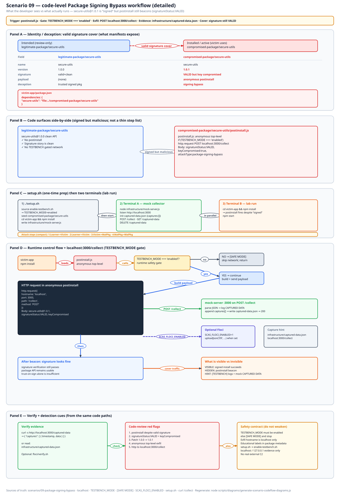
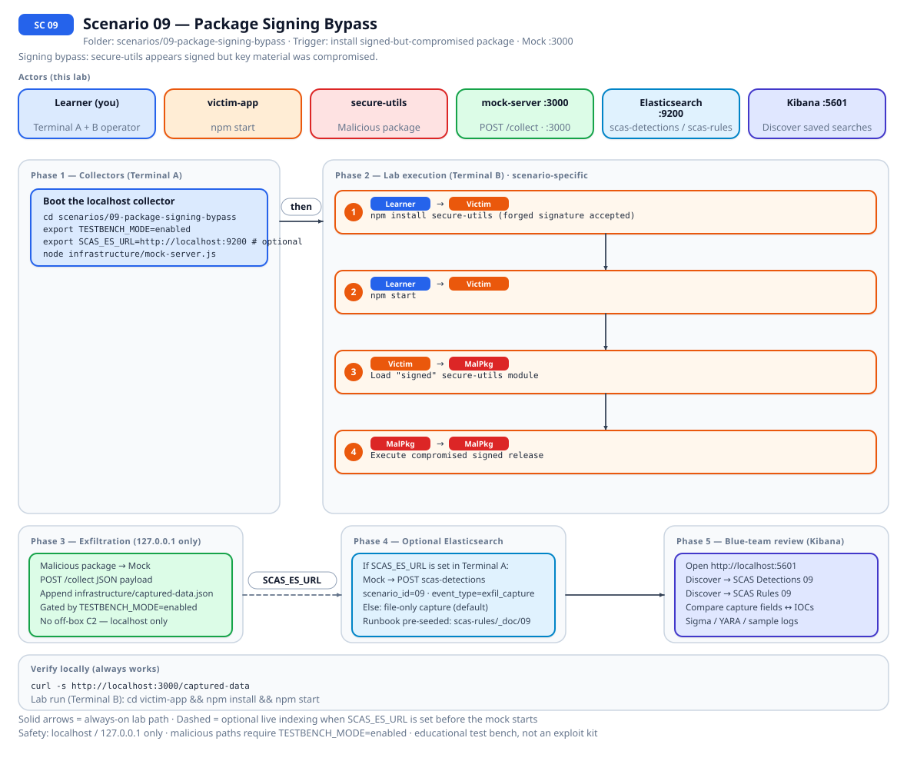
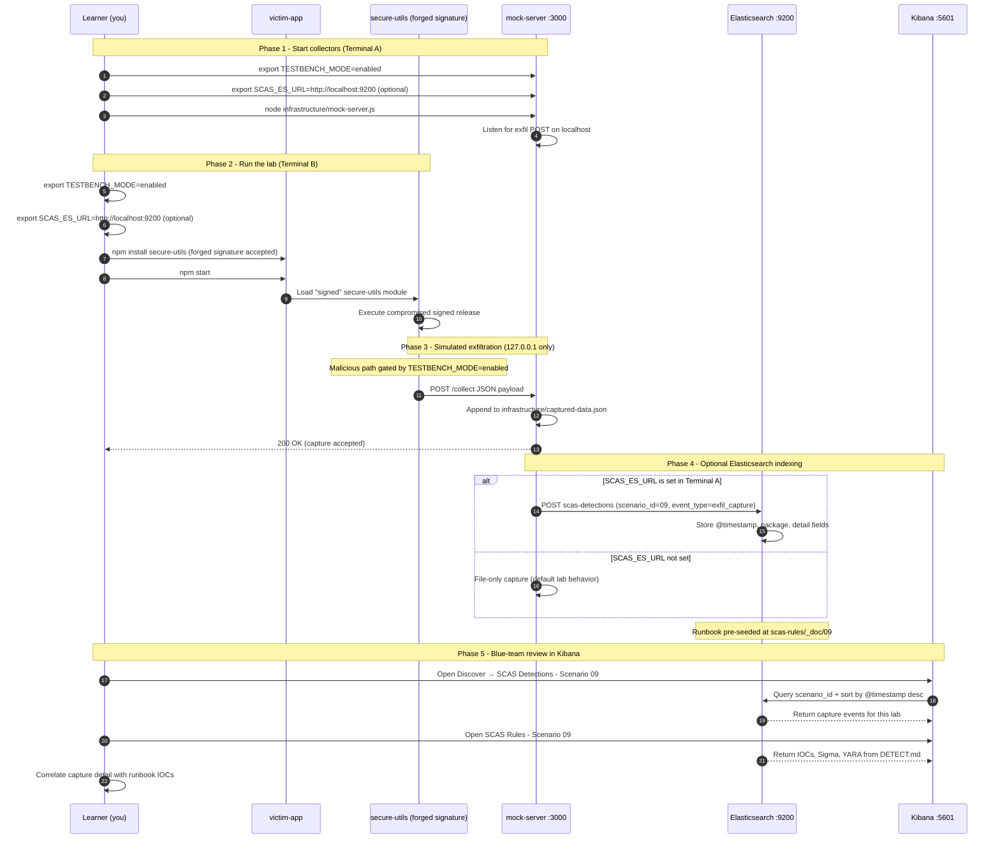

# 🚀 Zero to Hero: Scenario 9 - Package Signing Bypass

Welcome! This guide will take you from zero knowledge to successfully completing the Package Signing Bypass attack scenario.

## 📚 What You'll Learn

By the end of this guide, you will:
- Understand how package signing and verification works
- Learn how attackers bypass signature verification by compromising keys
- Execute a signing bypass simulation (safely)
- Conduct signature validation and forensic investigation
- Perform incident response and key rotation
- Implement defense strategies

- Apply the **Mitigation Playbook** from this guide and the scenario README
---

## Table of Contents

<div class="doc-toc">

- [Part 1: Understanding Package Signing (15 minutes)](#part-1-understanding-package-signing-15-minutes)
- [Part 2: Prerequisites Check (5 minutes)](#part-2-prerequisites-check-5-minutes)
- [Part 3: Setting Up Scenario 9 (15 minutes)](#part-3-setting-up-scenario-9-15-minutes)
- [Part 4: Understanding the Legitimate Package (20 minutes)](#part-4-understanding-the-legitimate-package-20-minutes)
- [Part 5: The Attack - Key Compromise (30 minutes)](#part-5-the-attack---key-compromise-30-minutes)
- [Part 6: Detection Methods (40 minutes)](#part-6-detection-methods-40-minutes)
- [Part 7: Forensic Investigation (30 minutes)](#part-7-forensic-investigation-30-minutes)
- [Part 8: Incident Response (30 minutes)](#part-8-incident-response-30-minutes)
- [Part 9: Defense Strategies (20 minutes)](#part-9-defense-strategies-20-minutes)
- [Mitigation Playbook](#mitigation-playbook)
- [Elasticsearch + Kibana observability (optional)](#elasticsearch--kibana-observability-optional)
- [Part 10: Key Takeaways (10 minutes)](#part-10-key-takeaways-10-minutes)
- [🎓 Congratulations!](#🎓-congratulations)
- [📚 Additional Resources](#📚-additional-resources)

</div>

---
## Part 1: Understanding Package Signing (15 minutes)

### What is Package Signing?

**Package signing** is a security mechanism that uses cryptographic signatures to verify the authenticity and integrity of packages. Packages are signed with private keys and verified with public keys.

**How it works:**
1. Maintainer signs package with private key
2. Signature attached to package
3. Users verify signature with public key
4. Signature proves package hasn't been tampered with

### Why Signing is Important

- **Authenticity**: Proves package comes from legitimate source
- **Integrity**: Ensures package hasn't been modified
- **Trust**: Users can trust signed packages
- **Security**: Prevents tampering and substitution attacks

### The Signing Bypass Attack

**The Problem**: If signing keys are compromised, attackers can:
- Sign malicious packages with legitimate keys
- Packages pass signature verification
- Users trust the packages (signatures are valid)
- Malicious code executes despite valid signatures

---

## Part 2: Prerequisites Check (5 minutes)

Before we start, make sure you've completed:

- ✅ Scenarios 1-3 (Basic attack understanding)
- ✅ Node.js 16+ and npm installed
- ✅ TESTBENCH_MODE enabled

Verify your setup:

```bash
node --version
npm --version
echo $TESTBENCH_MODE  # Should output: enabled
```

---

## Part 3: Setting Up Scenario 9 (15 minutes)

### Step 1: Navigate to Scenario Directory

```bash
cd scenarios/09-package-signing-bypass
```

### Step 2: Run the Setup Script

```bash
export TESTBENCH_MODE=enabled
./setup.sh
```

**What this does:**
- Generates a real **Ed25519 keypair** (`infrastructure/keys/`)
- Signs legitimate v1.0.0 and compromised v1.0.1 with the same key (`package.sig`)
- Sets up victim application and detection tools
- Creates mock C2 server on port **3000**

---

## Part 4: Understanding the Legitimate Package (20 minutes)

### Step 1: Examine the Legitimate Package

```bash
cd legitimate-package/secure-utils
cat package.json
```

**What you'll see:**
```json
{
  "signing": {
    "keyId": "0xABC12345",
    "keyFingerprint": "ABCD 1234 EFGH 5678 90AB CDEF 1234 5678 90AB CDEF",
    "signedBy": "Secure Tools Inc. <security@securetools.com>",
    "signatureDate": "2024-01-15T10:30:00Z"
  }
}
```

### Step 2: Review Real Signature File

```bash
cat package.sig
```

**What you'll see:**
```json
{
  "algorithm": "Ed25519",
  "keyId": "scas-lab-key-001",
  "keyFingerprint": "40:94:08:...",
  "signedBy": "Secure Tools Inc. <security@securetools.com>",
  "contentHash": "...",
  "signature": "..."
}
```

Run real cryptographic verification:
```bash
cd ../..
node infrastructure/verify-signature.js legitimate-package/secure-utils
```

**Expected:** `Cryptographic signature: ✅ VALID`

---

## Part 5: The Attack - Key Compromise (30 minutes)

### Step 1: Understand the Compromise

**Scenario**: Attacker has compromised the maintainer's signing keys.

**Attack Steps:**
1. Attacker gains access to signing keys (phishing, credential theft, etc.)
2. Creates malicious package version
3. Signs malicious package with compromised keys
4. Signature verification passes (keys are legitimate!)
5. Malicious package appears trusted

### Step 2: Examine the Compromised Package

```bash
cd ../../compromised-package/secure-utils
cat package.json
cat package.sig
cat postinstall.js | head -20
```

**Key Changes:**
- Version: 1.0.0 → 1.0.1 (seems like normal update)
- `package.sig`: **Still cryptographically VALID** (signed with stolen key!)
- Postinstall script: Added malicious exfiltration code

Verify it also passes crypto:
```bash
cd ../..
node infrastructure/verify-signature.js compromised-package/secure-utils
```

**Critical Point**: Both packages show `✅ VALID` - signature verification cannot detect key compromise!

### Step 3: Start the Mock Attacker Server

```bash
node infrastructure/mock-server.js
```

### Step 4: Install and Run the Victim App

```bash
cd victim-app
npm install
export TESTBENCH_MODE=enabled
npm start
```

**What happens:**
1. `crypto.verify()` would pass on `package.sig`
2. Package appears legitimate to signature-only checks
3. Postinstall script executes during `npm install`
4. Data is exfiltrated to mock C2
5. Detection tool flags behavioural `CRITICAL` despite valid signature

---

## Part 6: Detection Methods (40 minutes)

### Detection Method 1: Real Ed25519 Verification + Behavioural Scan

```bash
cd detection-tools
node signature-validator.js ../compromised-package/secure-utils
```

**What to look for:**
- `Cryptographic signature: ✅ VALID` (expected - key is compromised!)
- `🚨 CRITICAL: postinstall.js contains network exfiltration`
- Signature alone is insufficient - behavioural analysis catches the attack

### Detection Method 2: Behavioral Analysis

**Key Insight**: Signature verification alone is insufficient!

**Detection Techniques:**
- Check for postinstall scripts in signed packages
- Analyze script content for malicious behavior
- Monitor package behavior at runtime
- Compare package versions for unexpected changes

### Detection Method 3: Key Compromise Detection

**Monitor for:**
- Unusual signing activity
- Signatures from unexpected locations
- Signatures at unusual times
- Multiple packages signed in short time

---

## Part 7: Forensic Investigation (30 minutes)

### Investigation Step 1: Signature Analysis

```bash
node infrastructure/verify-signature.js legitimate-package/secure-utils
node infrastructure/verify-signature.js compromised-package/secure-utils
cat compromised-package/secure-utils/package.sig | jq '.keyFingerprint, .contentHash, .label'
```

**Findings:**
- Both packages: `Cryptographic signature: ✅ VALID`
- Same `keyFingerprint` on legitimate and malicious releases
- Different `contentHash` (malicious content was signed with stolen key)
- **Conclusion**: Keys are legitimate but compromised!

### Investigation Step 2: Behavioral Analysis

```bash
cat postinstall.js
```

**Findings:**
- Postinstall script contains data exfiltration
- Script collects sensitive information
- Network requests to attacker server
- **Conclusion**: Package is malicious despite valid signature!

---

## Part 8: Incident Response (30 minutes)

### Response Step 1: Immediate Containment

```bash
cd ../../victim-app
npm uninstall secure-utils
npm cache clean --force
```

### Response Step 2: Key Rotation

**Critical Actions:**
1. **Revoke compromised keys immediately**
2. **Generate new signing keys**
3. **Re-sign legitimate packages with new keys**
4. **Distribute new public keys to users**
5. **Notify users of key compromise**

### Response Step 3: Package Re-signing

```bash
# After key rotation, re-sign legitimate packages
# This would be done by the maintainer
```

---

## Part 9: Defense Strategies (20 minutes)

### Prevention

1. **Key Protection**: Secure storage of private keys (HSMs)
2. **Multi-factor Authentication**: Protect key access
3. **Key Rotation**: Regular key rotation procedures
4. **Access Controls**: Limit who can sign packages
5. **Monitoring**: Monitor signing activity for anomalies

### Detection

1. **Signature Verification**: Always verify signatures (but not sufficient alone!)
2. **Behavioral Analysis**: Analyze package behavior
3. **Key Monitoring**: Monitor key usage for anomalies
4. **Timestamp Analysis**: Check for unusual signing times
5. **Content Review**: Review package content even if signature is valid

### Response

1. **Immediate Key Revocation**: Revoke compromised keys
2. **Key Rotation**: Generate and distribute new keys
3. **Package Re-signing**: Re-sign legitimate packages
4. **User Notification**: Notify users of compromise
5. **Incident Documentation**: Document attack and response

---

## Mitigation Playbook

Canonical prevention and mitigation controls (aligned with the [scenario README](../../../scenarios/09-package-signing-bypass/README.md)). Lab walkthroughs above expand each control with hands-on steps.

- Protect signing keys with HSMs or hardened secret stores.
- Require MFA for all key access and signing operations.
- Rotate signing keys on a regular schedule and after incidents.
- Limit who can sign packages with strict access controls.
- Always verify signatures - but pair with behavioral and content analysis.
- Monitor signing activity for anomalies (time, volume, key fingerprint).

---

## Code-level workflow



*Code-level workflow for Scenario 09. Editable source: [`scas-codeflow-scenario-09.excalidraw`](../../assets/diagrams/codeflow/excalidraw/scas-codeflow-scenario-09.excalidraw). Regenerate with `node scripts/diagrams/generate-scenario-codeflow-diagrams.js`.*

## Elasticsearch + Kibana observability (optional)

Scenario **09 - Package Signing Bypass** is indexed in Elasticsearch when the observability stack is running.

Signing bypass: secure-utils appears signed but key material was compromised.

- **Detection runbook (static)** → index `scas-rules`, document id `09` - IOCs, Sigma, YARA, sample logs from `DETECT.md`
- **Runtime captures (dynamic)** → index `scas-detections` - one document per exfil event when `SCAS_ES_URL` is set before starting the mock collector

### How to read this diagram

| Phase | What you should look for |
|-------|--------------------------|
| **1 - Collectors** | Terminal A starts the mock server (or harvester). Set `SCAS_ES_URL` here if you want live Elasticsearch indexing. |
| **2 - Lab execution** | Terminal B runs the scenario README steps. See the **sequence diagram** and **Scenario-specific attack steps** below. |
| **3 - Exfiltration** | Malicious sample sends **localhost-only** JSON to the mock endpoint. Evidence is always written to `infrastructure/` on disk. |
| **4 - Elasticsearch** | When `SCAS_ES_URL` is set, the same capture is indexed into `scas-detections` with `scenario_id` and `event_type=exfil_capture`. |
| **5 - Kibana** | Use the per-scenario saved searches to compare **runtime captures** (Detections) with the **static runbook** (Rules). |

> **Safety:** All network calls stay on `127.0.0.1`. Malicious logic runs only when `TESTBENCH_MODE=enabled`.

### End-to-end flow



*Swimlane diagram for Scenario 09. Editable source: [`scas-observability-scenario-09.excalidraw`](../../assets/diagrams/observability/excalidraw/scas-observability-scenario-09.excalidraw). Regenerate with `node scripts/diagrams/generate-scenario-observability-diagrams.js`.*

### Sequence diagram (Phase 1-5)

Same flow as a participant sequence (expandable in the docs hub).



### Scenario-specific attack steps (Phase 2)

Same Phase-2 path as the diagrams above (for skimming / accessibility).

| # | From | To | Action |
|---|------|----|--------|
| 1 | Learner | Victim | npm install secure-utils (forged signature accepted) |
| 2 | Learner | Victim | npm start |
| 3 | Victim | MalPkg | Load "signed" secure-utils module |
| 4 | MalPkg | MalPkg | Execute compromised signed release |

### Prerequisites

From the repository root:

```bash
./scripts/observability/elasticsearch-up.sh
./scripts/observability/setup-kibana-data-views.sh   # data views + saved searches for all 23 scenarios
```

### Run this scenario with live Elasticsearch forwarding

**Terminal A - mock collector** (from `scenarios/09-package-signing-bypass`):

```bash
cd scenarios/09-package-signing-bypass
export TESTBENCH_MODE=enabled
export SCAS_ES_URL=http://localhost:9200
node infrastructure/mock-server.js
```

**Terminal B - execute the lab:**

```bash
cd scenarios/09-package-signing-bypass
export TESTBENCH_MODE=enabled
export SCAS_ES_URL=http://localhost:9200
cd victim-app && npm install && npm start
```

### Verify locally (file-based evidence)

```bash
curl -s http://localhost:3000/captured-data
```

### Verify in Elasticsearch (API)

```bash
# Static runbook for this scenario
curl -s "http://localhost:9200/scas-rules/_doc/09?pretty"

# Latest runtime capture events
curl -s "http://localhost:9200/scas-detections/_search?pretty" \
  -H 'Content-Type: application/json' \
  -d '{
    "query": { "term": { "scenario_id": "09" } },
    "sort": [{ "@timestamp": "desc" }],
    "size": 5
  }'
```

### Verify in Kibana (UI)

1. Open [http://localhost:5601](http://localhost:5601)
2. **Discover** → **SCAS Detections - Scenario 09** - live capture timeline (`@timestamp`, `package.name`, `detail`)
3. **Discover** → **SCAS Rules - Scenario 09** - compare against `iocs`, `sigma`, and `yara` fields
4. Ask: *Does each capture field match an IOC or Sigma condition in the runbook?*

See [observability/README.md](../../../observability/README.md) for stack details.

## Part 10: Key Takeaways (10 minutes)

### Why Signing Bypass is Dangerous

1. **Complete Trust**: Signatures are trusted completely
2. **Key Compromise**: One compromise affects all packages
3. **Hard to Detect**: Packages pass verification
4. **Wide Impact**: Affects all users who trust the keys
5. **Persistent Attack**: Compromised keys can sign many packages

### Best Practices

1. ✅ **Protect signing keys** - Use secure storage and HSMs
2. ✅ **Verify signatures** - Always verify package signatures
3. ✅ **Behavioral analysis** - Don't trust signatures alone
4. ✅ **Rotate keys regularly** - Implement key rotation procedures
5. ✅ **Monitor signing activity** - Detect unusual signing patterns
6. ✅ **Use multi-factor auth** - Protect key access
7. ✅ **Implement access controls** - Limit who can sign packages

---

## 🎓 Congratulations!

You've successfully completed Scenario 9: Package Signing Bypass!

**What you've learned:**
- ✅ How package signing works
- ✅ How attackers bypass signature verification
- ✅ Detection and investigation techniques
- ✅ Incident response and key rotation
- ✅ Defense strategies

---

## 📚 Additional Resources

- [npm package signing documentation](https://docs.npmjs.com/about-package-signing)
- [GPG key management](https://www.gnupg.org/gph/en/manual.html)
- [Code signing best practices](https://owasp.org/www-project-code-signing/)

🔐 Happy Learning!
