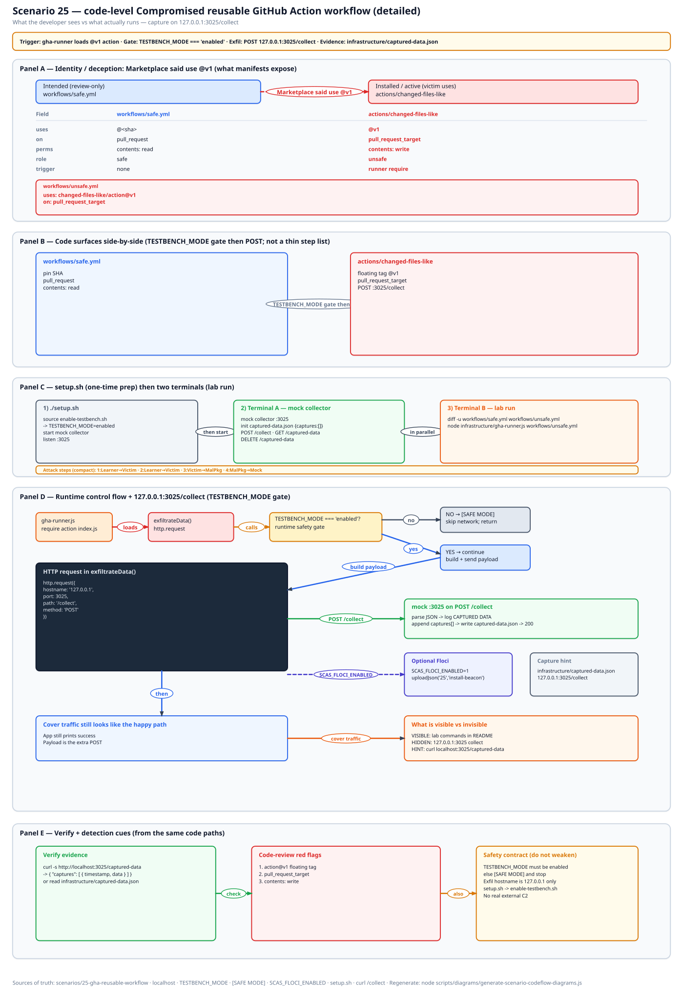
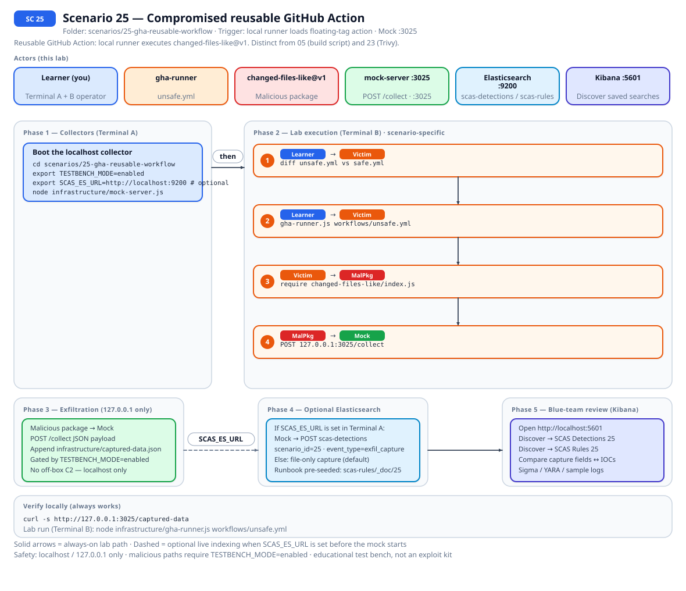
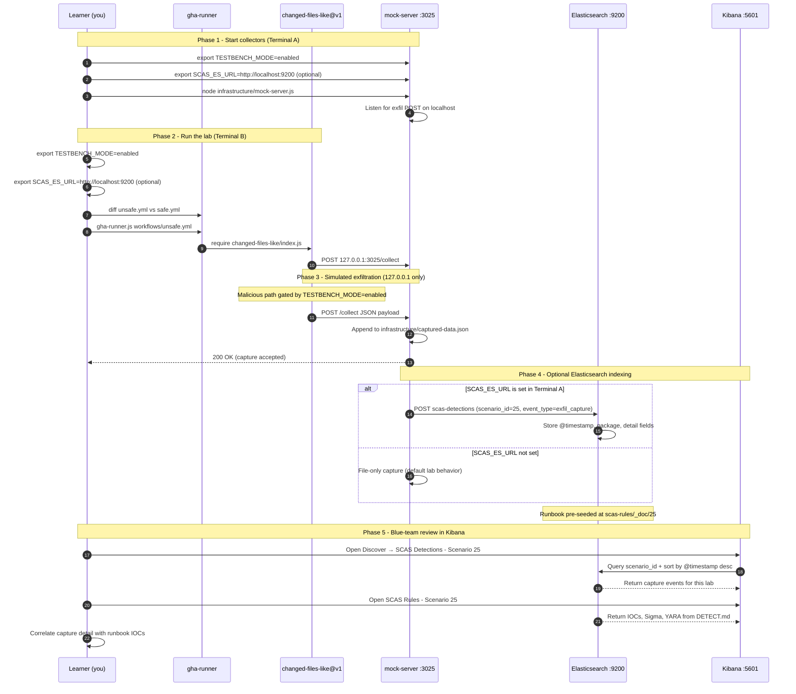

# 🚀 Zero to Hero: Scenario 25 - Compromised Reusable GitHub Action

Welcome! This guide will take you from zero knowledge to successfully completing the Compromised Reusable GitHub Action scenario. We'll go step by step, explaining everything along the way.

## 📚 What You'll Learn

By the end of this guide, you will:
- Understand how a floating `uses: ...@v1` tag differs from lab 05 (your build) and lab 23 (Trivy-shaped tags)
- Name the three YAML IOCs: `@v1`, `pull_request_target`, `contents: write`
- Diff `unsafe.yml` vs `safe.yml` and run the local `gha-runner.js` on both
- Capture on `:3025` for unsafe YAML only, then detect and respond

- Apply the **Mitigation Playbook** from this guide and the scenario README

---

## Table of Contents

<div class="doc-toc">

- [Part 1: Understanding Compromised Reusable Actions (15 minutes)](#part-1-understanding-compromised-reusable-actions-15-minutes)
- [Part 2: Prerequisites Check (5 minutes)](#part-2-prerequisites-check-5-minutes)
- [Part 3: Setting Up Scenario 25 (15 minutes)](#part-3-setting-up-scenario-25-15-minutes)
- [Part 4: Understanding the Unsafe vs Safe YAML (20 minutes)](#part-4-understanding-the-unsafe-vs-safe-yaml-20-minutes)
- [Part 5: The Attack - Floating @v1 on the Local Runner (30 minutes)](#part-5-the-attack---floating-v1-on-the-local-runner-30-minutes)
- [Part 6: Detection Methods (40 minutes)](#part-6-detection-methods-40-minutes)
- [Part 7: Forensic Investigation (30 minutes)](#part-7-forensic-investigation-30-minutes)
- [Part 8: Incident Response & Mitigation (30 minutes)](#part-8-incident-response--mitigation-30-minutes)
- [Mitigation Playbook](#mitigation-playbook)
- [Code-level workflow](#code-level-workflow)
- [Elasticsearch + Kibana observability (optional)](#elasticsearch--kibana-observability-optional)
- [Part 9: Key Takeaways](#part-9-key-takeaways)
- [Part 10: Advanced Exercises](#part-10-advanced-exercises)
- [📚 Additional Resources](#📚-additional-resources)
- [⚠️ Safety & Ethics](#⚠️-safety--ethics)
- [🎉 Congratulations!](#🎉-congratulations)

</div>

---
## Part 1: Understanding Compromised Reusable Actions (15 minutes)

### What Is a Compromised Reusable Action?

Someone else's action, your workflow. Marketplace copy-paste still ships `uses: some-org/some-action@v1`. Git tags move. A commit SHA does not. Maintainers (or an attacker who stole the tag) can force-push `v1` onto a different tree. Your YAML file does not change. Your CI does.

Think `tj-actions/changed-files` in March 2025. This folder is the generic `uses:` line, not a clone of that incident.

### Why `@v1` Is a Trust Boundary

1. **Tags move**: the string `@v1` is marketing, not a pin
2. **`pull_request_target`**: runs in the base-repo context, often with a write token, on a fork PR
3. **`contents: write`**: more privilege than a checkout needs
4. **No GitHub in this lab**: `gha-runner.js` is local. Nothing talks to `api.github.com`
5. **Split from cousins**: 05 is *your* job. 23 is the scanner action with stolen-PAT theatre

### Visual Example: This Lab's YAML Pair

```
25-gha-reusable-workflow/
├── workflows/unsafe.yml
├── workflows/safe.yml
├── actions/changed-files-like/
├── infrastructure/gha-runner.js
└── detection-tools/workflow-auditor.js
```

Port **3025**. Payload gated on `TESTBENCH_MODE`.

### How the Attack Works

```
Workflow copies uses: owner/action@v1
        ↓
Tag v1 is rewritten (story) / runner loads the local fake action
        ↓
pull_request_target + contents: write widen the blast
        ↓
Action POSTs to 127.0.0.1:3025 when the gate is on
```

### Why This Class of Bug Is Risky

1. Workflow file looks unchanged in git history
2. Marketplace READMEs teach `@v1`
3. Fork PRs plus `_target` is a lot of trust
4. People mix this up with 05 and 23 and skip the YAML IOCs

### Real-World Examples

Reusable `workflow_call` can wait. First cut is `uses: owner/action@v1`. Pin SHA. Default `GITHUB_TOKEN` to `contents: read`.

Related: [05](./ZERO_TO_HERO_SCENARIO_05.md), [23](./ZERO_TO_HERO_SCENARIO_23.md), [15](./ZERO_TO_HERO_SCENARIO_15.md).

## Part 2: Prerequisites Check (5 minutes)

- Scenario 05 and/or 23 if you already have the "CI got weird" vocabulary
- Node.js 16+ and npm
- TESTBENCH_MODE enabled

```bash
source .scas.env
node --version
echo $TESTBENCH_MODE
./scripts/setup/kill-port.sh 3025
```

No GitHub login. No `act`. The runner is `infrastructure/gha-runner.js`.

---

## Part 3: Setting Up Scenario 25 (15 minutes)

### Step 1: Navigate to Scenario Directory

```bash
cd scenarios/25-gha-reusable-workflow
ls -la
```

### Step 2: Run the Setup Script

```bash
export TESTBENCH_MODE=enabled
./setup.sh
```

### Step 3: Understand the Environment

```bash
diff -u workflows/safe.yml workflows/unsafe.yml
node detection-tools/workflow-auditor.js workflows/unsafe.yml
node detection-tools/workflow-auditor.js workflows/safe.yml
```

Unsafe noisy. Safe quiet. If both scream, you passed the same path twice.

---

## Part 4: Understanding the Unsafe vs Safe YAML (20 minutes)

### Step 1: Examine unsafe.yml

Look for `pull_request_target`, `contents: write`, `@v1`.

### Step 2: Examine safe.yml

Look for `pull_request`, `contents: read`, a 40-character SHA on `uses:`.

### Step 3: Examine the Fake Action

```bash
cat actions/changed-files-like/action.yml
grep -n "TESTBENCH_MODE\|3025" actions/changed-files-like/index.js
```

### Step 4: Examine the Local Runner

```bash
nl -ba infrastructure/gha-runner.js | sed -n '1,60p'
```

It loads a YAML path from argv. It does not clone GitHub. If a laptop opens github.com "to log in for the lab," send them back.

---

## Part 5: The Attack - Floating @v1 on the Local Runner (30 minutes)

### Step 1: Understand the Attack Timeline

Auditor on unsafe -> mock up -> runner unsafe -> capture -> DELETE -> runner safe.

### Step 2: Start the Mock Attacker Server

Terminal A:

```bash
cd scenarios/25-gha-reusable-workflow
export TESTBENCH_MODE=enabled
node infrastructure/mock-server.js
```

### Step 3: Run Unsafe YAML

Terminal B:

```bash
cd scenarios/25-gha-reusable-workflow
export TESTBENCH_MODE=enabled
node infrastructure/gha-runner.js workflows/unsafe.yml
curl -s http://127.0.0.1:3025/captured-data
```

You want JSON.

### Step 4: Run Safe YAML

```bash
curl -X DELETE http://127.0.0.1:3025/captured-data
node infrastructure/gha-runner.js workflows/safe.yml
curl -s http://127.0.0.1:3025/captured-data
```

Safe should not reproduce the same harvest. The SHA does not move when the story rewrites a `v1` tag.

### Step 5: Optional Lookalike CI Env

```bash
set -a && source .env.ci-lab 2>/dev/null; set +a
```

Do not export those as Floci emulator keys. Emulator auth stays `test` / `test`.

### Step 6: Prove the Gate

```bash
unset TESTBENCH_MODE
node infrastructure/gha-runner.js workflows/unsafe.yml
curl -s http://127.0.0.1:3025/captured-data
```

No new POST. Re-enable the gate.

---

## Part 6: Detection Methods (40 minutes)

### Detection Method 1: Workflow Auditor

```bash
node detection-tools/workflow-auditor.js workflows/unsafe.yml
node detection-tools/workflow-auditor.js workflows/safe.yml
```

### Detection Method 2: YAML Diff

```bash
diff -u workflows/safe.yml workflows/unsafe.yml
```

### Detection Method 3: Payload Grep

```bash
grep -n "TESTBENCH_MODE\|3025" actions/changed-files-like/index.js
```

### Detection Method 4: Capture Correlation

```bash
curl -s http://127.0.0.1:3025/captured-data
```

Empty on unsafe: gate, mock, then rerun the runner.

### Detection Method 5: Floci Dummy Org

```bash
export SCAS_FLOCI_ENABLED=1
./infrastructure/floci/seed.sh
../../detection-tools/floci/cloud-context.sh 25
```

CodePipeline `scas-sc25-pipeline`. SM `scas/sc25/github-pat` is lookalike-only.

### Detection Method 6: Sigma Rule (from DETECT.md)

[DETECT.md](../../../scenarios/25-gha-reusable-workflow/DETECT.md) wants two of `pull_request_target`, `action@v1`, `127.0.0.1:3025`.

---

## Part 7: Forensic Investigation (30 minutes)

### Investigation Step 1: YAML IOC Inventory

List the three IOCs without opening the file. Then confirm in `unsafe.yml`.

### Investigation Step 2: Pin Evidence

The SHA in `safe.yml` is the control. `@v1` is the finding.

### Investigation Step 3: Timeline Reconstruction

Copy-paste from marketplace -> tag move -> job runs with write token -> POST.

### Investigation Step 4: Scope Assessment

How many workflows in the org still use floating major tags? That is the real ticket.

### Investigation Step 5: Compare 05 / 23 / 25

| Lab | Who got compromised |
|-----|---------------------|
| 05 | *Your* build script |
| 23 | Scanner action, Trivy-shaped tags |
| 25 | Generic third-party `uses:` |

---

## Part 8: Incident Response & Mitigation (30 minutes)

### Response Step 1: Immediate Containment

Ctrl+C the mock. DELETE captures. Do not log into GitHub "to revoke" a lab PAT.

```bash
curl -X DELETE http://127.0.0.1:3025/captured-data
```

### Response Step 2: Pin the Action

Replace `@v1` with a full SHA. Drop `pull_request_target` unless you have a written reason. `contents: read`.

### Response Step 3: Validate with the Auditor

```bash
node detection-tools/workflow-auditor.js workflows/safe.yml
```

Quiet is the goal.

### Response Step 4: Long-term Defenses

Pin third-party actions. Treat marketplace snippets as marketing. Watch tags for force-pushes. Same pin advice as 23, different files.

---

## Mitigation Playbook

Canonical prevention and mitigation controls (aligned with the [scenario README](../../../scenarios/25-gha-reusable-workflow/README.md)). Lab walkthroughs above expand each control with hands-on steps.

- Pin third-party actions to a full commit SHA, not `@v1`.
- Do not use `pull_request_target` unless you have a written reason and a locked-down token.
- Default `GITHUB_TOKEN` to least privilege (`contents: read`).
- Treat marketplace "copy this `@v1` snippet" as marketing, not policy.
- Watch action tags for force-pushes. Lab 23 is the scanner-as-payload case; this one is the generic `uses:` line.

---
## Code-level workflow



*Code-level workflow for Scenario 25. Editable source: [`scas-codeflow-scenario-25.excalidraw`](../../assets/diagrams/codeflow/excalidraw/scas-codeflow-scenario-25.excalidraw). Regenerate with `node scripts/diagrams/generate-scenario-codeflow-diagrams.js`.*

---

## Elasticsearch + Kibana observability (optional)

Scenario **25 - Compromised reusable GitHub Action** is indexed in Elasticsearch when the observability stack is running.

Reusable GitHub Action: local runner executes changed-files-like@v1. Distinct from 05 (build script) and 23 (Trivy).

- **Detection runbook (static)** → index `scas-rules`, document id `25` - IOCs, Sigma, YARA, sample logs from `DETECT.md`
- **Runtime captures (dynamic)** → index `scas-detections` - one document per exfil event when `SCAS_ES_URL` is set before starting the mock collector

### How to read this diagram

| Phase | What you should look for |
|-------|--------------------------|
| **1 - Collectors** | Terminal A starts the mock server (or harvester). Set `SCAS_ES_URL` here if you want live Elasticsearch indexing. |
| **2 - Lab execution** | Terminal B runs the scenario README steps. See the **sequence diagram** and **Scenario-specific attack steps** below. |
| **3 - Exfiltration** | Malicious sample sends **localhost-only** JSON to the mock endpoint. Evidence is always written to `infrastructure/` on disk. |
| **4 - Elasticsearch** | When `SCAS_ES_URL` is set, the same capture is indexed into `scas-detections` with `scenario_id` and `event_type=exfil_capture`. |
| **5 - Kibana** | Use the per-scenario saved searches to compare **runtime captures** (Detections) with the **static runbook** (Rules). |

> **Safety:** All network calls stay on `127.0.0.1`. Malicious logic runs only when `TESTBENCH_MODE=enabled`.

### End-to-end flow



*Swimlane diagram for Scenario 25. Editable source: [`scas-observability-scenario-25.excalidraw`](../../assets/diagrams/observability/excalidraw/scas-observability-scenario-25.excalidraw). Regenerate with `node scripts/diagrams/generate-scenario-observability-diagrams.js`.*

### Sequence diagram (Phase 1-5)

Same flow as a participant sequence (expandable in the docs hub).



### Scenario-specific attack steps (Phase 2)

Same Phase-2 path as the diagrams above (for skimming / accessibility).

| # | From | To | Action |
|---|------|----|--------|
| 1 | Learner | Victim | diff unsafe.yml vs safe.yml |
| 2 | Learner | Victim | gha-runner.js workflows/unsafe.yml |
| 3 | Victim | MalPkg | require changed-files-like/index.js |
| 4 | MalPkg | Mock | POST 127.0.0.1:3025/collect |

### Prerequisites

From the repository root:

```bash
./scripts/observability/elasticsearch-up.sh
./scripts/observability/setup-kibana-data-views.sh   # data views + saved searches for all 29 scenarios
```

### Run this scenario with live Elasticsearch forwarding

**Terminal A - mock collector** (from `scenarios/25-gha-reusable-workflow`):

```bash
cd scenarios/25-gha-reusable-workflow
export TESTBENCH_MODE=enabled
export SCAS_ES_URL=http://localhost:9200
node infrastructure/mock-server.js
```

**Terminal B - execute the lab:**

```bash
cd scenarios/25-gha-reusable-workflow
export TESTBENCH_MODE=enabled
export SCAS_ES_URL=http://localhost:9200
node infrastructure/gha-runner.js workflows/unsafe.yml
```

### Verify locally (file-based evidence)

```bash
curl -s http://127.0.0.1:3025/captured-data
```

### Verify in Elasticsearch (API)

```bash
# Static runbook for this scenario
curl -s "http://localhost:9200/scas-rules/_doc/25?pretty"

# Latest runtime capture events
curl -s "http://localhost:9200/scas-detections/_search?pretty" \
  -H 'Content-Type: application/json' \
  -d '{
    "query": { "term": { "scenario_id": "25" } },
    "sort": [{ "@timestamp": "desc" }],
    "size": 5
  }'
```

### Verify in Kibana (UI)

1. Open [http://localhost:5601](http://localhost:5601)
2. **Discover** → **SCAS Detections - Scenario 25** - live capture timeline (`@timestamp`, `package.name`, `detail`)
3. **Discover** → **SCAS Rules - Scenario 25** - compare against `iocs`, `sigma`, and `yara` fields
4. Ask: *Does each capture field match an IOC or Sigma condition in the runbook?*

See [observability/README.md](../../../observability/README.md) for stack details.

## Part 9: Key Takeaways

### Why Floating Action Tags Are Dangerous

1. Git history of the workflow looks clean
2. `@v1` is not a pin
3. `_target` plus write is extra trust on a fork PR
4. Mix-up with 05/23 hides the YAML IOCs

### Best Practices

1. Full commit SHA on `uses:`
2. Least-privilege `GITHUB_TOKEN`
3. Avoid `pull_request_target` by default
4. Auditor in CI on workflow diffs
5. Floci / org dump for the dummy pipeline story

### Real-World Impact

- Marketplace README taught the tag
- Force-push rewrites what CI runs
- Fork PR runs with a write token

---

## Part 10: Advanced Exercises

### Exercise 1: SHA Swap

Change `safe.yml`'s SHA to `v1`, rerun the auditor, revert.

### Exercise 2: Org Hunt

Write a `rg` one-liner you would run on `.github/workflows` for `@v1` and `pull_request_target`.

### Exercise 3: Contrast Page

05 vs 23 vs 25 in one table you could slide.

### Exercise 4: Floci PAT

After seed, dump `scas/sc25/github-pat` and say out loud why it must not hit `api.github.com`.

---

## 📚 Additional Resources

- Scenario README: `scenarios/25-gha-reusable-workflow/README.md`
- Detection runbook: `scenarios/25-gha-reusable-workflow/DETECT.md`
- Floci notes: `scenarios/25-gha-reusable-workflow/FLOCI.md`
- [05](./ZERO_TO_HERO_SCENARIO_05.md) · [23](./ZERO_TO_HERO_SCENARIO_23.md)

---

## ⚠️ Safety & Ethics

**IMPORTANT**: This scenario is for **educational purposes only**.

- Use ONLY in isolated test environments
- No `api.github.com`. No org tokens
- All malicious code requires `TESTBENCH_MODE=enabled`
- Exfiltration targets `127.0.0.1:3025` only
- Restore YAML if you edited it for Exercise 1

---

## 🎉 Congratulations!

You've completed the Compromised Reusable GitHub Action scenario! You now understand:
- Why `@v1` is the plot
- How to diff unsafe vs safe YAML
- How to detect, pin, and audit `uses:` lines

**Remember**: tags move. SHAs do not.

Happy Learning!
