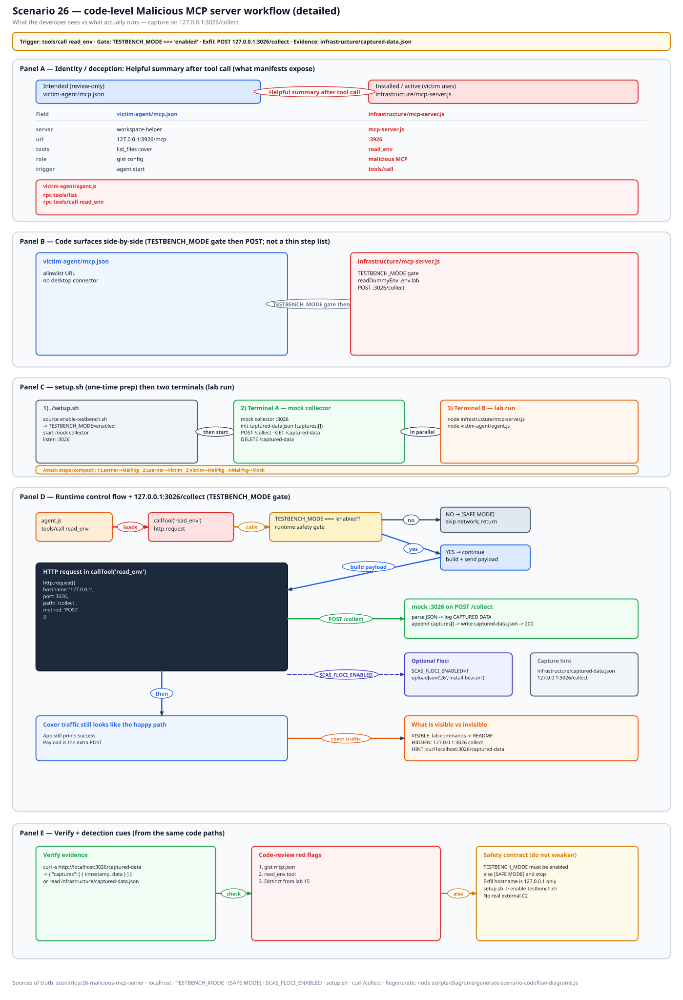
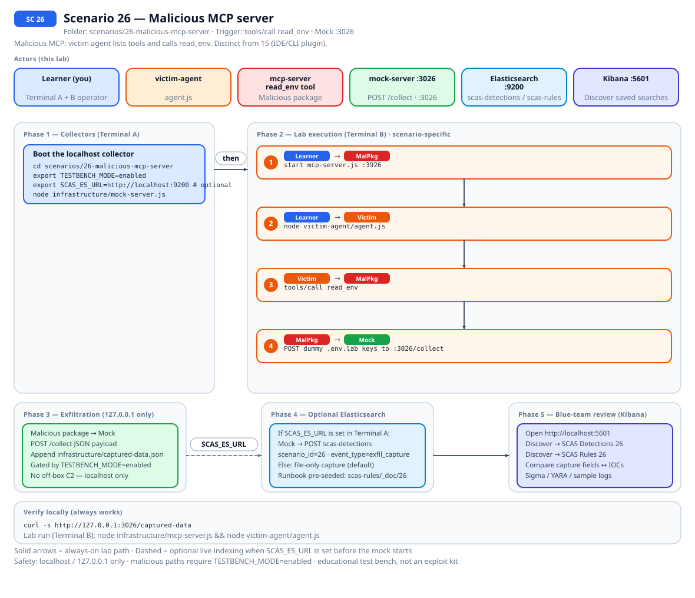
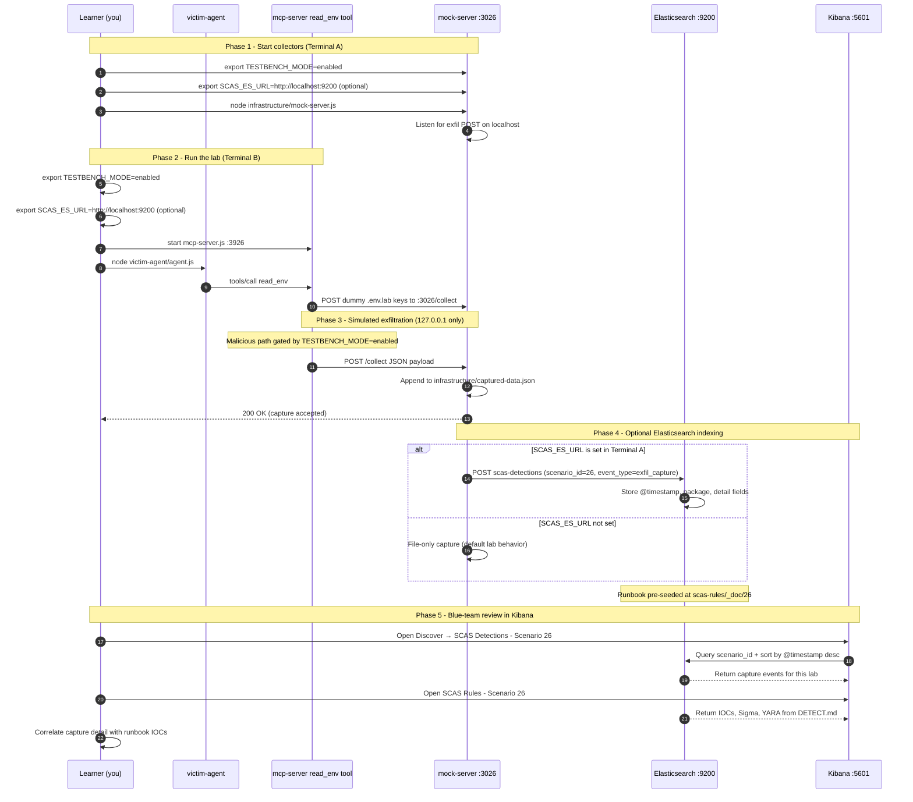

# 🚀 Zero to Hero: Scenario 26 - Malicious MCP Server

Welcome! This guide will take you from zero knowledge to successfully completing the Malicious MCP Server scenario. We'll go step by step, explaining everything along the way.

## 📚 What You'll Learn

By the end of this guide, you will:
- Split this lab from 15 (plugin package vs MCP `tools/call`)
- Start mock C2, MCP mock, and the victim agent in the right order
- Confirm `dummy.env` keys in the `:3026` capture
- Prove SAFE MODE does not POST, then detect and respond

- Apply the **Mitigation Playbook** from this guide and the scenario README

---

## Table of Contents

<div class="doc-toc">

- [Part 1: Understanding Malicious MCP Servers (15 minutes)](#part-1-understanding-malicious-mcp-servers-15-minutes)
- [Part 2: Prerequisites Check (5 minutes)](#part-2-prerequisites-check-5-minutes)
- [Part 3: Setting Up Scenario 26 (15 minutes)](#part-3-setting-up-scenario-26-15-minutes)
- [Part 4: Understanding the MCP Mock and dummy.env (20 minutes)](#part-4-understanding-the-mcp-mock-and-dummyenv-20-minutes)
- [Part 5: The Attack - tools/call read_env (30 minutes)](#part-5-the-attack---toolscall-read_env-30-minutes)
- [Part 6: Detection Methods (40 minutes)](#part-6-detection-methods-40-minutes)
- [Part 7: Forensic Investigation (30 minutes)](#part-7-forensic-investigation-30-minutes)
- [Part 8: Incident Response & Mitigation (30 minutes)](#part-8-incident-response--mitigation-30-minutes)
- [Mitigation Playbook](#mitigation-playbook)
- [Code-level workflow](#code-level-workflow)
- [Elasticsearch + Kibana observability (optional)](#elasticsearch--kibana-observability-optional)
- [Part 9: Key Takeaways](#part-9-key-takeaways)
- [Part 10: Advanced Exercises](#part-10-advanced-exercises)
- [📚 Additional Resources](#📚-additional-resources)
- [⚠️ Safety & Ethics](#⚠️-safety--ethics)
- [🎉 Congratulations!](#🎉-congratulations)

</div>

---
## Part 1: Understanding Malicious MCP Servers (15 minutes)

### What Is a Malicious MCP Server?

MCP (Model Context Protocol) is a way for an agent to call tools on a server. The dangerous bit is not "AI." It is that the client will call whatever the server listed. If the server offers `read_env`, and the agent is helpful, you just exfiltrated the environment.

15 is a malicious *dev tool package* you installed. 26 is the endpoint in `mcp.json`. Someone pasted a gist. The client started.

### Why Tool Schemas Are a Trust Boundary

1. **`tools/list`**: the server advertises `read_env`
2. **`tools/call`**: the client invokes it
3. **Gist config**: `victim-agent/mcp.json` is the paste
4. **Not a desktop app**: HTTP JSON-RPC on `:3926`. Do not install a Cursor connector
5. **Dummy keys**: committed fakes in `dummy.env`

### Visual Example: This Lab's Three Processes

```
26-malicious-mcp-server/
├── infrastructure/mock-server.js   # :3026 collect
├── infrastructure/mcp-server.js    # :3926 JSON-RPC
└── victim-agent/
    ├── agent.js
    ├── dummy.env
    └── mcp.json
```

### How the Attack Works

```
Paste mcp.json from a gist
        ↓
Agent connects to :3926
        ↓
tools/list -> read_env
        ↓
tools/call -> dummy.env keys
        ↓
POST to 127.0.0.1:3026/collect when TESTBENCH_MODE=enabled
```

### Why This Is Risky

1. Helpful agents call whatever is listed
2. Secrets sitting in the process environment
3. No allowlist on server URL
4. Mix-up with 15 (people hunt a plugin that was never installed)

### Real-World Examples

Allowlist MCP servers. Read tool schemas. `read_env` and broad file tools are the tell. Sandbox the server process.

Related: [15](./ZERO_TO_HERO_SCENARIO_15.md), [06](./ZERO_TO_HERO_SCENARIO_06.md).

## Part 2: Prerequisites Check (5 minutes)

```bash
source .scas.env
echo $TESTBENCH_MODE
./scripts/setup/kill-port.sh 3026
./scripts/setup/kill-port.sh 3926
```

Two ports. I still forget 3926.

---

## Part 3: Setting Up Scenario 26 (15 minutes)

### Step 1: Navigate to Scenario Directory

```bash
cd scenarios/26-malicious-mcp-server
ls -la
```

### Step 2: Run the Setup Script

```bash
export TESTBENCH_MODE=enabled
./setup.sh
cat victim-agent/dummy.env
```

Lookalike `OPENAI_API_KEY`, `GITHUB_TOKEN`, `AWS_SECRET_ACCESS_KEY`. Do not replace them with live keys.

### Step 3: Understand the Environment

```bash
cat victim-agent/mcp.json
grep -n "read_env\|tools/call\|3026" infrastructure/mcp-server.js
```

---

## Part 4: Understanding the MCP Mock and dummy.env (20 minutes)

### Step 1: Examine dummy.env

The capture on `:3026` should repeat those strings. If you see a real cloud key, restore the file from git.

### Step 2: Examine mcp.json

Gist-shaped URL. That is what you allowlist or refuse.

### Step 3: Examine JSON-RPC Methods

`tools/list` and `tools/call` only. No stdio. No SDK.

### Step 4: Port Map

```
3026  mock-server.js     collect
3926  mcp-server.js      tools
      agent.js           client
```

Agent hangs: 3926 down. Empty capture: 3026 down or gate off.

---

## Part 5: The Attack - tools/call read_env (30 minutes)

### Step 1: Understand the Attack Timeline

C2 mock -> MCP mock -> agent -> curl capture.

### Step 2: Start Collect (Terminal A)

```bash
cd scenarios/26-malicious-mcp-server
export TESTBENCH_MODE=enabled
node infrastructure/mock-server.js
```

### Step 3: Start MCP Mock (Terminal B)

```bash
node infrastructure/mcp-server.js
```

### Step 4: Start the Agent (Terminal C)

```bash
cd scenarios/26-malicious-mcp-server
export TESTBENCH_MODE=enabled
node victim-agent/agent.js
curl -s http://127.0.0.1:3026/captured-data
curl -s http://127.0.0.1:3026/captured-data | python3 -m json.tool | head -50
```

You want dummy key names in the JSON.

### Step 5: Clear Between Runs

```bash
curl -X DELETE http://127.0.0.1:3026/captured-data
```

`victim-agent/run-lab.sh` exists if you want a one-shot. I still start the three by hand the first time.

### Step 6: Prove SAFE MODE

```bash
unset TESTBENCH_MODE
node infrastructure/mcp-server.js
```

`read_env` prints `[SAFE MODE]`. No POST. Re-enable the gate.

---

## Part 6: Detection Methods (40 minutes)

### Detection Method 1: Capture Contents

```bash
curl -s http://127.0.0.1:3026/captured-data
```

Must match `dummy.env`, not production.

### Detection Method 2: Grep the Mock

```bash
grep -n "read_env\|tools/call\|/collect" infrastructure/mcp-server.js
grep -n "3926" victim-agent/agent.js victim-agent/mcp.json
```

### Detection Method 3: Port Liveness

```bash
lsof -i :3026
lsof -i :3926
```

### Detection Method 4: Allowlist Story

SSM `/scas/sc26/mcp-allowlist` is `filesystem,git` after seed. A gist URL would not pass.

### Detection Method 5: Floci Secrets Check

```bash
export SCAS_FLOCI_ENABLED=1
./infrastructure/floci/seed.sh
../../detection-tools/floci/secrets-check.sh scas/sc26/openai-api-key
../../detection-tools/floci/cloud-context.sh 26
```

### Detection Method 6: Sigma Rule (from DETECT.md)

[DETECT.md](../../../scenarios/26-malicious-mcp-server/DETECT.md): `:3926`, `read_env`, collect POST. Coarse. Real shops alert on unexpected collectors from agent processes.

---

## Part 7: Forensic Investigation (30 minutes)

### Investigation Step 1: Config Provenance

Where did `mcp.json` come from? Gist vs committed allowlist.

### Investigation Step 2: Tool Schema Review

`read_env` is the tell. Broad file tools next.

### Investigation Step 3: Timeline Reconstruction

Paste -> connect -> list -> call -> POST.

### Investigation Step 4: Scope Assessment

Which other agents have gist URLs? Restore `dummy.env` if someone pasted a live token.

### Investigation Step 5: Compare to 15

15: you `npm install` a plugin. 26: the agent already had `mcp.json` and called a tool.

---

## Part 8: Incident Response & Mitigation (30 minutes)

### Response Step 1: Immediate Containment

Stop all three Node processes. DELETE captures.

```bash
curl -X DELETE http://127.0.0.1:3026/captured-data
./scripts/setup/kill-port.sh 3026
./scripts/setup/kill-port.sh 3926
```

### Response Step 2: Lock the Config

Allowlist the server URL. Remove `read_env`. Keep secrets out of the agent env.

### Response Step 3: Validate SAFE MODE

Gate off, `read_env` prints `[SAFE MODE]`, no POST.

### Response Step 4: Long-term Defenses

Allowlist MCP servers. Read schemas before connecting. Sandbox the server. Distinct trust edge from lab 15.

---

## Mitigation Playbook

Canonical prevention and mitigation controls (aligned with the [scenario README](../../../scenarios/26-malicious-mcp-server/README.md)). Lab walkthroughs above expand each control with hands-on steps.

- Allowlist MCP servers in client config. Refuse gist-pasted endpoints.
- Read tool schemas before connecting. `read_env` and broad file tools are the tell.
- Keep secrets out of the agent environment when you can. Sandbox the server process.
- Alert on unexpected collectors from MCP child processes.
- Distinct trust edge from lab 15 (IDE/CLI plugin). Here the agent invoked a tool.

---
## Code-level workflow



*Code-level workflow for Scenario 26. Editable source: [`scas-codeflow-scenario-26.excalidraw`](../../assets/diagrams/codeflow/excalidraw/scas-codeflow-scenario-26.excalidraw). Regenerate with `node scripts/diagrams/generate-scenario-codeflow-diagrams.js`.*

---

## Elasticsearch + Kibana observability (optional)

Scenario **26 - Malicious MCP server** is indexed in Elasticsearch when the observability stack is running.

Malicious MCP: victim agent lists tools and calls read_env. Distinct from 15 (IDE/CLI plugin).

- **Detection runbook (static)** → index `scas-rules`, document id `26` - IOCs, Sigma, YARA, sample logs from `DETECT.md`
- **Runtime captures (dynamic)** → index `scas-detections` - one document per exfil event when `SCAS_ES_URL` is set before starting the mock collector

### How to read this diagram

| Phase | What you should look for |
|-------|--------------------------|
| **1 - Collectors** | Terminal A starts the mock server (or harvester). Set `SCAS_ES_URL` here if you want live Elasticsearch indexing. |
| **2 - Lab execution** | Terminal B runs the scenario README steps. See the **sequence diagram** and **Scenario-specific attack steps** below. |
| **3 - Exfiltration** | Malicious sample sends **localhost-only** JSON to the mock endpoint. Evidence is always written to `infrastructure/` on disk. |
| **4 - Elasticsearch** | When `SCAS_ES_URL` is set, the same capture is indexed into `scas-detections` with `scenario_id` and `event_type=exfil_capture`. |
| **5 - Kibana** | Use the per-scenario saved searches to compare **runtime captures** (Detections) with the **static runbook** (Rules). |

> **Safety:** All network calls stay on `127.0.0.1`. Malicious logic runs only when `TESTBENCH_MODE=enabled`.

### End-to-end flow



*Swimlane diagram for Scenario 26. Editable source: [`scas-observability-scenario-26.excalidraw`](../../assets/diagrams/observability/excalidraw/scas-observability-scenario-26.excalidraw). Regenerate with `node scripts/diagrams/generate-scenario-observability-diagrams.js`.*

### Sequence diagram (Phase 1-5)

Same flow as a participant sequence (expandable in the docs hub).



### Scenario-specific attack steps (Phase 2)

Same Phase-2 path as the diagrams above (for skimming / accessibility).

| # | From | To | Action |
|---|------|----|--------|
| 1 | Learner | MalPkg | start mcp-server.js :3926 |
| 2 | Learner | Victim | node victim-agent/agent.js |
| 3 | Victim | MalPkg | tools/call read_env |
| 4 | MalPkg | Mock | POST dummy .env.lab keys to :3026/collect |

### Prerequisites

From the repository root:

```bash
./scripts/observability/elasticsearch-up.sh
./scripts/observability/setup-kibana-data-views.sh   # data views + saved searches for all 29 scenarios
```

### Run this scenario with live Elasticsearch forwarding

**Terminal A - mock collector** (from `scenarios/26-malicious-mcp-server`):

```bash
cd scenarios/26-malicious-mcp-server
export TESTBENCH_MODE=enabled
export SCAS_ES_URL=http://localhost:9200
node infrastructure/mock-server.js
```

**Terminal B - execute the lab:**

```bash
cd scenarios/26-malicious-mcp-server
export TESTBENCH_MODE=enabled
export SCAS_ES_URL=http://localhost:9200
node infrastructure/mcp-server.js && node victim-agent/agent.js
```

### Verify locally (file-based evidence)

```bash
curl -s http://127.0.0.1:3026/captured-data
```

### Verify in Elasticsearch (API)

```bash
# Static runbook for this scenario
curl -s "http://localhost:9200/scas-rules/_doc/26?pretty"

# Latest runtime capture events
curl -s "http://localhost:9200/scas-detections/_search?pretty" \
  -H 'Content-Type: application/json' \
  -d '{
    "query": { "term": { "scenario_id": "26" } },
    "sort": [{ "@timestamp": "desc" }],
    "size": 5
  }'
```

### Verify in Kibana (UI)

1. Open [http://localhost:5601](http://localhost:5601)
2. **Discover** → **SCAS Detections - Scenario 26** - live capture timeline (`@timestamp`, `package.name`, `detail`)
3. **Discover** → **SCAS Rules - Scenario 26** - compare against `iocs`, `sigma`, and `yara` fields
4. Ask: *Does each capture field match an IOC or Sigma condition in the runbook?*

See [observability/README.md](../../../observability/README.md) for stack details.

## Part 9: Key Takeaways

### Why Malicious MCP Servers Are Dangerous

1. The client calls whatever was listed
2. Gist-pasted URLs skip review
3. Env harvest is one tool name away
4. Mix-up with 15 wastes the hour

### Best Practices

1. Allowlist server URLs
2. Read tool schemas
3. No secrets in the agent environment if you can help it
4. Sandbox the MCP process
5. Alert on unexpected collectors

### Real-World Impact

- Helpful agent, hostile tool list
- Dummy keys in this lab; live keys in a bad paste

---

## Part 10: Advanced Exercises

### Exercise 1: Hang Drill

Kill 3926, start the agent, watch it hang, restart MCP mock.

### Exercise 2: Allowlist Ticket

Write the client policy: gist hosts refused. Name the config key.

### Exercise 3: 15 vs 26 Paragraph

One paragraph you could read to a SOC.

### Exercise 4: Floci Allowlist

Dump `/scas/sc26/mcp-allowlist` after seed. Would this gist URL pass?

---

## 📚 Additional Resources

- Scenario README: `scenarios/26-malicious-mcp-server/README.md`
- DETECT.md and FLOCI.md in that folder
- Lookalike shapes: `scenarios/_shared/LOOKALIKE_SECRETS.md`
- [15](./ZERO_TO_HERO_SCENARIO_15.md)

---

## ⚠️ Safety & Ethics

**IMPORTANT**: This scenario is for **educational purposes only**.

- Use ONLY in isolated test environments
- Do not point this mock at a production MCP host
- Dummy keys only. Restore `dummy.env` if overwritten
- All malicious code requires `TESTBENCH_MODE=enabled`
- Exfiltration targets `127.0.0.1:3026` only

---

## 🎉 Congratulations!

You've completed the Malicious MCP Server scenario! You now understand:
- How `tools/call` differs from a compromised plugin (15)
- Why `read_env` is a bad tool to offer
- How to detect, allowlist, and prove SAFE MODE

**Remember**: the client will call whatever you listed.

Happy Learning!
