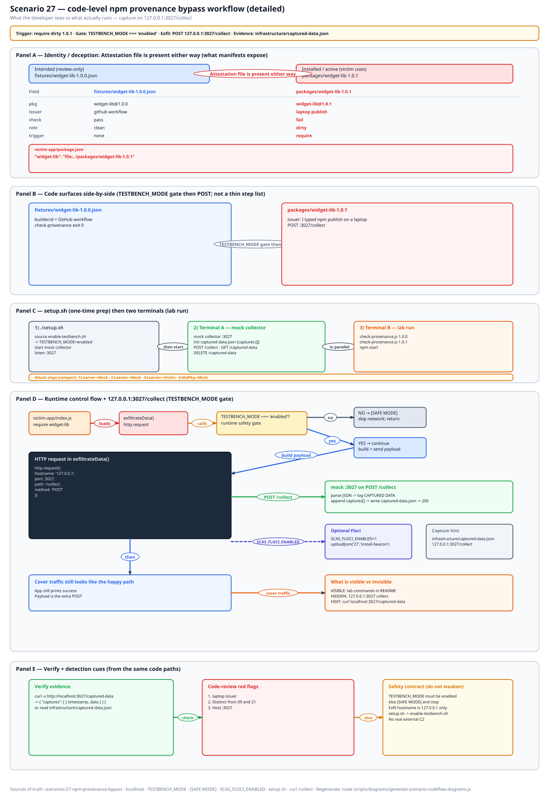
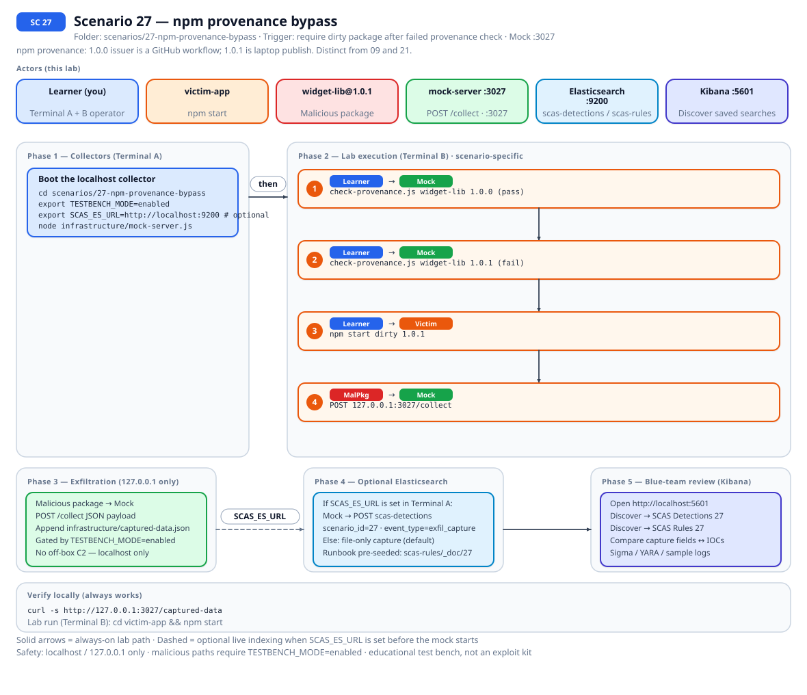
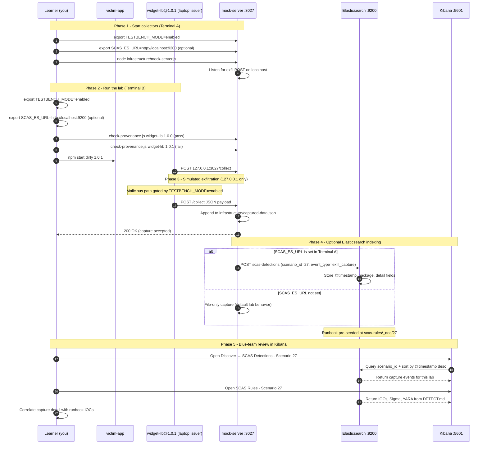

# 🚀 Zero to Hero: Scenario 27 - npm Provenance Bypass

Welcome! This guide will take you from zero knowledge to successfully completing the npm Provenance Bypass scenario. We'll go step by step, explaining everything along the way.

## 📚 What You'll Learn

By the end of this guide, you will:
- Split 27 (attestation issuer) from 09 (signing) and 21 (postinstall)
- Pass `check-provenance.js` on `widget-lib` 1.0.0 and fail 1.0.1
- Still load the dirty `file:` package and capture on `:3027`
- Detect, investigate, and treat provenance as a gate, not a linter

- Apply the **Mitigation Playbook** from this guide and the scenario README

---

## Table of Contents

<div class="doc-toc">

- [Part 1: Understanding npm Provenance Bypass (15 minutes)](#part-1-understanding-npm-provenance-bypass-15-minutes)
- [Part 2: Prerequisites Check (5 minutes)](#part-2-prerequisites-check-5-minutes)
- [Part 3: Setting Up Scenario 27 (15 minutes)](#part-3-setting-up-scenario-27-15-minutes)
- [Part 4: Understanding the Attestation Fixtures (20 minutes)](#part-4-understanding-the-attestation-fixtures-20-minutes)
- [Part 5: The Attack - Laptop Issuer 1.0.1 (30 minutes)](#part-5-the-attack---laptop-issuer-101-30-minutes)
- [Part 6: Detection Methods (40 minutes)](#part-6-detection-methods-40-minutes)
- [Part 7: Forensic Investigation (30 minutes)](#part-7-forensic-investigation-30-minutes)
- [Part 8: Incident Response & Mitigation (30 minutes)](#part-8-incident-response--mitigation-30-minutes)
- [Mitigation Playbook](#mitigation-playbook)
- [Code-level workflow](#code-level-workflow)
- [Elasticsearch + Kibana observability (optional)](#elasticsearch--kibana-observability-optional)
- [Part 9: Key Takeaways](#part-9-key-takeaways)
- [Part 10: Advanced Exercises](#part-10-advanced-exercises)
- [📚 Additional Resources](#📚-additional-resources)
- [⚠️ Safety & Ethics](#⚠️-safety--ethics)
- [🎉 Congratulations!](#🎉-congratulations)

</div>

---
## Part 1: Understanding npm Provenance Bypass (15 minutes)

### What Is npm Provenance Bypass?

npm provenance (trusted publishing) ties a package version to a CI identity. The interesting field here is the issuer / builder id. A GitHub Actions OIDC workflow is one story. `npm publish` from a laptop is another.

`widget-lib@1.0.0` has a dummy in-toto statement whose issuer is `https://github.com/example/repo/.github/workflows/release.yml`. `1.0.1` says `I typed npm publish on a laptop.` The mock on `:3027` serves both. We never call registry.npmjs.org.

### Why Issuer Identity Is a Trust Boundary

1. **09 asks "was this signed?"** Different folder.
2. **21 asks "did postinstall fire?"** Axios-like tarball. Different hour.
3. **27 asks "who was allowed to publish?"**
4. **Checker can fail and install still proceeds** if policy is a comment, not a gate
5. **Fixtures are fake JSON** I care about the decision, not a perfect statement parser

### Visual Example: This Lab's Fixtures

```
27-npm-provenance-bypass/
├── fixtures/widget-lib-1.0.0.json
├── fixtures/widget-lib-1.0.1.json
├── infrastructure/check-provenance.js
├── packages/widget-lib-1.0.0/
├── packages/widget-lib-1.0.1/
└── victim-app/                 # file: already pointed at dirty 1.0.1
```

### How the Attack Works

```
1.0.0 attestation: workflow issuer -> checker exits 0
        ↓
1.0.1 attestation: laptop sentence -> checker fails
        ↓
victim-app still has file: 1.0.1 from setup.sh
        ↓
npm start POSTs to 127.0.0.1:3027 when TESTBENCH_MODE=enabled
```

### Why This Is Risky

1. CI leaves a "provenance looks weird" comment and still installs
2. Signing (09) can pass in some other universe while issuer is wrong
3. Teams collapse 09/21/27 into "supply chain crypto"

### Real-World Examples

Trusted publishing / OIDC vs classic tokens. Pin versions. Alert on bumps that do not match a known workflow subject.

Related: [09](./ZERO_TO_HERO_SCENARIO_09.md), [21](./ZERO_TO_HERO_SCENARIO_21.md).

## Part 2: Prerequisites Check (5 minutes)

```bash
source .scas.env
node --version
echo $TESTBENCH_MODE
./scripts/setup/kill-port.sh 3027
```

---

## Part 3: Setting Up Scenario 27 (15 minutes)

### Step 1: Navigate to Scenario Directory

```bash
cd scenarios/27-npm-provenance-bypass
ls fixtures
```

### Step 2: Run the Setup Script

```bash
export TESTBENCH_MODE=enabled
./setup.sh
```

### Step 3: Understand the Environment

Skim both statements. 1.0.0 should name the example workflow URL. 1.0.1 should name the laptop sentence.

```bash
grep -n "laptop\|github.com/example" fixtures/*
```

---

## Part 4: Understanding the Attestation Fixtures (20 minutes)

### Step 1: Read 1.0.0

Workflow issuer URL. Checker should exit 0.

### Step 2: Read 1.0.1

Laptop sentence. Checker should fail.

### Step 3: Examine Victim package.json

```bash
grep -n widget-lib victim-app/package.json
```

`setup.sh` already pointed at the dirty `file:` copy. If you change it to 1.0.0 to "make capture stop," you skipped the demo.

### Step 4: Examine the Checker

```bash
nl -ba infrastructure/check-provenance.js | sed -n '1,80p'
```

Small policy stub. Not sigstore. Not `npm audit signatures`. Do not pipe fixtures at a production verifier.

---

## Part 5: The Attack - Laptop Issuer 1.0.1 (30 minutes)

### Step 1: Understand the Attack Timeline

Mock up -> check 1.0.0 -> check 1.0.1 -> npm start -> curl.

### Step 2: Start the Mock Attacker Server

```bash
cd scenarios/27-npm-provenance-bypass
export TESTBENCH_MODE=enabled
node infrastructure/mock-server.js
```

The mock also answers provenance fetches in this lab.

### Step 3: Run the Checker

Other terminal:

```bash
cd scenarios/27-npm-provenance-bypass
export TESTBENCH_MODE=enabled
node infrastructure/check-provenance.js widget-lib 1.0.0; echo 1.0.0:$?
node infrastructure/check-provenance.js widget-lib 1.0.1; echo 1.0.1:$?
```

I write the two exit codes on the board.

### Step 4: Dirty Load

```bash
cd victim-app && npm start
curl -s http://127.0.0.1:3027/captured-data
curl -s http://127.0.0.1:3027/captured-data | python3 -m json.tool | head -40
```

### Step 5: Clear

```bash
curl -X DELETE http://127.0.0.1:3027/captured-data
```

### Step 6: Prove the Gate

```bash
unset TESTBENCH_MODE
cd victim-app && npm start
curl -s http://127.0.0.1:3027/captured-data
```

No new harvest. Re-enable the gate.

---

## Part 6: Detection Methods (40 minutes)

### Detection Method 1: Checker Exit Codes

0 on 1.0.0. Fail on 1.0.1. Both pass means mock down or wrong cwd.

### Detection Method 2: Fixture Diff

```bash
diff -u fixtures/widget-lib-1.0.0.json fixtures/widget-lib-1.0.1.json | head
```

### Detection Method 3: Capture Correlation

```bash
curl -s http://127.0.0.1:3027/captured-data
```

### Detection Method 4: Lockfile Still Matters

Provenance does not replace pinning. Read [DETECT.md](../../../scenarios/27-npm-provenance-bypass/DETECT.md).

### Detection Method 5: Floci Unsigned Object

```bash
export SCAS_FLOCI_ENABLED=1
./infrastructure/floci/seed.sh
../../detection-tools/floci/cloud-context.sh 27
```

SSM `/scas/sc27/trusted-issuer`. Unsigned object under `attestations/`. IAM `scas-sc27-publisher-role`.

### Detection Method 6: Sigma Rule (from DETECT.md)

Looks for `provenance.builder.id` containing `laptop`.

---

## Part 7: Forensic Investigation (30 minutes)

### Investigation Step 1: Issuer String

What string in 1.0.1 made the checker fail?

### Investigation Step 2: Policy Gap

Why did `npm start` still work after that fail? Because install was already a `file:` pin. Gate the install.

### Investigation Step 3: Timeline Reconstruction

Publish 1.0.1 with laptop attestation -> checker fail (ignored) -> runtime POST.

### Investigation Step 4: Scope Assessment

Which versions in the lockfile lack trusted-publisher provenance from your issuer?

### Investigation Step 5: Compare 09 / 21 / 27

| Lab | Question |
|-----|----------|
| 09 | Was this signed? |
| 21 | Did postinstall fire on `axios-like` 1.14.1? |
| 27 | Who was allowed to publish? |

---

## Part 8: Incident Response & Mitigation (30 minutes)

### Response Step 1: Immediate Containment

Ctrl+C the mock. DELETE captures. Do not upload fixtures to a real registry.

```bash
curl -X DELETE http://127.0.0.1:3027/captured-data
```

### Response Step 2: Block the Version

Require trusted-publisher from a known workflow issuer. Reject laptop issuers when policy wants OIDC.

### Response Step 3: Validate the Checker

1.0.0 still 0. 1.0.1 still fails. Victim should not load 1.0.1 in a real gate.

### Response Step 4: Long-term Defenses

Pin exact versions. Verify lockfile in CI. Alert on bumps that do not match a GitHub Actions provenance subject. Keep 09 and 21 as separate folders.

---

## Mitigation Playbook

Canonical prevention and mitigation controls (aligned with the [scenario README](../../../scenarios/27-npm-provenance-bypass/README.md)). Lab walkthroughs above expand each control with hands-on steps.

- Require trusted-publisher / provenance from a known workflow issuer.
- Reject publishes whose attestation is missing or names a laptop when policy wants OIDC.
- Keep this distinct from 09 (signing) and 21 (compromised release + postinstall).
- Pin exact versions and verify the lockfile in CI.
- Alert on version bumps that do not match a GitHub Actions provenance subject.

---
## Code-level workflow



*Code-level workflow for Scenario 27. Editable source: [`scas-codeflow-scenario-27.excalidraw`](../../assets/diagrams/codeflow/excalidraw/scas-codeflow-scenario-27.excalidraw). Regenerate with `node scripts/diagrams/generate-scenario-codeflow-diagrams.js`.*

---

## Elasticsearch + Kibana observability (optional)

Scenario **27 - npm provenance bypass** is indexed in Elasticsearch when the observability stack is running.

npm provenance: 1.0.0 issuer is a GitHub workflow; 1.0.1 is laptop publish. Distinct from 09 and 21.

- **Detection runbook (static)** → index `scas-rules`, document id `27` - IOCs, Sigma, YARA, sample logs from `DETECT.md`
- **Runtime captures (dynamic)** → index `scas-detections` - one document per exfil event when `SCAS_ES_URL` is set before starting the mock collector

### How to read this diagram

| Phase | What you should look for |
|-------|--------------------------|
| **1 - Collectors** | Terminal A starts the mock server (or harvester). Set `SCAS_ES_URL` here if you want live Elasticsearch indexing. |
| **2 - Lab execution** | Terminal B runs the scenario README steps. See the **sequence diagram** and **Scenario-specific attack steps** below. |
| **3 - Exfiltration** | Malicious sample sends **localhost-only** JSON to the mock endpoint. Evidence is always written to `infrastructure/` on disk. |
| **4 - Elasticsearch** | When `SCAS_ES_URL` is set, the same capture is indexed into `scas-detections` with `scenario_id` and `event_type=exfil_capture`. |
| **5 - Kibana** | Use the per-scenario saved searches to compare **runtime captures** (Detections) with the **static runbook** (Rules). |

> **Safety:** All network calls stay on `127.0.0.1`. Malicious logic runs only when `TESTBENCH_MODE=enabled`.

### End-to-end flow



*Swimlane diagram for Scenario 27. Editable source: [`scas-observability-scenario-27.excalidraw`](../../assets/diagrams/observability/excalidraw/scas-observability-scenario-27.excalidraw). Regenerate with `node scripts/diagrams/generate-scenario-observability-diagrams.js`.*

### Sequence diagram (Phase 1-5)

Same flow as a participant sequence (expandable in the docs hub).



### Scenario-specific attack steps (Phase 2)

Same Phase-2 path as the diagrams above (for skimming / accessibility).

| # | From | To | Action |
|---|------|----|--------|
| 1 | Learner | Mock | check-provenance.js widget-lib 1.0.0 (pass) |
| 2 | Learner | Mock | check-provenance.js widget-lib 1.0.1 (fail) |
| 3 | Learner | Victim | npm start dirty 1.0.1 |
| 4 | MalPkg | Mock | POST 127.0.0.1:3027/collect |

### Prerequisites

From the repository root:

```bash
./scripts/observability/elasticsearch-up.sh
./scripts/observability/setup-kibana-data-views.sh   # data views + saved searches for all 29 scenarios
```

### Run this scenario with live Elasticsearch forwarding

**Terminal A - mock collector** (from `scenarios/27-npm-provenance-bypass`):

```bash
cd scenarios/27-npm-provenance-bypass
export TESTBENCH_MODE=enabled
export SCAS_ES_URL=http://localhost:9200
node infrastructure/mock-server.js
```

**Terminal B - execute the lab:**

```bash
cd scenarios/27-npm-provenance-bypass
export TESTBENCH_MODE=enabled
export SCAS_ES_URL=http://localhost:9200
cd victim-app && npm start
```

### Verify locally (file-based evidence)

```bash
curl -s http://127.0.0.1:3027/captured-data
```

### Verify in Elasticsearch (API)

```bash
# Static runbook for this scenario
curl -s "http://localhost:9200/scas-rules/_doc/27?pretty"

# Latest runtime capture events
curl -s "http://localhost:9200/scas-detections/_search?pretty" \
  -H 'Content-Type: application/json' \
  -d '{
    "query": { "term": { "scenario_id": "27" } },
    "sort": [{ "@timestamp": "desc" }],
    "size": 5
  }'
```

### Verify in Kibana (UI)

1. Open [http://localhost:5601](http://localhost:5601)
2. **Discover** → **SCAS Detections - Scenario 27** - live capture timeline (`@timestamp`, `package.name`, `detail`)
3. **Discover** → **SCAS Rules - Scenario 27** - compare against `iocs`, `sigma`, and `yara` fields
4. Ask: *Does each capture field match an IOC or Sigma condition in the runbook?*

See [observability/README.md](../../../observability/README.md) for stack details.

## Part 9: Key Takeaways

### Why Provenance Bypass Is Dangerous

1. Checker fail that does not block install
2. Laptop issuer vs workflow OIDC
3. Collapse with 09/21 hides the question

### Best Practices

1. Trusted publisher from a known issuer
2. Fail closed on missing / laptop attestations
3. Pin + lockfile
4. Distinct from signing and from postinstall labs

### Real-World Impact

- Comment in CI, package still in `node_modules`
- Dummy JSON here; real npm provenance is the analog

---

## Part 10: Advanced Exercises

### Exercise 1: Gate Design

Where in CI would `check-provenance.js` have to run so `npm start` cannot proceed?

### Exercise 2: Fixture Table

Two-row table: issuer string, expected exit code.

### Exercise 3: 09 / 21 / 27 Slide

Three sentences. No crypto mush.

### Exercise 4: Floci Issuer

Dump `/scas/sc27/trusted-issuer` after seed. Match it to 1.0.0.

---

## 📚 Additional Resources

- Scenario README: `scenarios/27-npm-provenance-bypass/README.md`
- DETECT.md and FLOCI.md in that folder
- [09](./ZERO_TO_HERO_SCENARIO_09.md) · [21](./ZERO_TO_HERO_SCENARIO_21.md)

---

## ⚠️ Safety & Ethics

**IMPORTANT**: This scenario is for **educational purposes only**.

- Use ONLY in isolated test environments
- Do not send fixtures to a real npm provenance verifier and expect glory
- All malicious code requires `TESTBENCH_MODE=enabled`
- Exfiltration targets `127.0.0.1:3027` only

---

## 🎉 Congratulations!

You've completed the npm Provenance Bypass scenario! You now understand:
- Who published vs whether it was signed vs whether postinstall fired
- Why a failing checker that still installs is a linter
- How to detect and gate issuer identity

**Remember**: fail closed on the install, not in a comment.

Happy Learning!
