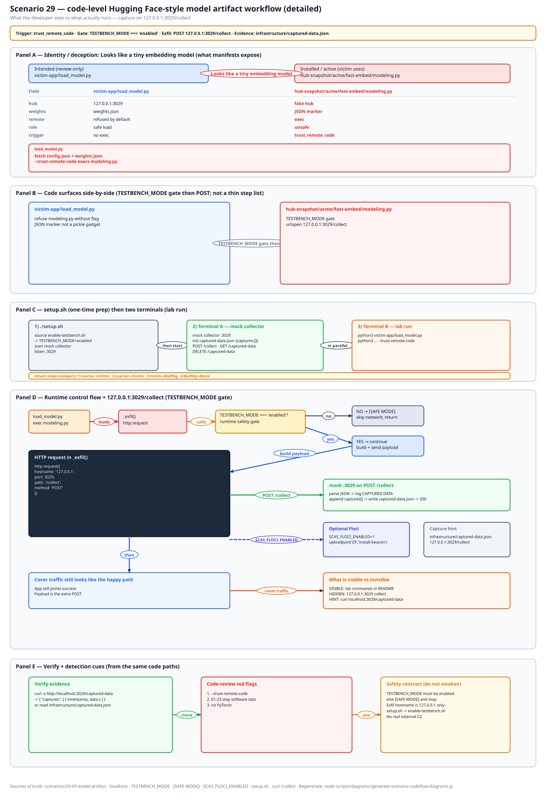
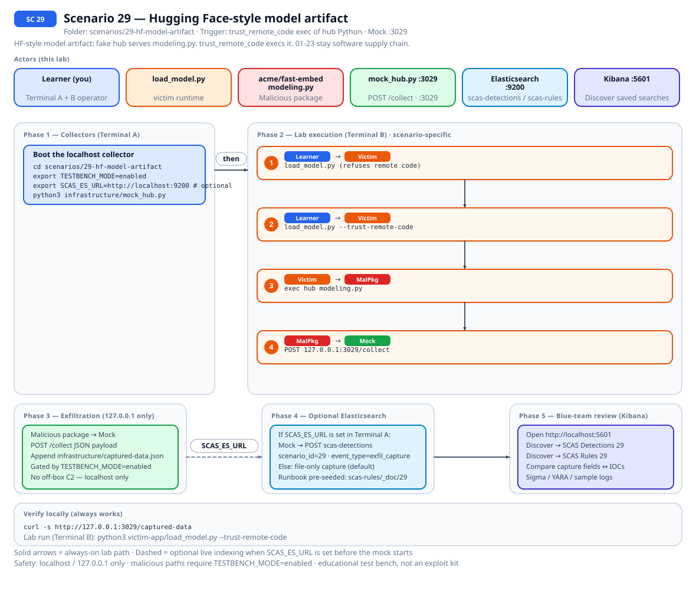
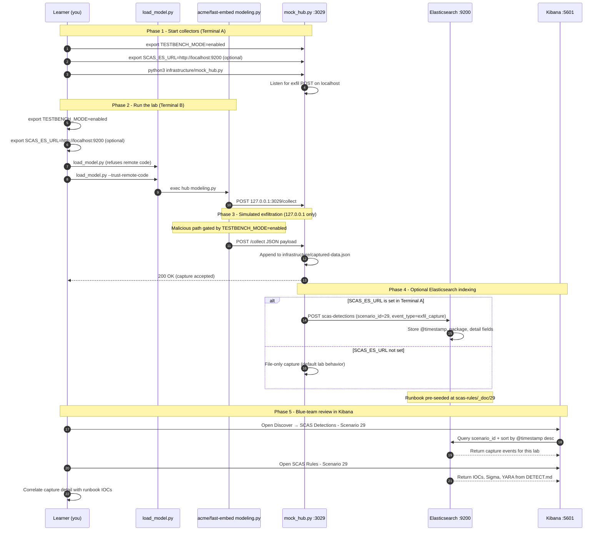

# 🚀 Zero to Hero: Scenario 29 - Hugging Face-style Model Artifact

Welcome! This guide will take you from zero knowledge to successfully completing the Hugging Face-style Model Artifact scenario. We'll go step by step, explaining everything along the way.

## 📚 What You'll Learn

By the end of this guide, you will:
- Load a mock hub snapshot without torch or huggingface.co
- See safe load refuse remote Python and unsafe `--trust-remote-code` capture on `:3029`
- Keep 01-23 as software supply chain; 29 is the ML-artifact track
- Detect, investigate, and pin model revisions

- Apply the **Mitigation Playbook** from this guide and the scenario README

---

## Table of Contents

<div class="doc-toc">

- [Part 1: Understanding Hugging Face-style Model Artifacts (15 minutes)](#part-1-understanding-hugging-face-style-model-artifacts-15-minutes)
- [Part 2: Prerequisites Check (5 minutes)](#part-2-prerequisites-check-5-minutes)
- [Part 3: Setting Up Scenario 29 (15 minutes)](#part-3-setting-up-scenario-29-15-minutes)
- [Part 4: Understanding the Mock Hub Snapshot (20 minutes)](#part-4-understanding-the-mock-hub-snapshot-20-minutes)
- [Part 5: The Attack - trust-remote-code (30 minutes)](#part-5-the-attack---trust-remote-code-30-minutes)
- [Part 6: Detection Methods (40 minutes)](#part-6-detection-methods-40-minutes)
- [Part 7: Forensic Investigation (30 minutes)](#part-7-forensic-investigation-30-minutes)
- [Part 8: Incident Response & Mitigation (30 minutes)](#part-8-incident-response--mitigation-30-minutes)
- [Mitigation Playbook](#mitigation-playbook)
- [Code-level workflow](#code-level-workflow)
- [Elasticsearch + Kibana observability (optional)](#elasticsearch--kibana-observability-optional)
- [Part 9: Key Takeaways](#part-9-key-takeaways)
- [Part 10: Advanced Exercises](#part-10-advanced-exercises)
- [📚 Additional Resources](#📚-additional-resources)
- [⚠️ Safety & Ethics](#⚠️-safety--ethics)
- [🎉 Congratulations!](#🎉-congratulations)

</div>

---
## Part 1: Understanding Hugging Face-style Model Artifacts (15 minutes)

### What Is a Malicious Model Artifact?

Labs 01-23 stay software supply chain (packages, CI, images). This folder is the first ML-artifact lab. I numbered it 29 on purpose so CATALOG and smoke stay dumb. It is not `scenarios/ml/`.

The bug I want you to feel: "I loaded a model and it ran code." Real Hugging Face hosting is out of scope. Nothing downloads from huggingface.co. There is no PyTorch wheel. `weights.json` is a JSON marker, not a pickle gadget.

### Why Loaders Are a Trust Boundary

1. **`trust_remote_code`**: exec whatever `modeling.py` the hub shipped
2. **Same class of mistake as `curl | sh`**, except the file arrived as "the model"
3. **03** is a compromised package. **15** is a compromised tool. **29** is a compromised artifact the ML loader will execute
4. **Stdlib only**. `pip install torch` is how you leave the lab
5. **Python 3.11** is in `.python-version`

### Visual Example: This Lab's Hub Snapshot

```
29-hf-model-artifact/
├── hub-snapshot/acme/fast-embed/
├── victim-app/load_model.py
└── infrastructure/mock_hub.py    # :3029
```

### How the Attack Works

```
python3 infrastructure/mock_hub.py
        ↓
python3 victim-app/load_model.py
        ↓
fetches config.json + weights.json, refuses remote Python
        ↓
python3 victim-app/load_model.py --trust-remote-code
        ↓
execs hub modeling.py, POSTs to 127.0.0.1:3029 when TESTBENCH_MODE=enabled
```

### Why This Is Risky

1. Flag copied from a tutorial
2. Floating revision `main`
3. Python next to tensors
4. Workshop that claims Axios is an ML backdoor because 29 exists

### Real-World Examples

Do not enable `trust_remote_code` for untrusted hubs. Prefer safetensors-class formats over pickle-class loads. Hash-pin revisions.

Related: [03](./ZERO_TO_HERO_SCENARIO_03.md), [15](./ZERO_TO_HERO_SCENARIO_15.md). GitHub issue #24 is the ML-track discussion.

## Part 2: Prerequisites Check (5 minutes)

```bash
source .scas.env
echo $TESTBENCH_MODE
python3 --version
./scripts/setup/kill-port.sh 3029
```

No CUDA download. If a student starts fetching torch, they left the lab.

---

## Part 3: Setting Up Scenario 29 (15 minutes)

### Step 1: Navigate to Scenario Directory

```bash
cd scenarios/29-hf-model-artifact
ls -la
```

### Step 2: Run the Setup Script

```bash
export TESTBENCH_MODE=enabled
./setup.sh
```

### Step 3: Understand the Environment

```bash
find hub-snapshot -type f | head -20
grep -n "trust\|modeling\|3029" victim-app/load_model.py
```

---

## Part 4: Understanding the Mock Hub Snapshot (20 minutes)

### Step 1: Examine weights.json

JSON on purpose. I do not want a pickle gadget in git.

```bash
find hub-snapshot -name 'weights.json' -exec cat {} \;
```

### Step 2: Examine load_model.py

Safe path fetches config + weights. Flag execs `modeling.py`.

### Step 3: Examine mock_hub.py

Tiny HTTP API. Not `mock-server.js`. Port **3029**.

### Step 4: Floci Analog

SSM `/scas/sc29/model-revision` should stay `lab-rev-0001`. Glue `scas_sc29_models`. `scas/sc29/hf-token` is lookalike-only.

---

## Part 5: The Attack - trust-remote-code (30 minutes)

### Step 1: Understand the Attack Timeline

Hub up -> safe load (empty capture) -> unsafe flag (JSON) -> SAFE MODE.

### Step 2: Start the Mock Hub

Terminal A:

```bash
cd scenarios/29-hf-model-artifact
export TESTBENCH_MODE=enabled
python3 infrastructure/mock_hub.py
```

### Step 3: Safe Load

Terminal B:

```bash
cd scenarios/29-hf-model-artifact
export TESTBENCH_MODE=enabled
python3 victim-app/load_model.py
echo safe_exit:$?
curl -s http://127.0.0.1:3029/captured-data
```

Refuse remote Python. Capture empty or unchanged.

### Step 4: Unsafe Load

```bash
python3 victim-app/load_model.py --trust-remote-code
echo unsafe_exit:$?
curl -s http://127.0.0.1:3029/captured-data | python3 -m json.tool | head -40
```

Now JSON. If safe load captured, you passed the flag by habit. DELETE and retry.

### Step 5: Clear

```bash
curl -X DELETE http://127.0.0.1:3029/captured-data
```

### Step 6: Prove SAFE MODE

```bash
unset TESTBENCH_MODE
python3 victim-app/load_model.py --trust-remote-code
```

`[SAFE MODE]`, no new POST. Re-enable the gate.

---

## Part 6: Detection Methods (40 minutes)

### Detection Method 1: Safe vs Flag

First command empty. Second command JSON. That pair is the demo.

### Detection Method 2: Grep the Loader

```bash
grep -n "trust\|modeling\|3029" victim-app/load_model.py infrastructure/mock_hub.py
```

### Detection Method 3: Snapshot Inventory

```bash
find hub-snapshot -type f
```

Unexpected Python next to weights is the hunt in a real snapshot.

### Detection Method 4: Capture Correlation

```bash
curl -s http://127.0.0.1:3029/captured-data
```

### Detection Method 5: Floci Revision Pin

```bash
export SCAS_FLOCI_ENABLED=1
./infrastructure/floci/seed.sh
../../detection-tools/floci/cloud-context.sh 29
```

### Detection Method 6: IOCs (from DETECT.md)

[DETECT.md](../../../scenarios/29-hf-model-artifact/DETECT.md): `--trust-remote-code`, `modeling.py`, POST to `:3029`.

---

## Part 7: Forensic Investigation (30 minutes)

### Investigation Step 1: Which Flag

Did the loader exec hub Python? That is the finding.

### Investigation Step 2: Weights Format

JSON here. Pickle-class loads in the analog. Prefer safetensors-class formats.

### Investigation Step 3: Timeline Reconstruction

Fetch snapshot -> safe load ok -> flag -> POST.

### Investigation Step 4: Scope Assessment

Which jobs float `main`? Which enable `trust_remote_code`?

### Investigation Step 5: Compare 03 / 15 / 29

Package vs tool vs model snapshot the loader will execute. Keep 01-23 in the software catalog.

---

## Part 8: Incident Response & Mitigation (30 minutes)

### Response Step 1: Immediate Containment

Ctrl+C the hub. DELETE captures. Victim cache under `victim-app/.cache/` is gitignored.

```bash
curl -X DELETE http://127.0.0.1:3029/captured-data
```

### Response Step 2: Disable the Flag

Do not enable `trust_remote_code` for untrusted hubs. Hash-pin revisions.

### Response Step 3: Validate Safe Load

Rerun without the flag. Capture stays empty.

### Response Step 4: Long-term Defenses

Scan snapshots for unexpected Python. Do not point `hf-token` at huggingface.co. Do not claim Trivy or Axios is an ML backdoor because this lab exists.

---

## Mitigation Playbook

Canonical prevention and mitigation controls (aligned with the [scenario README](../../../scenarios/29-hf-model-artifact/README.md)). Lab walkthroughs above expand each control with hands-on steps.

- Do not enable `trust_remote_code` for untrusted hubs.
- Prefer safetensors-class formats (or anything that is not pickle) over pickle-class loads.
- Hash-pin model revisions. Do not float `main`.
- Keep 01-23 in the software catalog. This lab is the ML-artifact track, not a claim that Trivy or Axios is an ML backdoor.
- Scan hub snapshots for unexpected Python next to weights.

---
## Code-level workflow



*Code-level workflow for Scenario 29. Editable source: [`scas-codeflow-scenario-29.excalidraw`](../../assets/diagrams/codeflow/excalidraw/scas-codeflow-scenario-29.excalidraw). Regenerate with `node scripts/diagrams/generate-scenario-codeflow-diagrams.js`.*

---

## Elasticsearch + Kibana observability (optional)

Scenario **29 - Hugging Face-style model artifact** is indexed in Elasticsearch when the observability stack is running.

HF-style model artifact: fake hub serves modeling.py. trust_remote_code execs it. 01-23 stay software supply chain.

- **Detection runbook (static)** → index `scas-rules`, document id `29` - IOCs, Sigma, YARA, sample logs from `DETECT.md`
- **Runtime captures (dynamic)** → index `scas-detections` - one document per exfil event when `SCAS_ES_URL` is set before starting the mock collector

### How to read this diagram

| Phase | What you should look for |
|-------|--------------------------|
| **1 - Collectors** | Terminal A starts the mock server (or harvester). Set `SCAS_ES_URL` here if you want live Elasticsearch indexing. |
| **2 - Lab execution** | Terminal B runs the scenario README steps. See the **sequence diagram** and **Scenario-specific attack steps** below. |
| **3 - Exfiltration** | Malicious sample sends **localhost-only** JSON to the mock endpoint. Evidence is always written to `infrastructure/` on disk. |
| **4 - Elasticsearch** | When `SCAS_ES_URL` is set, the same capture is indexed into `scas-detections` with `scenario_id` and `event_type=exfil_capture`. |
| **5 - Kibana** | Use the per-scenario saved searches to compare **runtime captures** (Detections) with the **static runbook** (Rules). |

> **Safety:** All network calls stay on `127.0.0.1`. Malicious logic runs only when `TESTBENCH_MODE=enabled`.

### End-to-end flow



*Swimlane diagram for Scenario 29. Editable source: [`scas-observability-scenario-29.excalidraw`](../../assets/diagrams/observability/excalidraw/scas-observability-scenario-29.excalidraw). Regenerate with `node scripts/diagrams/generate-scenario-observability-diagrams.js`.*

### Sequence diagram (Phase 1-5)

Same flow as a participant sequence (expandable in the docs hub).



### Scenario-specific attack steps (Phase 2)

Same Phase-2 path as the diagrams above (for skimming / accessibility).

| # | From | To | Action |
|---|------|----|--------|
| 1 | Learner | Victim | load_model.py (refuses remote code) |
| 2 | Learner | Victim | load_model.py --trust-remote-code |
| 3 | Victim | MalPkg | exec hub modeling.py |
| 4 | MalPkg | Mock | POST 127.0.0.1:3029/collect |

### Prerequisites

From the repository root:

```bash
./scripts/observability/elasticsearch-up.sh
./scripts/observability/setup-kibana-data-views.sh   # data views + saved searches for all 29 scenarios
```

### Run this scenario with live Elasticsearch forwarding

**Terminal A - mock collector** (from `scenarios/29-hf-model-artifact`):

```bash
cd scenarios/29-hf-model-artifact
export TESTBENCH_MODE=enabled
export SCAS_ES_URL=http://localhost:9200
python3 infrastructure/mock_hub.py
```

**Terminal B - execute the lab:**

```bash
cd scenarios/29-hf-model-artifact
export TESTBENCH_MODE=enabled
export SCAS_ES_URL=http://localhost:9200
python3 victim-app/load_model.py --trust-remote-code
```

### Verify locally (file-based evidence)

```bash
curl -s http://127.0.0.1:3029/captured-data
```

### Verify in Elasticsearch (API)

```bash
# Static runbook for this scenario
curl -s "http://localhost:9200/scas-rules/_doc/29?pretty"

# Latest runtime capture events
curl -s "http://localhost:9200/scas-detections/_search?pretty" \
  -H 'Content-Type: application/json' \
  -d '{
    "query": { "term": { "scenario_id": "29" } },
    "sort": [{ "@timestamp": "desc" }],
    "size": 5
  }'
```

### Verify in Kibana (UI)

1. Open [http://localhost:5601](http://localhost:5601)
2. **Discover** → **SCAS Detections - Scenario 29** - live capture timeline (`@timestamp`, `package.name`, `detail`)
3. **Discover** → **SCAS Rules - Scenario 29** - compare against `iocs`, `sigma`, and `yara` fields
4. Ask: *Does each capture field match an IOC or Sigma condition in the runbook?*

See [observability/README.md](../../../observability/README.md) for stack details.

## Part 9: Key Takeaways

### Why Model Artifacts Are Dangerous

1. Loader execs hub Python
2. Tutorial flag
3. Floating `main`
4. Mix-up with package labs 01-23

### Best Practices

1. No `trust_remote_code` for untrusted hubs
2. Pin revisions
3. Non-pickle formats
4. Scan for Python next to weights
5. Stdlib-only in this folder

### Real-World Impact

- "I just loaded a model"
- JSON weights here so nobody needs torch

---

## Part 10: Advanced Exercises

### Exercise 1: Flag Habit

Run safe, then accidentally pass the flag, then DELETE and recover.

### Exercise 2: Pin Ticket

Where would `lab-rev-0001` be enforced in a real training job?

### Exercise 3: Catalog Line

Write the workshop sentence: 01-23 software, 29 ML-artifact.

### Exercise 4: Floci Glue

Dump `scas_sc29_models` after seed.

---

## 📚 Additional Resources

- Scenario README: `scenarios/29-hf-model-artifact/README.md`
- DETECT.md and FLOCI.md in that folder
- [03](./ZERO_TO_HERO_SCENARIO_03.md) · [15](./ZERO_TO_HERO_SCENARIO_15.md)

---

## ⚠️ Safety & Ethics

**IMPORTANT**: This scenario is for **educational purposes only**.

- Use ONLY in isolated test environments
- No huggingface.co. No torch wheel
- All malicious code requires `TESTBENCH_MODE=enabled`
- Exfiltration targets `127.0.0.1:3029` only
- Do not point lookalike `hf-token` at a real hub

---

## 🎉 Congratulations!

You've completed the Hugging Face-style Model Artifact scenario! You now understand:
- How a model load becomes code execution
- Why the safe path must stay empty
- How to detect, pin, and keep 01-23 in the software catalog

**Remember**: the file arrived as "the model."

Happy Learning!
